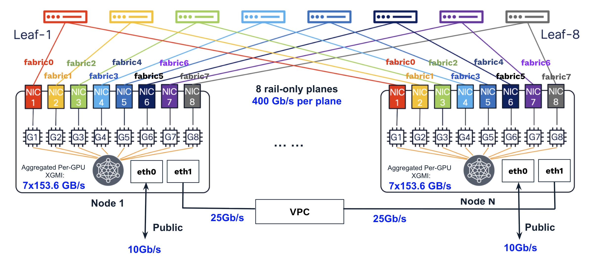
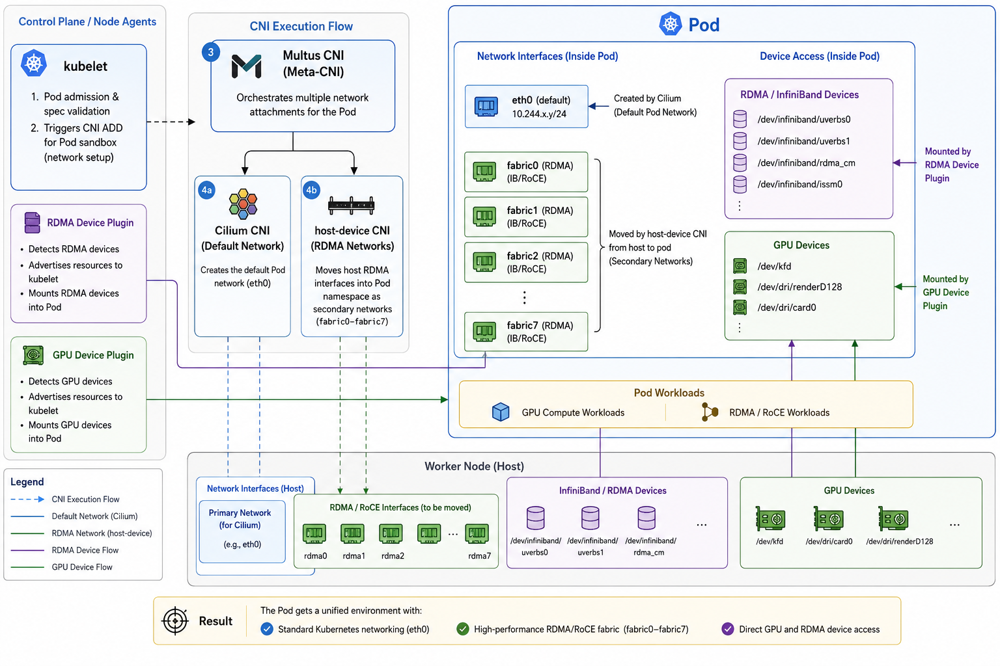

# Multi-Node Environment Setup and Testing for DOKS with AMD GPUs

This guide provides an overview of how to set up a multi-node DOKS environment and run distributed PyTorch tests on AMD GPU nodes, including both MI325x8 and MI350x8 platforms.

For non-DOKS environments, please refer to [mi350x8-mn-environment.MD](https://github.com/rxsalad/multi-node-solutions/blob/main/mi350x8-mn-environment.MD) for additional details.

## GPU Network Introduction

All DOKS workers have Internet access via `eth0` at 10 Gb/s and VPC connectivity via `eth1` at 25 Gb/s, while the GPU network supports inter-node GPU-to-GPU communication via [RDMA/RoCE](https://instinct.docs.amd.com/projects/gpu-cluster-networking/en/latest/how-to/roce-network-config.html) for distributed training and inference workloads.

A single GPU Fabric can support up to 128 homogeneous nodes (MI325x8 or MI350x8), including spare nodes. These nodes can be assigned across multiple customers, with VLANs used to isolate and segregate their traffic.

The GPU Fabric is rail-only at the moment and consists of 8 independent forwarding planes. Each plane connects at 400 Gb/s to [an NVIDIA Mellanox ConnectX-7 NIC](https://instinct.docs.amd.com/projects/system-acceptance/en/latest/network/nic-installation.html#nvidia-mellanox-cx-7-400gx1) on MI325x8 node or [an AMD Pensando Pollara NIC](https://instinct.docs.amd.com/projects/system-acceptance/en/latest/network/nic-installation.html#amd-pensando-pollara-400-ai-nic) on MI350X8 nodes. NICs across different planes are isolated and cannot communicate with each other.

**GPU Network with MI350x8 nodes:**



The 8 RDMA/RoCE NICs in DOKS workers are configured and managed as `fabric0–fabric7`, with a link-local IPv6 addresses automatically assigned to each inferace.

The `fabric0–fabric7` can be treated as standard Ethernet interfaces, supported by the kernel TCP/IP stack in DOKS workers (Debian 13). You can run HTTP or ping over their IP addresses, and traffic can be managed via iptables. When RDMA/RoCE applications run over the 8 NICs using RoCEv2 (UDP over IP), traffic is handled directly by the NICs, bypassing the kernel TCP/IP stack.

[Addtional Details:](understanding_RoCE.MD) RDMA/RoCE applications require access to both **the RDMA subsystem** and **the associated Ethernet interfaces**. First, applications must be able to access the RDMA character devices under `/dev/infiniband`. These devices provide the verbs interface used to create and manage RDMA resources such as queue pairs, memory regions, completion queues, and other RDMA objects. They also require access to the corresponding Ethernet interfaces, which provide the network context necessary for communication, including IP configuration, MTU settings, VLAN membership, and QoS parameters. Although data transfer occurs through the RDMA data path, the Ethernet interfaces remain essential for address resolution (for example, GID resolution), route selection, and endpoint discovery.

**Out-of-Band TCP/IP Channel (Control Plane)**

RDMA/RoCE applications still require an out-of-band TCP/IP channel for bootstrap/initialization and coordination, such as exchanging rank or connection information. In DOKS, there are several ways to provide this channel:

**Scenario 1:** Pods with Isolated Pod Networking

In typical DOKS deployments, Pods running on DOKS workers use their own `eth0` interface, created by the Cilium CNI, to communicate with other Pods, Services, Nodes and the Internet. This interface can also serve as the out-of-band TCP channel for RDMA/RoCE applications. In this deployment model, when using Multus CNI together with the host-device CNI, the RDMA network interfaces (`fabric0–fabric7`) are moved from the host network namespace into the Pod network namepsace. Once transferred, these interfaces are no longer visible or accessible from the host network namespace.

This approach does not support sharing RDMA/RoCE NICs among multiple applications running on the same node. Because each RDMA network interface is exclusively assigned to a single Pod, other Pods cannot access it, even though they may still have access to the RDMA character devices under `/dev/infiniband`. Refer to [amd-mn-k8s-rdma-sharing.MD](amd-mn-k8s-rdma-sharing.MD) for an alternative RDMA sharing solution based on the ipvlan CNI, which is used to create virtual `fabric0–fabric7` interfaces inside the pods, while sharing the same MAC addresses from the corresponding parent `fabric0–fabric7` interfaces on the DOKS workers, allowing multiple pods to share access to the same network interfaces.

**Addtional Details:** [DOKS uses Cilium CNI with VPC-native routing](https://docs.digitalocean.com/products/kubernetes/details/features/#vpc-native-networking), enabling Pod-to-Pod,Pod-to-Service, Pod-to-Node/External traffic to be forwarded directly through the Linux kernel networking stack without overlay encapsulation. Pod-to-Pod traffic is routed natively across the VPC and does not require NAT. [Cilium](https://docs.cilium.io/en/stable/) leverages [eBPF](https://ebpf.io/what-is-ebpf/) for routing, service load balancing, network policy enforcement, and NAT where necessary (for example, egress traffic), eliminating the need for kube-proxy and replacing traditional iptables-based service handling with an eBPF-based datapath, while the Cilium agent operates solely in the control plane and is not involved in packet forwarding.

**Scenario 2:** Pods Sharing the Host Network

For Pods configured with the host network namespace (where interfaces such as `eth0` ,`eth1` and `fabric0–fabric7` are shared), the `eth1` interface is used as the dedicated out-of-band TCP/IP channel.

There is one clear issue with this approach: when multiple application replicas share the host network, port conflicts can occur if different instances—or even the host itself—attempt to bind to the same port.

This setup is similar to a non-DOKS environment, where containers are launched with direct access to the network namepsace on the host. For additional details, please refer to [the link](https://github.com/rxsalad/multi-node-solutions/blob/main/mi350x8-mn-pytorch-testing.MD#how-to-access-rdmaroce-nics-within-containers).

**Intra-node and Inter-node GPU Communication (Data Plane)**

For GPU-to-GPU communication, the preferred paths are [XGMI](https://instinct.docs.amd.com/projects/virt-drv/en/latest/userguides/XGMI_configuration.html) (AMD Infinity Fabric) for intra-node transfers and 400 Gigabit Ethernet with RDMA for inter-node transfers. PCIe and shared memory (intra-node) and TCP/IP (inter-node, eth1) serve only as fallback options. Numerous [RCCL environment variables](https://rocm.docs.amd.com/projects/rccl/en/develop/api-reference/env-variables.html) can be configured to control these communication paths, and they should be carefully considered.

**The following summarizes the different communication paths, their roles and traffic in distributed AI/ML applications on DOKS:**

| Interface / Path | Bandwidth | Role |
|------------------|----------|------|
| Scenario 1: Pod eth0 (Cilium CNI with VPC-native routing), <br> for Pod-to-Pod/Service/Node/External traffic | 10~25 Gb/s | SSH; <br>HTTP APIs for serving user traffic;<br> Downloads and uploads (models, datasets, libraries, and updates); <br>HTTP APIs for distributed inference across Router, Prefiller, and Decoder;<br> Bootstrap/initialization and coordination for RDMA/RoCE; <br>Fallback path for RDMA/RoCE |
| Scenario 2: Host eth0 | 10 Gb/s | SSH; <br>HTTP APIs for serving user traffic;<br> Downloads and uploads (container images, models, datasets, libraries, and updates) |
| Scenario 2: Host eth1 | 25 Gb/s | NFS (models/checkpoints, datasets, logs, and metrics), exposed to Pods through bind mounts; <br>HTTP APIs for distributed inference across Router, Prefiller, and Decoder;<br> Bootstrap/initialization and coordination for RDMA/RoCE; <br>Fallback path for RDMA/RoCE |
| fabric0–fabric7 | 400 Gb/s each | RDMA/RoCE for inter-node GPU-to-GPU communication (used by RCCL);<br> Training traffic (gradients, parameters, optimizer states, activations);<br> Inference traffic (activations, KV cache) |
| XGMI (not user-configurable) | 7×128 GB/s per MI325 GPU<br> 7×153.6 GB/s per MI350 GPU   | Intra-node GPU-to-GPU communication (used by RCCL);<br>  Training traffic (gradients, activations, optimizer states);<br> Inference traffic (activations, KV cache) |

## Environment Setup 

Ensure that you have at least 2 nodes in the same GPU Fabric assigned to your account.

Provision a DOKS cluster with 1 CPU worker and 2 MI350x8 workers using doctl:

``` bash
doctl vpcs list
doctl compute size list | grep cpu 
doctl compute size list | grep gpu 
doctl kubernetes cluster list

# MI350x8, default VPC
# Use a fabric-enabled size; otherwise, RDMA/RoCE will not be enabled.
doctl kubernetes cluster create rs-amd-sfo2-test \
  --region sfo2 \
  --version 1.34.1-do.2 \
  --node-pool "name=rs-mn-cpu-pool;size=s-8vcpu-16gb;count=1" \
  --node-pool "name=rs-mn-mi350x8-pool;size=gpu-mi350x8-2304gb-fabric-contracted;count=2" \
  --tag "rs-test"

doctl kubernetes cluster get rs-amd-sfo2-test -o json
doctl kubernetes cluster delete rs-amd-sfo2-test

# MI350x8 + MI325x8
doctl kubernetes cluster create rs-amd-tor1-test \
  --region tor1 \
  --vpc-uuid d7489d54-76ff-47b6-b214-2162e69c52a2 \
  --version 1.34.1-do.2 \
  --node-pool "name=rs-mn-cpu-pool;size=s-4vcpu-8gb-amd;count=1" \
  --node-pool "name=rs-mn-mi325x8-pool;size=gpu-mi325x8-2048gb-fabric-contracted;count=2" \
  --node-pool "name=rs-mn-mi350x8-pool;size=gpu-mi350x8-2304gb-fabric-contracted;count=2" \
  --tag "rs-test"
``` 

**Notes:** The memory information shown in the GPU instance size refers to the physical host server. Since a DOKS worker runs as a virtual machine, the usable memory inside the VM is smaller. You can verify the actual available memory within the VM (1.2 TiB for MI325x8 instances and 2.0 TiB for MI350x8 instances).

The 3 workers have been created and are now managed by DOKS.

``` bash
# doctl compute droplet list

ID           Name                             Public IPv4        Private IPv4    Public IPv6                Memory     VCPUs    Disk    Region    Image                                 VPC UUID                                Status    Tags                                                       Features                                       Volumes  
574372194    rs-mn-cpu-pool-381iam            167.71.156.33      10.120.0.6                                 16384      8        320     sfo2      Debian do-kube-1.34.1-do.2            996966ce-4eb8-4ed5-9bf2-7ff1688b5825    active    k8s,k8s:b8945e9f-2a50-469d-9eb6-7b0d3ad9f614,k8s:worker    private_networking                             
574372195    rs-mn-mi350x8-pool-381iaq        159.65.102.82      10.120.0.3                                 2097152    192      2046    sfo2      Debian do-kube-1.34.1-do.2-gpu-amd    996966ce-4eb8-4ed5-9bf2-7ff1688b5825    active    k8s,k8s:b8945e9f-2a50-469d-9eb6-7b0d3ad9f614,k8s:worker    droplet_agent,private_networking               
574372196    rs-mn-mi350x8-pool-381iaf        159.89.134.60      10.120.0.11                                2097152    192      2046    sfo2      Debian do-kube-1.34.1-do.2-gpu-amd    996966ce-4eb8-4ed5-9bf2-7ff1688b5825    active    k8s,k8s:b8945e9f-2a50-469d-9eb6-7b0d3ad9f614,k8s:worker    droplet_agent,private_networking      
```

## DOKS Worker Check (Host OS)

There are 2 ways to access DOKS workers to check system information and troubleshoot issues:

- **Privileged DaemonSet approach:** Deploy a privileged DaemonSet that schedules a pod on each node, then use `kubectl exec` to access the pod on the target node. Refer to [doks-debug](https://github.com/digitalocean/doks-debug) for details.

- **Web Console approach:** Use the Do web console. This requires a firewall rule allowing TCP port 22 on the target DOKS workers. You can use [tag-based matching](https://docs.digitalocean.com/products/networking/firewalls/details/features/), as all DOKS workers are labeled with the **k8s:worker** tag. You may also add your public SSH keys via the web console to enable future SSH access without using the web console.

### GPU Check

Perform a basic system and AMD GPU check on the GPU workers:

``` bash
uname -r
cat /etc/os-release
dkms status

# Check if the AMD GPU kernel driver is currently loaded and active.
lsmod | grep amdgpu 
lspci | grep -i amd

amd-smi version
amd-smi list 
amd-smi xgmi
amd-smi topology

rocm-smi
rocm-smi --showtopo
rocminfo

# Basic Tools
apt update
apt install net-tools
```

### RDMA/RoCE Check

Run the following commands on the GPU workers to verify network connectivity and RDMA/RoCE configuration.

``` bash
# Provides an overview of all network interfaces and their IPs.
ip -br a

# Shows detailed configuration and status information for each interface.
ifconfig

# Lists all RDMA devices exposed by the kernel
ls /sys/class/infiniband/

# Provides detailed hardware-level information about each RDMA device’s capabilities and configuration.
ibv_devices
ibv_devinfo -v | grep GID

# Displays the mapping between RDMA devices and network interfaces along with link status.
rdma link

# Ping the remote eth0 and eth1 addresses
ping xxx 

# Extract the IPv6 address assigned to each fabric interface.
for i in {0..7}; do
  echo "fabric$i:"
  ip -6 addr show dev fabric$i | grep inet6
done
```

| DOKS Worker    | rs-mn-mi350x8-pool-381iaf  | rs-mn-mi350x8-pool-381iaq  | rs-mn-cpu-pool-381iam |
|----------------|----------------|-----------------|-----------------|
| eth0-internet  | 159.89.134.60 | 159.65.102.82 | 167.71.156.33 |
| eth1-vpc       | 10.120.0.11/20  | 10.120.0.3/20 | 10.120.0.6/20 |
| fabric0  | fe80::490:81ff:fe49:c440/64 | fe80::490:81ff:fe4b:e670/64  | |
| fabric1  | fe80::490:81ff:fe49:488/64 | fe80::490:81ff:fe4b:ca20/64 | |
| fabric2  | fe80::490:81ff:fe49:18f8/64 | fe80::490:81ff:fe4c:1a90/64  | | 
| fabric3  | fe80::490:81ff:fe4a:6fb8/64 | fe80::490:81ff:fe4b:fc78/64 | |
| fabric4  | fe80::490:81ff:fe49:85d0/64 | fe80::490:81ff:fe4c:1790/64  | | 
| fabric5  | fe80::490:81ff:fe49:cbc0/64 | fe80::490:81ff:fe4c:f98/64 |  |
| fabric6  | fe80::490:81ff:fe49:d280/64 | fe80::490:81ff:fe4c:1610/64 |  |
| fabric7  | fe80::490:81ff:fe49:1eb0/64  | fe80::490:81ff:fe4b:f510/64  |  |


Each RDMA/RoCE fabric interface is automatically assigned a [link-local IPv6 address](https://www.geeksforgeeks.org/computer-networks/link-local-address/) (**fe80::/10**). This is a common design in HPC and AI clusters, where link-local addressing provides deterministic interface binding and reliable neighbor discovery for RDMA communication. In some large-scale RoCEv2 deployments, fabric interfaces may also be assigned routable IPv4 or IPv6 addresses to support broader networking, operational, and management requirements.

To verify fabric connectivity, test communication between the fabric interfaces on the two GPU workers. Because link-local IPv6 addresses are scoped to a specific interface and are not routable, the source interface must be explicitly specified using the `-I` option.

``` bash
# rs-mn-mi350x8-pool-381iaf -> rs-mn-mi350x8-pool-381iaq 

ping -c 1 -6 -I fabric0 fe80::490:81ff:fe4b:e670 # Peer fabric0 interface
...
ping -c 1 -6 -I fabric7 fe80::490:81ff:fe49:1eb0 # Peer fabric7 interface
```

[IPv6 Neighbor Discovery Protocol - NDP](https://www.networkacademy.io/ccna/ipv6/neighbor-discovery-protocol) resolves a destination IPv6 address to the MAC address of the specific interface that owns that address on the same Layer 2 network. NDP operates only within the local broadcast domain and does not discover or interact with other interfaces on the remote node.

When a `ping` command is issued, the host first sends an ICMPv6 Neighbor Solicitation message (via multicast) to resolve the destination MAC address. After neighbor resolution completes, the ICMPv6 Echo Request is transmitted directly over the local Layer 2 fabric to the target interface.

In a rail-only GPU fabric, communication is supported only between directly connected peer interfaces. Cross-rail communication is not supported. For example, the following tests will fail because the source and destination interfaces belong to different rails:

``` bash
# rs-mn-mi350x8-pool-381iaf -> rs-mn-mi350x8-pool-381iaq 

ping -c 1 -6 -I fabric7 fe80::490:81ff:fe4b:e670 # Destination is peer fabric0
...
ping -c 1 -6 -I fabric0 fe80::490:81ff:fe49:1eb0 # Destination is peer fabric7
```

In these examples, the destination link-local address is reachable only through its corresponding rail. Since no Layer 2 connectivity exists between different rails, Neighbor Discovery cannot resolve the destination MAC address and the communication attempt fails.

### VPC Native Routing Check

Check host routing table on DOKS CPU and GPU workers:

``` bash
root@rs-mn-mi350x8-pool-381iaf:~# ip route

# Default Route
default via 159.89.128.1 dev eth0 proto static 

# VPC Peering Routes through the VPC router (10.120.0.1)
10.0.0.0/8 via 10.120.0.1 dev eth1 metric 101 mtu 1500 
172.16.0.0/12 via 10.120.0.1 dev eth1 metric 101 mtu 1500 
192.168.0.0/16 via 10.120.0.1 dev eth1 metric 101 mtu 1500 

# Anchor IP, Additional VPC-local network segment via eth0 
10.46.0.0/16 dev eth0 scope link 

# Private IP, VPC Node Network via eth1 
10.120.0.0/20 dev eth1 proto kernel scope link src 10.120.0.11 

# Pod Network
10.121.0.0/25 via 10.120.0.6 dev eth1 proto kernel                          # to 128 Pods on rs-mn-cpu-pool-381iam 
10.121.0.128/25 via 10.120.0.3 dev eth1 proto kernel                        # to 128 Pods on rs-mn-mi350x8-pool-381iaq
10.121.1.0/25 via 10.121.1.67 dev cilium_host proto kernel src 10.121.1.67  # to 128 Pods on the local node - rs-mn-mi350x8-pool-381iaf

# Gateway of local pod interface route (CNI endpoint for host-pod communication)
10.121.1.67 dev cilium_host proto kernel scope link 

# Public Internet subnet 
159.89.128.0/20 dev eth0 proto kernel scope link src 159.89.134.60 
```

The routing table shows a VPC-native Kubernetes networking setup where `eth0` provides public internet access and `eth1` serves as the VPC underlay. Private RFC1918 traffic (10/8, 172.16/12, 192.168/16) is routed through the VPC gateway (10.120.0.1). 

Pod networking is VPC-native, with each node pool’s pod CIDR routed directly over the VPC network via static next-hop routes, enabling inter-node pod communication without overlay encapsulation. Local pod traffic is handled through the cilium_host interface, while Cilium manages pod-to-node integration.

The DOKS service subnet (the ClusterIP range, for example 10.120.32.0/19) does not appear in the host routing table because it is not a routable Layer 3 network. Instead, the service CIDR is implemented as a virtual address space in the Cilium eBPF dataplane. When traffic is sent to a ClusterIP address, Cilium performs in-kernel service load balancing and translates the virtual service IP to one of the backend pod endpoints. Because service traffic is intercepted and processed before a routing lookup occurs, no corresponding ip route entries are installed for the service CIDR.

### Worker Details - MI350x8 and MI325x8

The MI350X and MI325X nodes expose RDMA networking through different driver stacks, which is reflected in their NIC naming and GID behavior. On the MI350X system, RDMA devices appear as ionic_*, representing AMD’s newer RoCE-focused networking stack where each interface is typically aligned with a GPU or PCI function and exposes only RoCE v2 GIDs (IPv6 link-local identifiers) for RDMA communication. 

In contrast, the MI325X system uses mlx5_* devices from the mature Mellanox ConnectX (mlx5) driver, which supports a broader RDMA feature set and exposes both RoCE v1 and RoCE v2 GIDs. In both cases, the GID serves as the RDMA-layer identity used to establish queue pair communication between nodes, but the MI325X stack offers more flexibility and compatibility modes, while the MI350X stack is more streamlined and RoCEv2-centric.

<details>
<summary>MI350x8</summary>

``` bash
# uname -r
6.12.48+deb13-amd64

# cat /etc/os-release
PRETTY_NAME="Debian GNU/Linux 13 (trixie)"
NAME="Debian GNU/Linux"
VERSION_ID="13"
VERSION="13 (trixie)"
VERSION_CODENAME=trixie
DEBIAN_VERSION_FULL=13.2
ID=debian
HOME_URL="https://www.debian.org/"
SUPPORT_URL="https://www.debian.org/support"
BUG_REPORT_URL="https://bugs.debian.org/"

# dkms status
amdgpu/6.14.14-2226257.24.04, 6.12.48+deb13-amd64, x86_64: installed (Original modules exist)
ionic/25.11.1.001, 6.12.48+deb13-amd64, x86_64: installed (Original modules exist)
mlnx-ofed-kernel/24.10.OFED.24.10.3.2.5.1, 6.12.48+deb13-amd64, x86_64: installed (Original modules exist)

# amd-smi version
AMDSMI Tool: 26.0.2+39589fda | AMDSMI Library version: 26.0.2 | ROCm version: 7.0.2 | amdgpu version: 6.14.14 | amd_hsmp version: N/A

# amd-smi
+------------------------------------------------------------------------------+
| AMD-SMI 26.0.2+39589fda      amdgpu version: 6.14.14  ROCm version: 7.0.2    |
| Platform: Linux Guest                                                        |
|-------------------------------------+----------------------------------------|
| BDF                        GPU-Name | Mem-Uti   Temp   UEC       Power-Usage |
| GPU  HIP-ID  OAM-ID  Partition-Mode | GFX-Uti    Fan               Mem-Usage |
|=====================================+========================================|
| 0000:83:00.0 AMD Instinct MI350X VF | 0 %      56 °C   0          264/1000 W |
|   0       0       6        SPX/NPS1 | 11 %       N/A           285/294480 MB |
|-------------------------------------+----------------------------------------|
| 0000:8b:00.0 AMD Instinct MI350X VF | 0 %      63 °C   0          267/1000 W |
|   1       1       7        SPX/NPS1 | 11 %       N/A           285/294480 MB |
|-------------------------------------+----------------------------------------|
| 0000:93:00.0 AMD Instinct MI350X VF | 0 %      57 °C   0          257/1000 W |
|   2       2       5        SPX/NPS1 | 11 %       N/A           285/294480 MB |
|-------------------------------------+----------------------------------------|
| 0000:9b:00.0 AMD Instinct MI350X VF | 0 %      65 °C   0          268/1000 W |
|   3       3       4        SPX/NPS1 | 11 %       N/A           285/294480 MB |
|-------------------------------------+----------------------------------------|
| 0000:a3:00.0 AMD Instinct MI350X VF | 0 %      55 °C   0          259/1000 W |
|   4       4       2        SPX/NPS1 | 11 %       N/A           285/294480 MB |
|-------------------------------------+----------------------------------------|
| 0000:ab:00.0 AMD Instinct MI350X VF | 0 %      62 °C   0          266/1000 W |
|   5       5       3        SPX/NPS1 | 11 %       N/A           285/294480 MB |
|-------------------------------------+----------------------------------------|
| 0000:b3:00.0 AMD Instinct MI350X VF | 0 %      59 °C   0          259/1000 W |
|   6       6       1        SPX/NPS1 | 11 %       N/A           285/294480 MB |
|-------------------------------------+----------------------------------------|
| 0000:bb:00.0 AMD Instinct MI350X VF | 0 %      60 °C   0          267/1000 W |
|   7       7       0        SPX/NPS1 | 11 %       N/A           285/294480 MB |
+-------------------------------------+----------------------------------------+

# rocm-smi --showtopo
============================ ROCm System Management Interface ============================
================================ Weight between two GPUs =================================
       GPU0         GPU1         GPU2         GPU3         GPU4         GPU5         GPU6         GPU7         
GPU0   0            15           15           15           15           15           15           15           
GPU1   15           0            15           15           15           15           15           15           
GPU2   15           15           0            15           15           15           15           15           
GPU3   15           15           15           0            15           15           15           15           
GPU4   15           15           15           15           0            15           15           15           
GPU5   15           15           15           15           15           0            15           15           
GPU6   15           15           15           15           15           15           0            15           
GPU7   15           15           15           15           15           15           15           0            
================================= Hops between two GPUs ==================================
       GPU0         GPU1         GPU2         GPU3         GPU4         GPU5         GPU6         GPU7         
GPU0   0            1            1            1            1            1            1            1            
GPU1   1            0            1            1            1            1            1            1            
GPU2   1            1            0            1            1            1            1            1            
GPU3   1            1            1            0            1            1            1            1            
GPU4   1            1            1            1            0            1            1            1            
GPU5   1            1            1            1            1            0            1            1            
GPU6   1            1            1            1            1            1            0            1            
GPU7   1            1            1            1            1            1            1            0            
=============================== Link Type between two GPUs ===============================
       GPU0         GPU1         GPU2         GPU3         GPU4         GPU5         GPU6         GPU7         
GPU0   0            XGMI         XGMI         XGMI         XGMI         XGMI         XGMI         XGMI         
GPU1   XGMI         0            XGMI         XGMI         XGMI         XGMI         XGMI         XGMI         
GPU2   XGMI         XGMI         0            XGMI         XGMI         XGMI         XGMI         XGMI         
GPU3   XGMI         XGMI         XGMI         0            XGMI         XGMI         XGMI         XGMI         
GPU4   XGMI         XGMI         XGMI         XGMI         0            XGMI         XGMI         XGMI         
GPU5   XGMI         XGMI         XGMI         XGMI         XGMI         0            XGMI         XGMI         
GPU6   XGMI         XGMI         XGMI         XGMI         XGMI         XGMI         0            XGMI         
GPU7   XGMI         XGMI         XGMI         XGMI         XGMI         XGMI         XGMI         0            
======================================= Numa Nodes =======================================
GPU[0]          : (Topology) Numa Node: 0
GPU[0]          : (Topology) Numa Affinity: 0
GPU[1]          : (Topology) Numa Node: 0
GPU[1]          : (Topology) Numa Affinity: 0
GPU[2]          : (Topology) Numa Node: 0
GPU[2]          : (Topology) Numa Affinity: 0
GPU[3]          : (Topology) Numa Node: 0
GPU[3]          : (Topology) Numa Affinity: 0
GPU[4]          : (Topology) Numa Node: 1
GPU[4]          : (Topology) Numa Affinity: 1
GPU[5]          : (Topology) Numa Node: 1
GPU[5]          : (Topology) Numa Affinity: 1
GPU[6]          : (Topology) Numa Node: 1
GPU[6]          : (Topology) Numa Affinity: 1
GPU[7]          : (Topology) Numa Node: 1
GPU[7]          : (Topology) Numa Affinity: 1
================================== End of ROCm SMI Log ===================================

# ls /sys/class/infiniband/
ionic_0  ionic_1  ionic_2  ionic_3  ionic_4  ionic_5  ionic_6  ionic_7

# ibv_devices
    device                 node GUID
    ------              ----------------
    ionic_0             049081fffe49c440
    ionic_1             049081fffe490488
    ionic_2             049081fffe4918f8
    ionic_3             049081fffe4a6fb8
    ionic_4             049081fffe4985d0
    ionic_5             049081fffe49cbc0
    ionic_6             049081fffe49d280
    ionic_7             049081fffe491eb0

# ibv_devinfo -v | grep GID
                        GID[  0]:               fe80::490:81ff:fe49:c440, RoCE v2
                        GID[  0]:               fe80::490:81ff:fe49:488, RoCE v2
                        GID[  0]:               fe80::490:81ff:fe49:18f8, RoCE v2
                        GID[  0]:               fe80::490:81ff:fe4a:6fb8, RoCE v2
                        GID[  0]:               fe80::490:81ff:fe49:85d0, RoCE v2
                        GID[  0]:               fe80::490:81ff:fe49:cbc0, RoCE v2
                        GID[  0]:               fe80::490:81ff:fe49:d280, RoCE v2
                        GID[  0]:               fe80::490:81ff:fe49:1eb0, RoCE v2

# rdma link
link ionic_0/1 state ACTIVE physical_state LINK_UP netdev fabric0 
link ionic_1/1 state ACTIVE physical_state LINK_UP netdev fabric1 
link ionic_2/1 state ACTIVE physical_state LINK_UP netdev fabric2 
link ionic_3/1 state ACTIVE physical_state LINK_UP netdev fabric3 
link ionic_4/1 state ACTIVE physical_state LINK_UP netdev fabric4 
link ionic_5/1 state ACTIVE physical_state LINK_UP netdev fabric5 
link ionic_6/1 state ACTIVE physical_state LINK_UP netdev fabric6 
link ionic_7/1 state ACTIVE physical_state LINK_UP netdev fabric7                        
```

</details>

<details>
<summary>MI325x8</summary>

``` bash
# uname -r
6.12.48+deb13-amd64

# cat /etc/os-release
PRETTY_NAME="Debian GNU/Linux 13 (trixie)"
NAME="Debian GNU/Linux"
VERSION_ID="13"
VERSION="13 (trixie)"
VERSION_CODENAME=trixie
DEBIAN_VERSION_FULL=13.2
ID=debian
HOME_URL="https://www.debian.org/"
SUPPORT_URL="https://www.debian.org/support"
BUG_REPORT_URL="https://bugs.debian.org/"

# dkms status
amdgpu/6.14.14-2226257.24.04, 6.12.48+deb13-amd64, x86_64: installed (Original modules exist)
ionic/25.11.1.001, 6.12.48+deb13-amd64, x86_64: installed (Original modules exist)
mlnx-ofed-kernel/24.10.OFED.24.10.3.2.5.1, 6.12.48+deb13-amd64, x86_64: installed (Original modules exist)

# amd-smi version
AMDSMI Tool: 26.0.2+39589fda | AMDSMI Library version: 26.0.2 | ROCm version: 7.0.2 | amdgpu version: 6.14.14 | amd_hsmp version: N/A

# amd-smi
+------------------------------------------------------------------------------+
| AMD-SMI 26.0.2+39589fda      amdgpu version: 6.14.14  ROCm version: 7.0.2    |
| Platform: Linux Guest                                                        |
|-------------------------------------+----------------------------------------|
| BDF                        GPU-Name | Mem-Uti   Temp   UEC       Power-Usage |
| GPU  HIP-ID  OAM-ID  Partition-Mode | GFX-Uti    Fan               Mem-Usage |
|=====================================+========================================|
| 0000:83:00.0 AMD Instinct Mi325X VF | 34 %     67 °C   0          932/1000 W |
|   0       0       6        SPX/NPS1 | 96 %       N/A        237092/261824 MB |
|-------------------------------------+----------------------------------------|
| 0000:8b:00.0 AMD Instinct Mi325X VF | 42 %     69 °C   0          958/1000 W |
|   1       1       7        SPX/NPS1 | 96 %       N/A        238042/261824 MB |
|-------------------------------------+----------------------------------------|
| 0000:93:00.0 AMD Instinct Mi325X VF | 35 %     65 °C   0          939/1000 W |
|   2       2       5        SPX/NPS1 | 95 %       N/A        238086/261824 MB |
|-------------------------------------+----------------------------------------|
| 0000:9b:00.0 AMD Instinct Mi325X VF | 36 %     71 °C   0          945/1000 W |
|   3       3       4        SPX/NPS1 | 96 %       N/A        237092/261824 MB |
|-------------------------------------+----------------------------------------|
| 0000:a3:00.0 AMD Instinct Mi325X VF | 29 %     63 °C   0          874/1000 W |
|   4       4       2        SPX/NPS1 | 91 %       N/A        237092/261824 MB |
|-------------------------------------+----------------------------------------|
| 0000:ab:00.0 AMD Instinct Mi325X VF | 31 %     75 °C   0          898/1000 W |
|   5       5       3        SPX/NPS1 | 93 %       N/A        237092/261824 MB |
|-------------------------------------+----------------------------------------|
| 0000:b3:00.0 AMD Instinct Mi325X VF | 36 %     66 °C   0          902/1000 W |
|   6       6       1        SPX/NPS1 | 93 %       N/A        237092/261824 MB |
|-------------------------------------+----------------------------------------|
| 0000:bb:00.0 AMD Instinct Mi325X VF | 36 %     68 °C   0          916/1000 W |
|   7       7       0        SPX/NPS1 | 94 %       N/A        237092/261824 MB |
+-------------------------------------+----------------------------------------+

# rocm-smi --showtopo
============================ ROCm System Management Interface ============================
================================ Weight between two GPUs =================================
       GPU0         GPU1         GPU2         GPU3         GPU4         GPU5         GPU6         GPU7         
GPU0   0            15           15           15           15           15           15           15           
GPU1   15           0            15           15           15           15           15           15           
GPU2   15           15           0            15           15           15           15           15           
GPU3   15           15           15           0            15           15           15           15           
GPU4   15           15           15           15           0            15           15           15           
GPU5   15           15           15           15           15           0            15           15           
GPU6   15           15           15           15           15           15           0            15           
GPU7   15           15           15           15           15           15           15           0            
================================= Hops between two GPUs ==================================
       GPU0         GPU1         GPU2         GPU3         GPU4         GPU5         GPU6         GPU7         
GPU0   0            1            1            1            1            1            1            1            
GPU1   1            0            1            1            1            1            1            1            
GPU2   1            1            0            1            1            1            1            1            
GPU3   1            1            1            0            1            1            1            1            
GPU4   1            1            1            1            0            1            1            1            
GPU5   1            1            1            1            1            0            1            1            
GPU6   1            1            1            1            1            1            0            1            
GPU7   1            1            1            1            1            1            1            0            
=============================== Link Type between two GPUs ===============================
       GPU0         GPU1         GPU2         GPU3         GPU4         GPU5         GPU6         GPU7         
GPU0   0            XGMI         XGMI         XGMI         XGMI         XGMI         XGMI         XGMI         
GPU1   XGMI         0            XGMI         XGMI         XGMI         XGMI         XGMI         XGMI         
GPU2   XGMI         XGMI         0            XGMI         XGMI         XGMI         XGMI         XGMI         
GPU3   XGMI         XGMI         XGMI         0            XGMI         XGMI         XGMI         XGMI         
GPU4   XGMI         XGMI         XGMI         XGMI         0            XGMI         XGMI         XGMI         
GPU5   XGMI         XGMI         XGMI         XGMI         XGMI         0            XGMI         XGMI         
GPU6   XGMI         XGMI         XGMI         XGMI         XGMI         XGMI         0            XGMI         
GPU7   XGMI         XGMI         XGMI         XGMI         XGMI         XGMI         XGMI         0            
======================================= Numa Nodes =======================================
GPU[0]          : (Topology) Numa Node: 0
GPU[0]          : (Topology) Numa Affinity: 0
GPU[1]          : (Topology) Numa Node: 0
GPU[1]          : (Topology) Numa Affinity: 0
GPU[2]          : (Topology) Numa Node: 0
GPU[2]          : (Topology) Numa Affinity: 0
GPU[3]          : (Topology) Numa Node: 0
GPU[3]          : (Topology) Numa Affinity: 0
GPU[4]          : (Topology) Numa Node: 1
GPU[4]          : (Topology) Numa Affinity: 1
GPU[5]          : (Topology) Numa Node: 1
GPU[5]          : (Topology) Numa Affinity: 1
GPU[6]          : (Topology) Numa Node: 1
GPU[6]          : (Topology) Numa Affinity: 1
GPU[7]          : (Topology) Numa Node: 1
GPU[7]          : (Topology) Numa Affinity: 1
================================== End of ROCm SMI Log ===================================

# ls /sys/class/infiniband/ 
mlx5_0  mlx5_1  mlx5_2  mlx5_3  mlx5_4  mlx5_5  mlx5_6  mlx5_7

# ibv_devices
    device                 node GUID
    ------              ----------------
    mlx5_0              92e317fffe9789c8
    mlx5_1              92e317fffe979020
    mlx5_2              92e317fffe978f08
    mlx5_3              92e317fffe978f28
    mlx5_4              92e317fffe979098
    mlx5_5              92e317fffe9789b8
    mlx5_6              92e317fffe978f50
    mlx5_7              92e317fffe978ff0

# ibv_devinfo -v | grep GID
                        GID[  0]:               fe80:0000:0000:0000:90e3:17ff:fe97:89c8, RoCE v1
                        GID[  1]:               fe80::90e3:17ff:fe97:89c8, RoCE v2
                        GID[  0]:               fe80:0000:0000:0000:90e3:17ff:fe97:9020, RoCE v1
                        GID[  1]:               fe80::90e3:17ff:fe97:9020, RoCE v2
                        GID[  0]:               fe80:0000:0000:0000:90e3:17ff:fe97:8f08, RoCE v1
                        GID[  1]:               fe80::90e3:17ff:fe97:8f08, RoCE v2
                        GID[  0]:               fe80:0000:0000:0000:90e3:17ff:fe97:8f28, RoCE v1
                        GID[  1]:               fe80::90e3:17ff:fe97:8f28, RoCE v2
                        GID[  0]:               fe80:0000:0000:0000:90e3:17ff:fe97:9098, RoCE v1
                        GID[  1]:               fe80::90e3:17ff:fe97:9098, RoCE v2
                        GID[  0]:               fe80:0000:0000:0000:90e3:17ff:fe97:89b8, RoCE v1
                        GID[  1]:               fe80::90e3:17ff:fe97:89b8, RoCE v2
                        GID[  0]:               fe80:0000:0000:0000:90e3:17ff:fe97:8f50, RoCE v1
                        GID[  1]:               fe80::90e3:17ff:fe97:8f50, RoCE v2
                        GID[  0]:               fe80:0000:0000:0000:90e3:17ff:fe97:8ff0, RoCE v1
                        GID[  1]:               fe80::90e3:17ff:fe97:8ff0, RoCE v2

# rdma link
link mlx5_0/1 state ACTIVE physical_state LINK_UP netdev fabric0 
link mlx5_1/1 state ACTIVE physical_state LINK_UP netdev fabric1 
link mlx5_2/1 state ACTIVE physical_state LINK_UP netdev fabric2 
link mlx5_3/1 state ACTIVE physical_state LINK_UP netdev fabric3 
link mlx5_4/1 state ACTIVE physical_state LINK_UP netdev fabric4 
link mlx5_5/1 state ACTIVE physical_state LINK_UP netdev fabric5 
link mlx5_6/1 state ACTIVE physical_state LINK_UP netdev fabric6 
link mlx5_7/1 state ACTIVE physical_state LINK_UP netdev fabric7 
```

</details>

## DOKS Cluster Check

[DOKS](https://docs.digitalocean.com/products/kubernetes/) is a managed Kubernetes service that provides a fully managed control plane, high availability, and autoscaling. Its GPU workers (droplets) are configured for GPU acceleration and RDMA networking and are managed by DOKS, along with GPU and RDMA device plugins. Core platform services—including networking, storage, and observability—are also fully managed, delivering an integrated environment for multi-node AI and HPC workloads.

### Basic Cluster Check

Perform the following checks to verify the health and readiness of the DOKS cluster:

<details>
<summary>Cluster</summary>

``` bash
# kubectl get nodes -o wide
NAME                        STATUS   ROLES    AGE     VERSION   INTERNAL-IP   EXTERNAL-IP     OS-IMAGE                       KERNEL-VERSION        CONTAINER-RUNTIME
rs-mn-cpu-pool-381iam       Ready    <none>   12d   v1.34.1   10.120.0.6    167.71.156.33   Debian GNU/Linux 13 (trixie)   6.12.48+deb13-amd64   containerd://1.7.28
rs-mn-mi350x8-pool-381iaf   Ready    <none>   12d   v1.34.1   10.120.0.11   159.89.134.60   Debian GNU/Linux 13 (trixie)   6.12.48+deb13-amd64   containerd://1.7.28
rs-mn-mi350x8-pool-381iaq   Ready    <none>   12d   v1.34.1   10.120.0.3    159.65.102.82   Debian GNU/Linux 13 (trixie)   6.12.48+deb13-amd64   containerd://1.7.28

# kubectl get daemonset -ALL
NAMESPACE     NAME                                        DESIRED   CURRENT   READY   UP-TO-DATE   AVAILABLE   NODE SELECTOR                                                                                                  AGE 
kube-system   amd-gpu-device-plugin                       2         2         2       2            2           doks.digitalocean.com/gpu-brand=amd,kubernetes.io/os=linux                                                     12d   
kube-system   cilium                                      3         3         3       3            3           kubernetes.io/os=linux                                                                                         12d   
kube-system   cpc-bridge-proxy-ebpf                       3         3         3       3            3           kubernetes.io/os=linux                                                                                         12d   
kube-system   csi-do-node                                 3         3         3       3            3           kubernetes.io/os=linux                                                                                         12d   
kube-system   do-node-agent                               1         1         1       1            1           kubernetes.io/os=linux                                                                                         12d   
kube-system   do-node-agent-amd-device-metrics-exporter   2         2         2       2            2           doks.digitalocean.com/gpu-brand=amd,kubernetes.io/os=linux                                                     12d   
kube-system   do-node-agent-nvidia-dcgm-exporter          0         0         0       0            0           doks.digitalocean.com/gpu-brand=nvidia,doks.digitalocean.com/nvidia-dcgm-enabled=true,kubernetes.io/os=linux   12d   
kube-system   doks-telemetry-config-reloader              3         3         3       3            3           kubernetes.io/os=linux                                                                                         12d   
kube-system   rdma-shared-dp-ds                           2         2         2       2            2           doks.digitalocean.com/is-gpu-fabric-connected=true,kubernetes.io/os=linux                                      12d  

# kubectl get pods -ALL
NAMESPACE     NAME                                              READY   STATUS    RESTARTS   AGE     
kube-system   amd-gpu-device-plugin-2l72n                       1/1     Running   0          12d   
kube-system   amd-gpu-device-plugin-wf9gr                       1/1     Running   0          12d   
kube-system   cilium-hvrqg                                      2/2     Running   0          12d   
kube-system   cilium-mbz2g                                      2/2     Running   0          12d   
kube-system   cilium-nm9wd                                      2/2     Running   0          12d   
kube-system   coredns-7c475d69-4ztgp                            1/1     Running   0          12d   
kube-system   coredns-7c475d69-8t9ft                            1/1     Running   0          12d   
kube-system   cpc-bridge-proxy-ebpf-5v27z                       1/1     Running   0          12d   
kube-system   cpc-bridge-proxy-ebpf-n9x7k                       1/1     Running   0          12d   
kube-system   cpc-bridge-proxy-ebpf-pk5b2                       1/1     Running   0          12d   
kube-system   csi-do-node-nmvc2                                 2/2     Running   0          12d   
kube-system   csi-do-node-wvczt                                 2/2     Running   0          12d   
kube-system   csi-do-node-zjxwb                                 2/2     Running   0          12d   
kube-system   do-node-agent-74z6r                               1/1     Running   0          12d   
kube-system   do-node-agent-amd-device-metrics-exporter-9p7pr   3/3     Running   0          12d   
kube-system   do-node-agent-amd-device-metrics-exporter-c5qvx   3/3     Running   0          12d   
kube-system   doks-telemetry-config-reloader-4dp8p              1/1     Running   0          12d   
kube-system   doks-telemetry-config-reloader-96t4n              1/1     Running   0          12d   
kube-system   doks-telemetry-config-reloader-x5gsn              1/1     Running   0          12d   
kube-system   hubble-relay-7d6bc4d6f4-htj5k                     1/1     Running   0          12d   
kube-system   hubble-ui-b95c9f464-kgqnf                         2/2     Running   0          12d   
kube-system   konnectivity-agent-54996dbbb4-xxxm8               1/1     Running   0          12d   
kube-system   konnectivity-agent-54996dbbb4-zlpns               1/1     Running   0          12d   
kube-system   rdma-shared-dp-ds-6pzt6                           1/1     Running   0          12d   
kube-system   rdma-shared-dp-ds-mfhxs                           1/1     Running   0          12d  
```
</details>

### Managed GPU Droplets

Perform the following checks on DOKS workers:

#### DOKS Worker - MI350x8

The DOKS-managed AMD MI350X GPU worker node (8 GPUs) is healthy, with GPU readiness confirmed (AmdGpuReady=True). It supports RDMA fabric networking and exposes GPU/RDMA resources via device plugins. Core platform components (Cilium, CSI, and telemetry agents) are running, and the node is currently schedulable with no active GPU or RDMA allocations.

<details>
<summary>MI350x8</summary>

``` bash
# kubectl describe node rs-mn-mi350x8-pool-381iaf 
Name:               rs-mn-mi350x8-pool-381iaf
Roles:              <none>
Labels:             amd.com/gpu=8
                    beta.kubernetes.io/arch=amd64
                    beta.kubernetes.io/instance-type=gpu-mi350x8-2304gb-fabric-contracted
                    beta.kubernetes.io/os=linux
                    doks.digitalocean.com/gpu-brand=amd
                    doks.digitalocean.com/gpu-model=mi350x
                    doks.digitalocean.com/is-gpu-fabric-connected=true
                    doks.digitalocean.com/managed=true
                    doks.digitalocean.com/node-id=640271ca-4f12-4a1d-b3b8-4f0c423de23c
                    doks.digitalocean.com/node-pool=rs-mn-mi350x8-pool
                    doks.digitalocean.com/node-pool-id=269062e6-0689-49ed-9a7d-bb80779adbb9
                    doks.digitalocean.com/version=1.34.1-do.2
                    failure-domain.beta.kubernetes.io/region=sfo2
                    kubernetes.io/arch=amd64
                    kubernetes.io/hostname=rs-mn-mi350x8-pool-381iaf
                    kubernetes.io/os=linux
                    node.kubernetes.io/instance-type=gpu-mi350x8-2304gb-fabric-contracted
                    region=sfo2
                    topology.kubernetes.io/region=sfo2
Annotations:        alpha.kubernetes.io/provided-node-ip: 10.120.0.11
                    csi.volume.kubernetes.io/nodeid: {"dobs.csi.digitalocean.com":"574372196"}
                    network.cilium.io/ipv4-Ingress-ip: 10.121.1.36
                    network.cilium.io/ipv4-cilium-host: 10.121.1.67
                    network.cilium.io/ipv4-health-ip: 10.121.1.61
                    network.cilium.io/ipv4-pod-cidr: 10.121.1.0/25
                    node.alpha.kubernetes.io/ttl: 0
                    volumes.kubernetes.io/controller-managed-attach-detach: true
CreationTimestamp:  Sun, 31 May 2026 18:59:58 +0000
Taints:             amd.com/gpu:NoSchedule
Unschedulable:      false
Lease:
  HolderIdentity:  rs-mn-mi350x8-pool-381iaf
  AcquireTime:     <unset>
  RenewTime:       Sat, 13 Jun 2026 15:26:10 +0000
Conditions:
  Type                             Status  LastHeartbeatTime                 LastTransitionTime                Reason                       Message
  ----                             ------  -----------------                 ------------------                ------                       -------
  NetworkUnavailable               False   Sun, 31 May 2026 19:00:48 +0000   Sun, 31 May 2026 19:00:48 +0000   CiliumIsUp                   Cilium is running on this node
  MemoryPressure                   False   Sat, 13 Jun 2026 15:24:18 +0000   Sun, 31 May 2026 18:59:58 +0000   KubeletHasSufficientMemory   kubelet has sufficient memory available
  DiskPressure                     False   Sat, 13 Jun 2026 15:24:18 +0000   Sun, 31 May 2026 18:59:58 +0000   KubeletHasNoDiskPressure     kubelet has no disk pressure
  PIDPressure                      False   Sat, 13 Jun 2026 15:24:18 +0000   Sun, 31 May 2026 18:59:58 +0000   KubeletHasSufficientPID      kubelet has sufficient PID available
  Ready                            True    Sat, 13 Jun 2026 15:24:18 +0000   Sun, 31 May 2026 19:00:42 +0000   KubeletReady                 kubelet is posting ready status
  doks.kubernetes.io/AmdGpuReady   True    Sat, 13 Jun 2026 15:26:09 +0000   Sun, 31 May 2026 19:01:09 +0000   EndpointOK                   Endpoint reports ready at http://127.0.0.1:5000/metrics
Addresses:
  InternalIP:  10.120.0.11
  Hostname:    rs-mn-mi350x8-pool-381iaf
  ExternalIP:  159.89.134.60
Capacity:
  amd.com/gpu:        8
  cpu:                192
  ephemeral-storage:  2111508792Ki
  hugepages-1Gi:      0
  hugepages-2Mi:      0
  memory:             2113762624Ki
  pods:               110
  rdma/fabric0:       100
  rdma/fabric1:       100
  rdma/fabric10:      0
  rdma/fabric11:      0
  rdma/fabric12:      0
  rdma/fabric13:      0
  rdma/fabric14:      0
  rdma/fabric15:      0
  rdma/fabric2:       100
  rdma/fabric3:       100
  rdma/fabric4:       100
  rdma/fabric5:       100
  rdma/fabric6:       100
  rdma/fabric7:       100
  rdma/fabric8:       0
  rdma/fabric9:       0
Allocatable:
  amd.com/gpu:        8
  cpu:                191420m
  ephemeral-storage:  1945966499486
  hugepages-1Gi:      0
  hugepages-2Mi:      0
  memory:             2064043328Ki
  pods:               110
  rdma/fabric0:       100
  rdma/fabric1:       100
  rdma/fabric10:      0
  rdma/fabric11:      0
  rdma/fabric12:      0
  rdma/fabric13:      0
  rdma/fabric14:      0
  rdma/fabric15:      0
  rdma/fabric2:       100
  rdma/fabric3:       100
  rdma/fabric4:       100
  rdma/fabric5:       100
  rdma/fabric6:       100
  rdma/fabric7:       100
  rdma/fabric8:       0
  rdma/fabric9:       0
System Info:
  Machine ID:                 10973a39aa974aeeb6f1592d263e5c80
  System UUID:                10973a39-aa97-4aee-b6f1-592d263e5c80
  Boot ID:                    d4bf0a18-e8f3-402d-a87e-b3963c71fd55
  Kernel Version:             6.12.48+deb13-amd64
  OS Image:                   Debian GNU/Linux 13 (trixie)
  Operating System:           linux
  Architecture:               amd64
  Container Runtime Version:  containerd://1.7.28
  Kubelet Version:            v1.34.1
  Kube-Proxy Version:         
ProviderID:                   digitalocean://574372196
Non-terminated Pods:          (7 in total)
  Namespace                   Name                                               CPU Requests  CPU Limits  Memory Requests  Memory Limits  Age
  ---------                   ----                                               ------------  ----------  ---------------  -------------  ---
  kube-system                 amd-gpu-device-plugin-2l72n                        0 (0%)        0 (0%)      0 (0%)           0 (0%)         12d
  kube-system                 cilium-mbz2g                                       320m (0%)     0 (0%)      350Mi (0%)       50Mi (0%)      12d
  kube-system                 cpc-bridge-proxy-ebpf-n9x7k                        100m (0%)     0 (0%)      75Mi (0%)        0 (0%)         12d
  kube-system                 csi-do-node-nmvc2                                  0 (0%)        0 (0%)      0 (0%)           0 (0%)         12d
  kube-system                 do-node-agent-amd-device-metrics-exporter-c5qvx    312m (0%)     1010m (0%)  312Mi (0%)       1356Mi (0%)    12d
  kube-system                 doks-telemetry-config-reloader-4dp8p               0 (0%)        0 (0%)      0 (0%)           0 (0%)         12d
  kube-system                 rdma-shared-dp-ds-mfhxs                            0 (0%)        0 (0%)      0 (0%)           0 (0%)         12d
Allocated resources:
  (Total limits may be over 100 percent, i.e., overcommitted.)
  Resource           Requests    Limits
  --------           --------    ------
  cpu                732m (0%)   1010m (0%)
  memory             737Mi (0%)  1406Mi (0%)
  ephemeral-storage  5Gi (0%)    10Gi (0%)
  hugepages-1Gi      0 (0%)      0 (0%)
  hugepages-2Mi      0 (0%)      0 (0%)
  amd.com/gpu        0           0
  rdma/fabric0       0           0
  rdma/fabric1       0           0
  rdma/fabric10      0           0
  rdma/fabric11      0           0
  rdma/fabric12      0           0
  rdma/fabric13      0           0
  rdma/fabric14      0           0
  rdma/fabric15      0           0
  rdma/fabric2       0           0
  rdma/fabric3       0           0
  rdma/fabric4       0           0
  rdma/fabric5       0           0
  rdma/fabric6       0           0
  rdma/fabric7       0           0
  rdma/fabric8       0           0
  rdma/fabric9       0           0
Events:              <none>
```

</details>

#### DOKS Worker - MI325x8

THe DOKS-managed AMD MI325X GPU worker node (8 GPUs) is health, with GPU readiness confirmed (AmdGpuReady=True). The node supports RDMA fabric networking and exposes GPU/RDMA resources via device plugins. It is currently active and partially utilized, running multiple vLLM-related pods along with standard DOKS system components (Cilium, CSI, GPU device plugin, and telemetry agents). The node is schedulable and shows stable system conditions with no pressure or errors reported.

<details>
<summary>MI325x8</summary>

``` bash
# kubectl describe node rs-mn-mi350x8-pool-381iaf 
Name:               rs-mn-mi325x8-pool-38ihco
Roles:              <none>
Labels:             amd.com/gpu=8
                    beta.kubernetes.io/arch=amd64
                    beta.kubernetes.io/instance-type=gpu-mi325x8-2048gb-fabric-contracted
                    beta.kubernetes.io/os=linux
                    doks.digitalocean.com/gpu-brand=amd
                    doks.digitalocean.com/gpu-model=mi325x
                    doks.digitalocean.com/is-gpu-fabric-connected=true
                    doks.digitalocean.com/managed=true
                    doks.digitalocean.com/node-id=8c6b37b5-a022-4ab3-87f3-00c60e23cb5b
                    doks.digitalocean.com/node-pool=rs-mn-mi325x8-pool
                    doks.digitalocean.com/node-pool-id=4d8e22a6-e47e-4a5c-8dd0-6bfe77a03913
                    doks.digitalocean.com/version=1.34.1-do.2
                    failure-domain.beta.kubernetes.io/region=tor1
                    kubernetes.io/arch=amd64
                    kubernetes.io/hostname=rs-mn-mi325x8-pool-38ihco
                    kubernetes.io/os=linux
                    node.kubernetes.io/instance-type=gpu-mi325x8-2048gb-fabric-contracted
                    region=tor1
                    topology.kubernetes.io/region=tor1
Annotations:        alpha.kubernetes.io/provided-node-ip: 10.118.0.3
                    csi.volume.kubernetes.io/nodeid: {"dobs.csi.digitalocean.com":"574160677"}
                    network.cilium.io/ipv4-Ingress-ip: 10.151.4.210
                    network.cilium.io/ipv4-cilium-host: 10.151.4.172
                    network.cilium.io/ipv4-health-ip: 10.151.4.237
                    network.cilium.io/ipv4-pod-cidr: 10.151.4.128/25
                    node.alpha.kubernetes.io/ttl: 0
                    volumes.kubernetes.io/controller-managed-attach-detach: true
CreationTimestamp:  Sat, 30 May 2026 15:34:57 +0000
Taints:             amd.com/gpu:NoSchedule
Unschedulable:      false
Lease:
  HolderIdentity:  rs-mn-mi325x8-pool-38ihco
  AcquireTime:     <unset>
  RenewTime:       Sat, 13 Jun 2026 16:14:23 +0000
Conditions:
  Type                             Status  LastHeartbeatTime                 LastTransitionTime                Reason                       Message
  ----                             ------  -----------------                 ------------------                ------                       -------
  NetworkUnavailable               False   Sat, 30 May 2026 15:35:25 +0000   Sat, 30 May 2026 15:35:25 +0000   CiliumIsUp                   Cilium is running on this node
  MemoryPressure                   False   Sat, 13 Jun 2026 16:10:48 +0000   Sun, 07 Jun 2026 17:45:23 +0000   KubeletHasSufficientMemory   kubelet has sufficient memory available
  DiskPressure                     False   Sat, 13 Jun 2026 16:10:48 +0000   Sun, 07 Jun 2026 17:45:23 +0000   KubeletHasNoDiskPressure     kubelet has no disk pressure
  PIDPressure                      False   Sat, 13 Jun 2026 16:10:48 +0000   Sun, 07 Jun 2026 17:45:23 +0000   KubeletHasSufficientPID      kubelet has sufficient PID available
  Ready                            True    Sat, 13 Jun 2026 16:10:48 +0000   Sun, 07 Jun 2026 17:45:23 +0000   KubeletReady                 kubelet is posting ready status
  doks.kubernetes.io/AmdGpuReady   True    Sat, 13 Jun 2026 16:14:18 +0000   Sun, 07 Jun 2026 17:46:19 +0000   EndpointOK                   Endpoint reports ready at http://127.0.0.1:5000/metrics
Addresses:
  InternalIP:  10.118.0.3
  Hostname:    rs-mn-mi325x8-pool-38ihco
  ExternalIP:  165.227.40.111
Capacity:
  amd.com/gpu:        8
  cpu:                160
  ephemeral-storage:  2111508792Ki
  hugepages-1Gi:      0
  hugepages-2Mi:      0
  memory:             1321048412Ki
  pods:               110
  rdma/fabric0:       100
  rdma/fabric1:       100
  rdma/fabric10:      0
  rdma/fabric11:      0
  rdma/fabric12:      0
  rdma/fabric13:      0
  rdma/fabric14:      0
  rdma/fabric15:      0
  rdma/fabric2:       100
  rdma/fabric3:       100
  rdma/fabric4:       100
  rdma/fabric5:       100
  rdma/fabric6:       100
  rdma/fabric7:       100
  rdma/fabric8:       0
  rdma/fabric9:       0
Allocatable:
  amd.com/gpu:        8
  cpu:                159500m
  ephemeral-storage:  1945966499486
  hugepages-1Gi:      0
  hugepages-2Mi:      0
  memory:             1287435612Ki
  pods:               110
  rdma/fabric0:       100
  rdma/fabric1:       100
  rdma/fabric10:      0
  rdma/fabric11:      0
  rdma/fabric12:      0
  rdma/fabric13:      0
  rdma/fabric14:      0
  rdma/fabric15:      0
  rdma/fabric2:       100
  rdma/fabric3:       100
  rdma/fabric4:       100
  rdma/fabric5:       100
  rdma/fabric6:       100
  rdma/fabric7:       100
  rdma/fabric8:       0
  rdma/fabric9:       0
System Info:
  Machine ID:                 18c6b23ddb2a4ce7ab4a54d8d281ec78
  System UUID:                18c6b23d-db2a-4ce7-ab4a-54d8d281ec78
  Boot ID:                    134f52be-b492-4b94-8c99-1f49df2f453f
  Kernel Version:             6.12.48+deb13-amd64
  OS Image:                   Debian GNU/Linux 13 (trixie)
  Operating System:           linux
  Architecture:               amd64
  Container Runtime Version:  containerd://1.7.28
  Kubelet Version:            v1.34.1
  Kube-Proxy Version:         
ProviderID:                   digitalocean://574160677
Non-terminated Pods:          (15 in total)
  Namespace                   Name                                                               CPU Requests  CPU Limits  Memory Requests  Memory Limits  Age
  ---------                   ----                                                               ------------  ----------  ---------------  -------------  ---
  default                     rs-mn-mi325x8-pool-38ihco-vllm-nginx-deployment-31-6f59bc7662jz    0 (0%)        0 (0%)      0 (0%)           0 (0%)         5d20h
  default                     rs-mn-mi325x8-pool-38ihco-vllm-nginx-deployment-31-6f59bc78q9m9    0 (0%)        0 (0%)      0 (0%)           0 (0%)         5d20h
  default                     rs-mn-mi325x8-pool-38ihco-vllm-nginx-deployment-31-6f59bc7fmt2m    0 (0%)        0 (0%)      0 (0%)           0 (0%)         5d20h
  default                     rs-mn-mi325x8-pool-38ihco-vllm-nginx-deployment-31-6f59bc7nxds9    0 (0%)        0 (0%)      0 (0%)           0 (0%)         5d20h
  default                     rs-mn-mi325x8-pool-38ihco-vllm-nginx-deployment-31-6f59bc7q68vr    0 (0%)        0 (0%)      0 (0%)           0 (0%)         5d20h
  default                     rs-mn-mi325x8-pool-38ihco-vllm-nginx-deployment-31-6f59bc7t2z4r    0 (0%)        0 (0%)      0 (0%)           0 (0%)         5d20h
  default                     rs-mn-mi325x8-pool-38ihco-vllm-nginx-deployment-31-6f59bc7vkx82    0 (0%)        0 (0%)      0 (0%)           0 (0%)         5d20h
  default                     rs-mn-mi325x8-pool-38ihco-vllm-nginx-deployment-31-6f59bc7zdfwt    0 (0%)        0 (0%)      0 (0%)           0 (0%)         5d20h
  kube-system                 amd-gpu-device-plugin-kg9t4                                        0 (0%)        0 (0%)      0 (0%)           0 (0%)         5d22h
  kube-system                 cilium-fpnq7                                                       320m (0%)     0 (0%)      350Mi (0%)       50Mi (0%)      5d22h
  kube-system                 cpc-bridge-proxy-ebpf-ps5xv                                        100m (0%)     0 (0%)      75Mi (0%)        0 (0%)         14d
  kube-system                 csi-do-node-zmwcn                                                  0 (0%)        0 (0%)      0 (0%)           0 (0%)         5d22h
  kube-system                 do-node-agent-amd-device-metrics-exporter-6pssm                    312m (0%)     1010m (0%)  312Mi (0%)       1356Mi (0%)    14d
  kube-system                 doks-telemetry-config-reloader-txvxh                               0 (0%)        0 (0%)      0 (0%)           0 (0%)         14d
  kube-system                 rdma-shared-dp-ds-rtxn5                                            0 (0%)        0 (0%)      0 (0%)           0 (0%)         5d22h
Allocated resources:
  (Total limits may be over 100 percent, i.e., overcommitted.)
  Resource           Requests    Limits
  --------           --------    ------
  cpu                732m (0%)   1010m (0%)
  memory             737Mi (0%)  1406Mi (0%)
  ephemeral-storage  5Gi (0%)    10Gi (0%)
  hugepages-1Gi      0 (0%)      0 (0%)
  hugepages-2Mi      0 (0%)      0 (0%)
  amd.com/gpu        8           8
  rdma/fabric0       0           0
  rdma/fabric1       0           0
  rdma/fabric10      0           0
  rdma/fabric11      0           0
  rdma/fabric12      0           0
  rdma/fabric13      0           0
  rdma/fabric14      0           0
  rdma/fabric15      0           0
  rdma/fabric2       0           0
  rdma/fabric3       0           0
  rdma/fabric4       0           0
  rdma/fabric5       0           0
  rdma/fabric6       0           0
  rdma/fabric7       0           0
  rdma/fabric8       0           0
  rdma/fabric9       0           0
Events:              <none>
```

</details>

### Key Plugins 

DOKS deploys, maintains, and upgrades the required GPU and RDMA device plugins to expose GPU and RDMA hardware resources to Kubernetes, ensuring compatibility, freshness, and proper workload management. These plugins make the hardware available to the Kubernetes scheduler, allowing workloads to request and be allocated GPU compute capacity and RDMA networking resources. 

#### do-node-agent-amd-device-metrics-exporter 

The do-node-agent-amd-device-metrics-exporter DaemonSet provides AMD GPU observability and node health reporting in the cluster. It runs on each AMD GPU node and collects detailed hardware telemetry (utilization, memory, temperature, power) through the amd-gpu-device-metrics-exporter container, exposing metrics on a local endpoint (127.0.0.1:5000/metrics). A readiness component (nrr-status-patcher) continuously evaluates these metrics and updates the Kubernetes node condition doks.kubernetes.io/AmdGpuReady, while the do-node-agent forwards GPU and system metrics to DO’s monitoring backend, enriched with cluster and node-pool metadata.

``` bash
kubectl -n kube-system describe daemonset do-node-agent-amd-device-metrics-exporter 

kubectl -n kube-system logs -f daemonset/do-node-agent-amd-device-metrics-exporter 
kubectl -n kube-system get pods -o wide | grep do-node-agent-amd-device-metrics-exporter
kubectl -n kube-system logs -f do-node-agent-amd-device-metrics-exporter-9p7pr -c nrr-status-patcher
kubectl -n kube-system logs -f do-node-agent-amd-device-metrics-exporter-9p7pr -c do-node-agent
kubectl -n kube-system logs -f do-node-agent-amd-device-metrics-exporter-9p7pr -c amdgpu-metrics-exporter-container 
```

#### amd-gpu-device-plugin

The amd-gpu-device-plugin DaemonSet exposes AMD GPUs as schedulable Kubernetes resources by implementing [the Kubernetes Device Plugin API](https://kubernetes.io/docs/concepts/extend-kubernetes/compute-storage-net/device-plugins/). It discovers GPU devices via /sys and registers them with kubelet through a gRPC socket under /var/lib/kubelet/device-plugins. Once registered, the plugin advertises resources such as amd.com/gpu, allowing the Kubernetes scheduler to place GPU workloads on nodes with available GPUs.

GPU devices are not manually mounted into pods. Instead, they are allocated through the Kubernetes Device Plugin framework. When a pod requests resources such as amd.com/gpu, kubelet invokes the AMD GPU device plugin's Allocate() gRPC call. The plugin selects the appropriate physical GPU devices and returns the container runtime configuration required to access them. Kubelet then incorporates this information into the OCI container specification, and the container runtime (for example, containerd/runc) performs the necessary device mappings, making devices such as /dev/kfd and /dev/dri available inside the container.

Alternatively, [Kubernetes Dynamic Resource Allocation](https://kubernetes.io/docs/concepts/scheduling-eviction/dynamic-resource-allocation/) (DRA) can be used instead of the Device Plugin framework. With DRA, GPU resources are requested through resource claims and managed by [AMD DRA Resource Driver](https://github.com/ROCm/k8s-gpu-dra-driver/). Device Plugin and DRA are mutually exclusive allocation mechanisms for a given resource. While Device Plugins can inject devices directly without CDI, DRA typically uses [the Container Device Interface](https://github.com/cncf-tags/container-device-interface) (CDI) to describe devices and the container configuration required for GPU access. At container startup, the container runtime consumes the CDI specification and injects the appropriate GPU devices into the container.

``` bash
kubectl -n kube-system describe daemonset amd-gpu-device-plugin 

kubectl -n kube-system logs -f daemonset/amd-gpu-device-plugin 
kubectl -n kube-system get pods -o wide | grep amd-gpu-device-plugin
kubectl -n kube-system logs -f amd-gpu-device-plugin-2l72n
```

#### rdma-shared-dp-ds 

The rdma-shared-dp-ds DaemonSet detects RDMA-capable hardware on the host, and registers RDMA resources with kubelet using the Kubernetes Device Plugin API over a gRPC socket under /var/lib/kubelet/device-plugins. Once registered, kubelet advertises RDMA capabilities as schedulable resources, allowing workloads to request and be allocated high-bandwidth, low-latency network access.

As with GPU devices, RDMA devices are not manually mounted into pods. Instead, they are exposed through the Kubernetes Device Plugin framework. When a pod requests RDMA resources, kubelet invokes the RDMA device plugin’s Allocate() gRPC call. The plugin selects the appropriate host devices and returns a container runtime specification describing the required device mappings, which kubelet translates into an OCI-compatible container specification. The container runtime (e.g., containerd/runc) performs the necessary bind mounts from the host into the container’s /dev namespace, making devices such as /dev/infiniband available inside the pod.

``` bash
kubectl -n kube-system describe daemonset rdma-shared-dp-ds

kubectl -n kube-system describe configmap rdma-devices 
kubectl -n kube-system logs -f daemonset/rdma-shared-dp-ds
kubectl -n kube-system get pods -o wide | grep rdma-shared-dp-ds
kubectl -n kube-system logs -f rdma-shared-dp-ds-6pzt6
```

## Multus CNI and host-device CNI

RDMA/RoCE workloads running in Pods require access to both the RDMA subsystem and underlying Ethernet network interfaces.

[Multus CNI](https://github.com/k8snetworkplumbingwg/multus-cni) can be used as a meta-CNI to enable multi-network support:
- It delegates the default network attachment to Cilium, which creates the primary eth0 interface in the Pod.
- It then invokes additional CNI plugins (e.g., [host-device](https://www.cni.dev/plugins/current/main/host-device/)) to attach secondary interfaces, such as RDMA devices, moving fabric0–fabric7 from the DOKS worker into the Pod’s network namespace.

### Installation

The host-device CNI plugin is preinstalled in DOKS workers.

[Install the Multus CNI plugin](https://docs.digitalocean.com/products/kubernetes/how-to/configure-multinode-gpus/#required-plugins):

- Define the NetworkAttachmentDefinition CRD for declaring additional pod networks.
- Set up RBAC (ClusterRole, ClusterRoleBinding, ServiceAccount) for Multus to access Kubernetes resources.
- Deploy a DaemonSet (kube-multus-ds) to run Multus on every node and handle CNI delegation at pod creation.
- Provide a ConfigMap for Multus runtime configuration.


``` bash
# kubectl apply -f https://raw.githubusercontent.com/k8snetworkplumbingwg/multus-cni/master/deployments/multus-daemonset-thick.yml

customresourcedefinition.apiextensions.k8s.io/network-attachment-definitions.k8s.cni.cncf.io created
clusterrole.rbac.authorization.k8s.io/multus created
clusterrolebinding.rbac.authorization.k8s.io/multus created
serviceaccount/multus created
configmap/multus-daemon-config created
daemonset.apps/kube-multus-ds created

# kubectl get pods -A | grep multus
kube-system    kube-multus-ds-5ptln                              1/1     Running   0          32h
kube-system    kube-multus-ds-9h88k                              1/1     Running   0          32h
kube-system    kube-multus-ds-pt9x6                              1/1     Running   0          32h
```

kube-multus-ds installs and configures Multus on every node, making it the primary CNI so that kubelet’s standard CNI request is routed through Multus.

When kubelet creates a Pod, it calls the container runtime, which then invokes the CNI plugin to set up networking. Because Multus is configured as the primary CNI in /etc/cni/net.d/, this request is first handled by Multus instead of a single CNI plugin. Multus reads the Pod’s network annotations and delegates interface setup to the appropriate CNI plugins (e.g., Cilium for eth0 and host-device for RDMA interfaces). These plugins attach their respective interfaces into the Pod’s network namespace, after which Multus returns the combined network configuration back through the CNI runtime to kubelet.

```
# DOKS Worker
# ls /etc/cni/net.d/
00-multus.conf	
05-cilium.conflist

# cat /etc/cni/net.d/00-multus.conf
{
  "cniVersion":"0.3.1",
  "logLevel":"verbose",
  "logToStderr":true,
  "name":"multus-cni-network",
  "clusterNetwork":"/host/etc/cni/net.d/05-cilium.conflist",
  "type":"multus-shim"
}
```
### Configuration

[NetworkAttachmentDefinitions](https://github.com/k8snetworkplumbingwg/multus-cni/blob/master/docs/how-to-use.md#create-network-attachment-definition) (NADs) define network configuration and mapping, but do not perform the actual interface attachment themselves. Instead, Pods reference these NADs via annotations, and Multus uses them to map host interfaces to container interfaces (host interface → NAD → Pod interface). NADs can be created in any namespace, as long as they are visible to Multus at Pod creation time, and each NAD only needs to be defined once.

Prepare and deploy the [amd-mn-doks/network-attachments.yaml](amd-mn-doks/network-attachments.yaml) configuration file to expose each host RDMA interface (fabric0–fabric7) as a dedicated, directly attached network interface inside Pods using Multus with the host-device CNI plugin.

<details>
<summary>network-attachments.yaml</summary>

``` yaml 
# Define an additional network interface that pods can attach to (via Multus). 
apiVersion: "k8s.cni.cncf.io/v1"
kind: NetworkAttachmentDefinition
metadata:
  name: roce-net-fabric0   
spec:
  # fabric0 on the host will be assigned into the pod using the host-device CNI
  config: '{
      "cniVersion": "0.3.1",
      "type": "host-device",
      "device": "fabric0"
    }'
---
apiVersion: "k8s.cni.cncf.io/v1"
kind: NetworkAttachmentDefinition
metadata:
  name: roce-net-fabric1
spec:
  config: '{
      "cniVersion": "0.3.1",
      "type": "host-device",
      "device": "fabric1"
    }'
---
apiVersion: "k8s.cni.cncf.io/v1"
kind: NetworkAttachmentDefinition
metadata:
  name: roce-net-fabric2
spec:
  config: '{
      "cniVersion": "0.3.1",
      "type": "host-device",
      "device": "fabric2"
    }'
---
apiVersion: "k8s.cni.cncf.io/v1"
kind: NetworkAttachmentDefinition
metadata:
  name: roce-net-fabric3
spec:
  config: '{
      "cniVersion": "0.3.1",
      "type": "host-device",
      "device": "fabric3"
    }'
---
apiVersion: "k8s.cni.cncf.io/v1"
kind: NetworkAttachmentDefinition
metadata:
  name: roce-net-fabric4
spec:
  config: '{
      "cniVersion": "0.3.1",
      "type": "host-device",
      "device": "fabric4"
    }'
---
apiVersion: "k8s.cni.cncf.io/v1"
kind: NetworkAttachmentDefinition
metadata:
  name: roce-net-fabric5
spec:
  config: '{
      "cniVersion": "0.3.1",
      "type": "host-device",
      "device": "fabric5"
    }'
---
apiVersion: "k8s.cni.cncf.io/v1"
kind: NetworkAttachmentDefinition
metadata:
  name: roce-net-fabric6
spec:
  config: '{
      "cniVersion": "0.3.1",
      "type": "host-device",
      "device": "fabric6"
    }'
---
apiVersion: "k8s.cni.cncf.io/v1"
kind: NetworkAttachmentDefinition
metadata:
  name: roce-net-fabric7
spec:
  config: '{
      "cniVersion": "0.3.1",
      "type": "host-device",
      "device": "fabric7"
    }'
```

</details>
<br>

``` bash
# kubectl apply -f amd-mn-doks/network-attachments.yaml

networkattachmentdefinition.k8s.cni.cncf.io/roce-net-fabric0 created
networkattachmentdefinition.k8s.cni.cncf.io/roce-net-fabric1 created
networkattachmentdefinition.k8s.cni.cncf.io/roce-net-fabric2 created
networkattachmentdefinition.k8s.cni.cncf.io/roce-net-fabric3 created
networkattachmentdefinition.k8s.cni.cncf.io/roce-net-fabric4 created
networkattachmentdefinition.k8s.cni.cncf.io/roce-net-fabric5 created
networkattachmentdefinition.k8s.cni.cncf.io/roce-net-fabric6 created
networkattachmentdefinition.k8s.cni.cncf.io/roce-net-fabric7 created

kubectl get network-attachment-definitions
kubectl describe network-attachment-definitions
```

## Summary – Pod GPU, RDMA and Network Setup Flow

| Component                         | Action                                                                                               | Output                                                |
| --------------------------------- | ---------------------------------------------------------------------------------------------------- | ----------------------------------------------------- |
| **kubelet**                       | Creates the pod and invokes the CNI plugins                                                          | Starts the pod networking workflow                    |
| **Multus CNI**                    | Orchestrates multiple CNI plugins                                                                    | Attaches the primary and secondary network interfaces |
| **↳ Cilium (primary CNI)**        | Configures the default Kubernetes pod network                                                        | `eth0` inside the pod                                 |
| **↳ host-device (secondary CNI)** | Moves RDMA-capable network interfaces from the host network namespace into the pod network namespace | `fabric0`–`fabric7` inside the pod                    |
| **RDMA Device Plugin**            | Advertises RDMA resources and mounts RDMA device files                                               | `/dev/infiniband` inside the pod                      |
| **GPU Device Plugin**             | Advertises GPU resources and mounts GPU device files                                                 | `/dev/kfd` and `/dev/dri` inside the pod              |



A Kubernetes Pod running GPU and RDMA workloads relies on coordinated setup across the kubelet, CNI plugins, and device plugins to enable compute, networking, and hardware access.

- kubelet initiates Pod creation and triggers CNI execution to set up networking.
- Multus CNI acts as a meta-CNI, orchestrating multiple network attachments: it delegates the default Pod network to Cilium, which creates eth0, and uses host-device CNI to move host RDMA interfaces into the Pod network namespace, exposing fabric0–fabric7.
- The RDMA Device Plugin exposes RDMA resources and mounts the character devices into the Pod (/dev/infiniband/*).
- The GPU Device Plugin exposes GPU device access (/dev/kfd, /dev/dri) to enable compute workloads.

Together, these components provide a unified Pod environment with:
- Standard Kubernetes networking (eth0)
- High-performance RDMA/RoCE fabric interfaces (fabric0–fabric7)
- Direct GPU and RDMA device access for accelerated workloads


## Summary – Pod GPU, RDMA and Network Setup Flow (Sharing Host Network - Deprecated)

| Component                         | Action                                                                                               | Output                                                |
| --------------------------------- | ---------------------------------------------------------------------------------------------------- | ----------------------------------------------------- |
| **kubelet**                       | Creates the pod and invokes the CNI plugins                                                          | Starts the pod networking workflow                    |
| **Sharing Host Network**          | Allow pods to share host network namespace                                                           | `eth0`, `eth1` and `fabric0–fabric7` inside the pod  |
| **RDMA Device Plugin**            | Advertises RDMA resources and mounts RDMA device files                                               | `/dev/infiniband` inside the pod                      |
| **GPU Device Plugin**             | Advertises GPU resources and mounts GPU device files                                                 | `/dev/kfd` and `/dev/dri` inside the pod              |


## Multi-Node Depolyment Example 


### Example Code: PyTorch P2P Bandwidth Test

Create a Kubernetes ConfigMap that stores [amd-mn-doks/p2p_bw_test.py](amd-mn-doks/p2p_bw_test.py). The ConfigMap will be mounted into two Pods, allowing both Pods to access the same script for RDMA/RoCE testing.

<details>
<summary>p2p_bw_test.py</summary>

``` python
import os
import torch
import torch.distributed as dist

def main():

    # Initialize distributed process group to set up RCCL communication between all participating processes.
    # init_method="env://":
    #   PyTorch reads all configuration from environment variables:
    #   - MASTER_ADDR  : IP of rank 0 node (coordination server)
    #   - MASTER_PORT  : port used for bootstrap communication
    #   - RANK         : unique ID of this process (0 ... world_size-1)
    #   - WORLD_SIZE   : total number of processes across all nodes
    # backend="nccl":
    #   Uses AMD RCCL or NVIDIA NCCL for GPU-to-GPU communication.
    #   Enables high-performance RDMA, XGM or transfers.
    dist.init_process_group(backend="nccl", init_method="env://")

    # Read runtime configuration
    rank = int(os.environ["RANK"])
    world_size = int(os.environ["WORLD_SIZE"])
    gpu_id = int(os.environ["GPU_ID"])

    # Bind process to a specific GPU to ensures all CUDA operations from this process use the correct device
    torch.cuda.set_device(gpu_id)
    # Create a torch.device object for tensor allocations and operations
    device = torch.device(f"cuda:{gpu_id}")
    print(f"Rank {rank} / {world_size}: using GPU {gpu_id}")

    # size_bytes: total data transferred per iteration
    # 16 GiB chosen to stress RDMA / RCCL pipeline sufficiently
    # num_elements: number of float32 elements (4 bytes each)
    size_bytes = 16 * 1024**3
    num_elements = size_bytes // 4
    print(f"Rank {rank} / {world_size}: allocating tensor")

    # Allocate GPU memory
    # tensor: source buffer (rank 0 sends this)
    # recv_tensor: destination buffer (rank 1 receives into)
    tensor = torch.ones(num_elements, dtype=torch.float32, device=device)
    recv_tensor = torch.empty_like(tensor)
    torch.cuda.synchronize() # blocks the CPU until all previously issued GPU operations (compute, memory, NCCL communication) are fully completed

    # Warmup to trigger NCCL/RCCL communicator initialization, and warm up RDMA connections and GPU kernels
    N_WARMUP = 2
    for i in range(N_WARMUP):
        if rank == 0:
            dist.send(tensor, dst=1)
        else:
            dist.recv(recv_tensor, src=0)
    torch.cuda.synchronize()

    # Measurement using N_ITERS runs to compute average bandwidth
    N_ITERS = 10
    times = []
    for i in range(N_ITERS):

        torch.cuda.synchronize() # Ensure previous GPU work is finished before timing
        # CUDA events provide GPU-side accurate timing (not CPU wall clock)
        start = torch.cuda.Event(enable_timing=True)
        end = torch.cuda.Event(enable_timing=True)
        start.record()
        # This is a blocking point-to-point operation using NCCL/RDMA
        if rank == 0:
            dist.send(tensor, dst=1)
        else:
            dist.recv(recv_tensor, src=0)
        end.record()
        torch.cuda.synchronize() # Ensure GPU operations complete before reading timing

        # Convert CUDA event timing to seconds
        elapsed_ms = start.elapsed_time(end)
        elapsed_sec = elapsed_ms / 1000.0
        times.append(elapsed_sec)

        if rank == 0:
            print(f"iter {i}: {elapsed_sec:.4f} sec")

    # Final statistics - Only rank 0 aggregates and prints results
    if rank == 0:
        avg = sum(times) / len(times)
        bandwidth_gbps = (size_bytes * 8) / avg / 1e9
        bandwidth_giBs = size_bytes / avg / (1024**3)
        print("\n==== RESULT ====")
        print(f"Avg time: {avg:.4f} sec")
        print(f"Bandwidth: {bandwidth_gbps:.2f} Gbps")
        print(f"Bandwidth: {bandwidth_giBs:.2f} GiB/s")

    # Cleanup distributed resources: properly releases NCCL/RCCL communicators and network resources
    dist.destroy_process_group()


if __name__ == "__main__":
    main()
```

</details>

``` bash
# kubectl create configmap mn-python-script --from-file=amd-mn-doks/p2p_bw_test.py

# kubectl describe configmap mn-python-script
# kubectl delete configmap mn-python-script
```


### Scenario 1: Pods with Isolated Pod Networking

Build the Kubernetes manifest [amd-mn-doks/mn-deployment-example-s1.yaml](amd-mn-doks/mn-deployment-example-s1.yaml) to create 2 Pods:

<details>
<summary>mn-deployment-example-s1.yaml</summary>

``` yaml
---
apiVersion: apps/v1
kind: Deployment
metadata:
  name: mn-deployment-example-s1
spec:
  replicas: 2
  selector:
    matchLabels:
      app: mn-deployment-example-s1
  template:
    metadata:
      labels:
        app: mn-deployment-example-s1
      annotations: 
      # Request Multus CNI to attach 8 additional RDMA/RoCE network attachments to the Pod. 
      # Each NAD - NetworkAttachmentDefinition (roce-net-fabricX) maps a host RDMA NIC into the Pod network namespace and exposes it with the specified interface name (fabric0–fabric7).
      # After Pod creation, the container will have the default Cilium interface (eth0) plus fabric0–fabric7 for high-performance RDMA/RoCE communication.
        k8s.v1.cni.cncf.io/networks: >-
          roce-net-fabric0@fabric0,
          roce-net-fabric1@fabric1,
          roce-net-fabric2@fabric2,
          roce-net-fabric3@fabric3,
          roce-net-fabric4@fabric4,
          roce-net-fabric5@fabric5,
          roce-net-fabric6@fabric6,
          roce-net-fabric7@fabric7
    spec:
      restartPolicy: Always

      nodeSelector:
        doks.digitalocean.com/gpu-brand: amd

      tolerations:
        - key: amd.com/gpu
          operator: Exists
          effect: NoSchedule

      volumes:
        - name: temp-hf-cache
          hostPath:
            path: /root/.cache/huggingface
            type: DirectoryOrCreate

        - name: dshm 
          emptyDir:
            medium: Memory
            sizeLimit: 128Gi

        - name: temp-python-script       
          configMap:
            name: mn-python-script

      containers:

        - name: server
          image: rocm/pytorch:rocm7.2.2_ubuntu24.04_py3.12_pytorch_release_2.7.1
          imagePullPolicy: Always
          ports:
            - containerPort: 8000
              name: http-example

          command: ["/bin/bash", "-lc"]
          args:
            - |
             set -ex
          
             apt update
             apt install -y iproute2 iputils-ping infiniband-diags ibverbs-utils
             
             # For MI350x8, to install userspace RDMA provider for AMD Pensando Pollara NICs, and not required for MI325x8
             echo 'deb [arch=amd64 signed-by=/etc/apt/keyrings/rocm.gpg] https://repo.radeon.com/amdainic/pensando/ubuntu/1.117.1-a-63 noble main' > /etc/apt/sources.list.d/ainic.list    
             apt update &&  apt install -y libionic1

             exec sleep infinity 

          securityContext:
            #privileged: true
            capabilities:
              add:
              # Adding IPC_LOCK grants the container permission to lock memory in RAM
              # Because NCCL + RDMA need to pin memory (keep it fixed in RAM) so the NIC and GPU can do direct memory access (DMA)
              # Without IPC_LOCK the kernel may block or limit that pinning, causing RDMA registration failures and the code to crash during communication setup
              - IPC_LOCK

          volumeMounts:
            - name: temp-hf-cache
              mountPath: /root/.cache/huggingface

            - name: dshm
              mountPath: /dev/shm

            - name: temp-python-script
              mountPath: /p2p_bw_test.py
              subPath: p2p_bw_test.py

          resources:
            limits:
              # Request all 8 AMD GPUs on the node. The AMD GPU device plugin will allocate the GPUs and expose the required GPU devices (/dev/kfd, /dev/dri) inside the container.
              amd.com/gpu: "8" 
              # Request one RDMA resource from each fabric. These resources are advertised by the RDMA device plugin and ensure the Pod is scheduled onto a node with access to all 8 RDMA fabrics.
              # The plugin also mounts the corresponding RDMA devices (/dev/infiniband/*) into the container.
              rdma/fabric0: 1
              rdma/fabric1: 1
              rdma/fabric2: 1
              rdma/fabric3: 1
              rdma/fabric4: 1
              rdma/fabric5: 1
              rdma/fabric6: 1
              rdma/fabric7: 1 
            requests:
              # Requests match limits because GPUs and RDMA devices are non-overcommittable hardware resources that must be exclusively allocated to the Pod.
              amd.com/gpu: "8"
              rdma/fabric0: 1
              rdma/fabric1: 1
              rdma/fabric2: 1
              rdma/fabric3: 1
              rdma/fabric4: 1
              rdma/fabric5: 1
              rdma/fabric6: 1
              rdma/fabric7: 1 
```

</details>

``` bash
# kubectl apply -f amd-mn-doks/mn-deployment-example-s1.yaml

# kubectl get pods -o wide
NAME                                        READY   STATUS    RESTARTS   AGE     IP             NODE                        NOMINATED NODE   READINESS GATES
mn-deployment-example-s1-7c5b4c57b7-dgv64   1/1     Running   0          5m37s   10.121.1.4     rs-mn-mi350x8-pool-381iaf   <none>           <none>
mn-deployment-example-s1-7c5b4c57b7-wwz85   1/1     Running   0          5m37s   10.121.0.133   rs-mn-mi350x8-pool-381iaq   <none>           <none>

# kubectl delete -f amd-mn-doks/mn-deployment-example-s1.yaml 
```


Run the following commands to inspect the Pod **mn-deployment-example-s1-7c5b4c57b7-dgv64** running on the DOKS worker **rs-mn-mi350x8-pool-381iaf**:

<details>
<summary>Within the Pod</summary>

``` bash
# kubectl exec -it mn-deployment-example-s1-7c5b4c57b7-dgv64 -- /bin/bash

# The kernel version shown is that of the DOKS worker
root@mn-deployment-example-s1-7c5b4c57b7-dgv64:/# uname -r
6.12.48+deb13-amd64

root@mn-deployment-example-s1-7c5b4c57b7-dgv64:/# cat /etc/os-release
PRETTY_NAME="Ubuntu 24.04.4 LTS"
NAME="Ubuntu"
VERSION_ID="24.04"
VERSION="24.04.4 LTS (Noble Numbat)"
VERSION_CODENAME=noble
ID=ubuntu
ID_LIKE=debian
HOME_URL="https://www.ubuntu.com/"
SUPPORT_URL="https://help.ubuntu.com/"
BUG_REPORT_URL="https://bugs.launchpad.net/ubuntu/"
PRIVACY_POLICY_URL="https://www.ubuntu.com/legal/terms-and-policies/privacy-policy"
UBUNTU_CODENAME=noble
LOGO=ubuntu-logo

root@mn-deployment-example-s1-7c5b4c57b7-dgv64:/# amd-smi version
AMDSMI Tool: 26.2.2+671d39a71e | AMDSMI Library version: 26.2.2 | ROCm version: 7.2.2 | amdgpu version: 6.14.14 | hsmp version: N/A

root@mn-deployment-example-s1-7c5b4c57b7-dgv64:/# ip -br a
lo               UNKNOWN        127.0.0.1/8 ::1/128 
fabric0          UP             fe80::490:81ff:fe49:c440/64 
fabric1          UP             fe80::490:81ff:fe49:488/64 
fabric2          UP             fe80::490:81ff:fe49:18f8/64 
fabric3          UP             fe80::490:81ff:fe4a:6fb8/64 
fabric4          UP             fe80::490:81ff:fe49:85d0/64 
fabric5          UP             fe80::490:81ff:fe49:cbc0/64 
fabric6          UP             fe80::490:81ff:fe49:d280/64 
fabric7          UP             fe80::490:81ff:fe49:1eb0/64 
eth0@if33        UP             10.121.1.4/32 fe80::50f3:79ff:fe5e:1107/64

root@mn-deployment-example-s1-7c5b4c57b7-dgv64:/# ls /dev/kfd
/dev/kfd

root@mn-deployment-example-s1-7c5b4c57b7-dgv64:/# ls /dev/dri
card0   card24  card40  card56  renderD128  renderD144  renderD160  renderD176
card16  card32  card48  card8   renderD136  renderD152  renderD168  renderD184

root@mn-deployment-example-s1-7c5b4c57b7-dgv64:/# ls /sys/class/infiniband/
ionic_0  ionic_1  ionic_2  ionic_3  ionic_4  ionic_5  ionic_6  ionic_7

root@mn-deployment-example-s1-7c5b4c57b7-dgv64:/# rdma link
link ionic_0/1 state ACTIVE physical_state LINK_UP netdev fabric0 
link ionic_1/1 state ACTIVE physical_state LINK_UP netdev fabric1 
link ionic_2/1 state ACTIVE physical_state LINK_UP netdev fabric2 
link ionic_3/1 state ACTIVE physical_state LINK_UP netdev fabric3 
link ionic_4/1 state ACTIVE physical_state LINK_UP netdev fabric4 
link ionic_5/1 state ACTIVE physical_state LINK_UP netdev fabric5 
link ionic_6/1 state ACTIVE physical_state LINK_UP netdev fabric6 
link ionic_7/1 state ACTIVE physical_state LINK_UP netdev fabric7 

root@mn-deployment-example-s1-7c5b4c57b7-dgv64:/# ibv_devices
    device          	   node GUID
    ------          	----------------
    ionic_0         	049081fffe49c440
    ionic_1         	049081fffe490488
    ionic_2         	049081fffe4918f8
    ionic_3         	049081fffe4a6fb8
    ionic_4         	049081fffe4985d0
    ionic_5         	049081fffe49cbc0
    ionic_6         	049081fffe49d280
    ionic_7         	049081fffe491eb0

root@mn-deployment-example-s1-7c5b4c57b7-dgv64:/# ibv_devinfo -v | grep GID
			GID[  0]:		fe80::490:81ff:fe49:c440, RoCE v2
			GID[  0]:		fe80::490:81ff:fe49:488, RoCE v2
			GID[  0]:		fe80::490:81ff:fe49:18f8, RoCE v2
			GID[  0]:		fe80::490:81ff:fe4a:6fb8, RoCE v2
			GID[  0]:		fe80::490:81ff:fe49:85d0, RoCE v2
			GID[  0]:		fe80::490:81ff:fe49:cbc0, RoCE v2
			GID[  0]:		fe80::490:81ff:fe49:d280, RoCE v2
			GID[  0]:		fe80::490:81ff:fe49:1eb0, RoCE v2
```

</details>

<details>
<summary>K8S Pod</summary>

``` bash
# kubectl describe pod mn-deployment-example-s1-7c5b4c57b7-dgv64
Name:             mn-deployment-example-s1-7c5b4c57b7-dgv64
Namespace:        default
Priority:         0
Service Account:  default
Node:             rs-mn-mi350x8-pool-381iaf/10.120.0.11
Start Time:       Sun, 14 Jun 2026 18:28:36 +0000
Labels:           app=mn-deployment-example-s1
                  pod-template-hash=7c5b4c57b7
Annotations:      k8s.v1.cni.cncf.io/network-status:
                    [{
                        "name": "cilium",
                        "interface": "eth0",
                        "ips": [
                            "10.121.1.4"
                        ],
                        "mac": "52:f3:79:5e:11:07",
                        "default": true,
                        "dns": {},
                        "gateway": [
                            "10.121.1.67"
                        ]
                    },{
                        "name": "default/roce-net-fabric0",
                        "interface": "fabric0",
                        "mac": "06:90:81:49:c4:40",
                        "dns": {}
                    },{
                        "name": "default/roce-net-fabric1",
                        "interface": "fabric1",
                        "mac": "06:90:81:49:04:88",
                        "dns": {}
                    },{
                        "name": "default/roce-net-fabric2",
                        "interface": "fabric2",
                        "mac": "06:90:81:49:18:f8",
                        "dns": {}
                    },{
                        "name": "default/roce-net-fabric3",
                        "interface": "fabric3",
                        "mac": "06:90:81:4a:6f:b8",
                        "dns": {}
                    },{
                        "name": "default/roce-net-fabric4",
                        "interface": "fabric4",
                        "mac": "06:90:81:49:85:d0",
                        "dns": {}
                    },{
                        "name": "default/roce-net-fabric5",
                        "interface": "fabric5",
                        "mac": "06:90:81:49:cb:c0",
                        "dns": {}
                    },{
                        "name": "default/roce-net-fabric6",
                        "interface": "fabric6",
                        "mac": "06:90:81:49:d2:80",
                        "dns": {}
                    },{
                        "name": "default/roce-net-fabric7",
                        "interface": "fabric7",
                        "mac": "06:90:81:49:1e:b0",
                        "dns": {}
                    }]
                  k8s.v1.cni.cncf.io/networks:
                    roce-net-fabric0@fabric0, roce-net-fabric1@fabric1, roce-net-fabric2@fabric2, roce-net-fabric3@fabric3, roce-net-fabric4@fabric4, roce-net...
Status:           Running
IP:               10.121.1.4
IPs:
  IP:           10.121.1.4
Controlled By:  ReplicaSet/mn-deployment-example-s1-7c5b4c57b7
Containers:
  server:
    Container ID:  containerd://012c51a0dbefa9094d98589433e405e4b6b84b44015b998f6e59274b566cfa69
    Image:         rocm/pytorch:rocm7.2.2_ubuntu24.04_py3.12_pytorch_release_2.7.1
    Image ID:      docker.io/rocm/pytorch@sha256:b868c3f1291d97e706b18a96b7a1bff0bf89c4e91dd06dc3cbb0ecb89c446221
    Port:          8000/TCP (http-example)
    Host Port:     0/TCP (http-example)
    Command:
      /bin/bash
      -lc
    Args:
      set -ex
      
      apt update
      apt install -y iproute2 iputils-ping infiniband-diags ibverbs-utils
      
      # For MI350x8, to install userspace RDMA provider for AMD Pensando Pollara NICs, and not required for MI325x8
      echo 'deb [arch=amd64 signed-by=/etc/apt/keyrings/rocm.gpg] https://repo.radeon.com/amdainic/pensando/ubuntu/1.117.1-a-63 noble main' > /etc/apt/sources.list.d/ainic.list    
      apt update &&  apt install -y libionic1
      
      exec sleep infinity 
      
    State:          Running
      Started:      Sun, 14 Jun 2026 18:28:39 +0000
    Ready:          True
    Restart Count:  0
    Limits:
      amd.com/gpu:   8
      rdma/fabric0:  1
      rdma/fabric1:  1
      rdma/fabric2:  1
      rdma/fabric3:  1
      rdma/fabric4:  1
      rdma/fabric5:  1
      rdma/fabric6:  1
      rdma/fabric7:  1
    Requests:
      amd.com/gpu:   8
      rdma/fabric0:  1
      rdma/fabric1:  1
      rdma/fabric2:  1
      rdma/fabric3:  1
      rdma/fabric4:  1
      rdma/fabric5:  1
      rdma/fabric6:  1
      rdma/fabric7:  1
    Environment:     <none>
    Mounts:
      /dev/shm from dshm (rw)
      /p2p_bw_test.py from temp-python-script (rw,path="p2p_bw_test.py")
      /root/.cache/huggingface from temp-hf-cache (rw)
      /var/run/secrets/kubernetes.io/serviceaccount from kube-api-access-6pnkz (ro)
Conditions:
  Type                        Status
  PodReadyToStartContainers   True 
  Initialized                 True 
  Ready                       True 
  ContainersReady             True 
  PodScheduled                True 
Volumes:
  temp-hf-cache:
    Type:          HostPath (bare host directory volume)
    Path:          /root/.cache/huggingface
    HostPathType:  DirectoryOrCreate
  dshm:
    Type:       EmptyDir (a temporary directory that shares a pod's lifetime)
    Medium:     Memory
    SizeLimit:  128Gi
  temp-python-script:
    Type:      ConfigMap (a volume populated by a ConfigMap)
    Name:      mn-python-script
    Optional:  false
  kube-api-access-6pnkz:
    Type:                    Projected (a volume that contains injected data from multiple sources)
    TokenExpirationSeconds:  3607
    ConfigMapName:           kube-root-ca.crt
    Optional:                false
    DownwardAPI:             true
QoS Class:                   BestEffort
Node-Selectors:              doks.digitalocean.com/gpu-brand=amd
Tolerations:                 amd.com/gpu:NoSchedule op=Exists
                             node.kubernetes.io/not-ready:NoExecute op=Exists for 300s
                             node.kubernetes.io/unreachable:NoExecute op=Exists for 300s
Events:                      <none>

# kubectl get pod mn-deployment-example-s1-7c5b4c57b7-dgv64 -o json | jq '.spec.containers[].resources'
{
  "limits": {
    "amd.com/gpu": "8",
    "rdma/fabric0": "1",
    "rdma/fabric1": "1",
    "rdma/fabric2": "1",
    "rdma/fabric3": "1",
    "rdma/fabric4": "1",
    "rdma/fabric5": "1",
    "rdma/fabric6": "1",
    "rdma/fabric7": "1"
  },
  "requests": {
    "amd.com/gpu": "8",
    "rdma/fabric0": "1",
    "rdma/fabric1": "1",
    "rdma/fabric2": "1",
    "rdma/fabric3": "1",
    "rdma/fabric4": "1",
    "rdma/fabric5": "1",
    "rdma/fabric6": "1",
    "rdma/fabric7": "1"
  }
}

# kubectl exec -it mn-deployment-example-s1-7c5b4c57b7-dgv64 -- ls -l /dev/kfd /dev/dri /dev/infiniband

crw-rw---- 1 root  991 240, 0 Jun 14 18:28 /dev/kfd

/dev/dri:
total 0
crw-rw---- 1 root video 226,   0 Jun 14 18:28 card0
crw-rw---- 1 root video 226,  16 Jun 14 18:28 card16
crw-rw---- 1 root video 226,  24 Jun 14 18:28 card24
crw-rw---- 1 root video 226,  32 Jun 14 18:28 card32
crw-rw---- 1 root video 226,  40 Jun 14 18:28 card40
crw-rw---- 1 root video 226,  48 Jun 14 18:28 card48
crw-rw---- 1 root video 226,  56 Jun 14 18:28 card56
crw-rw---- 1 root video 226,   8 Jun 14 18:28 card8
crw-rw---- 1 root   991 226, 128 Jun 14 18:28 renderD128
crw-rw---- 1 root   991 226, 136 Jun 14 18:28 renderD136
crw-rw---- 1 root   991 226, 144 Jun 14 18:28 renderD144
crw-rw---- 1 root   991 226, 152 Jun 14 18:28 renderD152
crw-rw---- 1 root   991 226, 160 Jun 14 18:28 renderD160
crw-rw---- 1 root   991 226, 168 Jun 14 18:28 renderD168
crw-rw---- 1 root   991 226, 176 Jun 14 18:28 renderD176
crw-rw---- 1 root   991 226, 184 Jun 14 18:28 renderD184

/dev/infiniband:
total 0
crw-rw-rw- 1 root root  10, 121 Jun 14 18:28 rdma_cm
crw------- 1 root root 231,   0 Jun 14 18:28 umad0
crw------- 1 root root 231,   1 Jun 14 18:28 umad1
crw------- 1 root root 231,   2 Jun 14 18:28 umad2
crw------- 1 root root 231,   3 Jun 14 18:28 umad3
crw------- 1 root root 231,   4 Jun 14 18:28 umad4
crw------- 1 root root 231,   5 Jun 14 18:28 umad5
crw------- 1 root root 231,   6 Jun 14 18:28 umad6
crw------- 1 root root 231,   7 Jun 14 18:28 umad7
crw-rw-rw- 1 root root 231, 192 Jun 14 18:28 uverbs0
crw-rw-rw- 1 root root 231, 193 Jun 14 18:28 uverbs1
crw-rw-rw- 1 root root 231, 194 Jun 14 18:28 uverbs2
crw-rw-rw- 1 root root 231, 195 Jun 14 18:28 uverbs3
crw-rw-rw- 1 root root 231, 196 Jun 14 18:28 uverbs4
crw-rw-rw- 1 root root 231, 197 Jun 14 18:28 uverbs5
crw-rw-rw- 1 root root 231, 198 Jun 14 18:28 uverbs6
crw-rw-rw- 1 root root 231, 199 Jun 14 18:28 uverbs7
```

</details>

Run the following commands to verify network and RDMA/RoCE configuration for the DOKS worker: rs-mn-mi350x8-pool-381iaf:

<details>
<summary>Host OS</summary>

``` bash
# After fabric0–fabric7 are moved into the Pod network namespace by Multus CNI along with the host-device CNI, they are no longer visible in the host network namespace
# ip -br a
lo               UNKNOWN        127.0.0.1/8 ::1/128 
eth0             UP             159.89.134.60/20 fe80::cc9b:13ff:fe26:6327/64 
eth1             UP             10.120.0.11/20 fe80::94da:37ff:fece:c90f/64 
cpbridge         UNKNOWN        100.65.9.120/32 fe80::dc0c:c1ff:fec0:e40a/64 
anchor           UNKNOWN        10.46.0.9/16 fe80::308b:d9ff:fe70:74bc/64 
cilium_net@cilium_host UP             fe80::847f:35ff:fefa:1d6e/64 
cilium_host@cilium_net UP             10.121.1.67/32 fe80::48c:8fff:feda:e44e/64 
lxc_health@if16  UP             fe80::64d0:79ff:fead:505c/64 
lxc0210366d1bbd@if18 UP             fe80::fc01:5aff:fe70:93b3/64 
lxcec13ad4e7c3e@if26 UP             fe80::8085:78ff:feac:391d/64 

# ls /sys/class/infiniband/
ionic_0  ionic_1  ionic_2  ionic_3  ionic_4  ionic_5  ionic_6  ionic_7

# ibv_devices
    device          	   node GUID
    ------          	----------------
    ionic_0         	049081fffe49c440
    ionic_1         	049081fffe490488
    ionic_2         	049081fffe4918f8
    ionic_3         	049081fffe4a6fb8
    ionic_4         	049081fffe4985d0
    ionic_5         	049081fffe49cbc0
    ionic_6         	049081fffe49d280
    ionic_7         	049081fffe491eb0

# The underlying RDMA devices (e.g., ionic_*) remain present on the host and continue to be exposed via rdma link. However, the corresponding netdev interfaces are now exclusively attached to the Pod namespace
# rdma link
link ionic_0/1 state ACTIVE physical_state LINK_UP 
link ionic_1/1 state ACTIVE physical_state LINK_UP 
link ionic_2/1 state ACTIVE physical_state LINK_UP 
link ionic_3/1 state ACTIVE physical_state LINK_UP 
link ionic_4/1 state ACTIVE physical_state LINK_UP 
link ionic_5/1 state ACTIVE physical_state LINK_UP 
link ionic_6/1 state ACTIVE physical_state LINK_UP 
link ionic_7/1 state ACTIVE physical_state LINK_UP 

# ls -l /var/lib/kubelet/device-plugins/
total 8
srwxr-xr-x 1 root root    0 May 31 19:00 amd.com_gpu
srwxr-xr-x 1 root root    0 May 31 18:59 kubelet.sock
-rw------- 1 root root 4698 Jun 14 18:28 kubelet_internal_checkpoint

# Check device plugin sockets in the DOKS worker
# ls -l /var/lib/kubelet/device-plugins/
# ss -xnp | grep kubelet
```

</details>

<details>
<summary>K8S Node</summary>

``` bash
# kubectl describe node rs-mn-mi350x8-pool-381iaf 
Name:               rs-mn-mi350x8-pool-381iaf
Roles:              <none>
Labels:             amd.com/gpu=8
                    beta.kubernetes.io/arch=amd64
                    beta.kubernetes.io/instance-type=gpu-mi350x8-2304gb-fabric-contracted
                    beta.kubernetes.io/os=linux
                    doks.digitalocean.com/gpu-brand=amd
                    doks.digitalocean.com/gpu-model=mi350x
                    doks.digitalocean.com/is-gpu-fabric-connected=true
                    doks.digitalocean.com/managed=true
                    doks.digitalocean.com/node-id=640271ca-4f12-4a1d-b3b8-4f0c423de23c
                    doks.digitalocean.com/node-pool=rs-mn-mi350x8-pool
                    doks.digitalocean.com/node-pool-id=269062e6-0689-49ed-9a7d-bb80779adbb9
                    doks.digitalocean.com/version=1.34.1-do.2
                    failure-domain.beta.kubernetes.io/region=sfo2
                    kubernetes.io/arch=amd64
                    kubernetes.io/hostname=rs-mn-mi350x8-pool-381iaf
                    kubernetes.io/os=linux
                    node.kubernetes.io/instance-type=gpu-mi350x8-2304gb-fabric-contracted
                    region=sfo2
                    topology.kubernetes.io/region=sfo2
Annotations:        alpha.kubernetes.io/provided-node-ip: 10.120.0.11
                    csi.volume.kubernetes.io/nodeid: {"dobs.csi.digitalocean.com":"574372196"}
                    network.cilium.io/ipv4-Ingress-ip: 10.121.1.36
                    network.cilium.io/ipv4-cilium-host: 10.121.1.67
                    network.cilium.io/ipv4-health-ip: 10.121.1.61
                    network.cilium.io/ipv4-pod-cidr: 10.121.1.0/25
                    node.alpha.kubernetes.io/ttl: 0
                    volumes.kubernetes.io/controller-managed-attach-detach: true
CreationTimestamp:  Sun, 31 May 2026 18:59:58 +0000
Taints:             amd.com/gpu:NoSchedule
Unschedulable:      false
Lease:
  HolderIdentity:  rs-mn-mi350x8-pool-381iaf
  AcquireTime:     <unset>
  RenewTime:       Sun, 14 Jun 2026 19:37:57 +0000
Conditions:
  Type                             Status  LastHeartbeatTime                 LastTransitionTime                Reason                       Message
  ----                             ------  -----------------                 ------------------                ------                       -------
  NetworkUnavailable               False   Sun, 31 May 2026 19:00:48 +0000   Sun, 31 May 2026 19:00:48 +0000   CiliumIsUp                   Cilium is running on this node
  MemoryPressure                   False   Sun, 14 Jun 2026 19:37:27 +0000   Sun, 31 May 2026 18:59:58 +0000   KubeletHasSufficientMemory   kubelet has sufficient memory available
  DiskPressure                     False   Sun, 14 Jun 2026 19:37:27 +0000   Sun, 31 May 2026 18:59:58 +0000   KubeletHasNoDiskPressure     kubelet has no disk pressure
  PIDPressure                      False   Sun, 14 Jun 2026 19:37:27 +0000   Sun, 31 May 2026 18:59:58 +0000   KubeletHasSufficientPID      kubelet has sufficient PID available
  Ready                            True    Sun, 14 Jun 2026 19:37:27 +0000   Sun, 31 May 2026 19:00:42 +0000   KubeletReady                 kubelet is posting ready status
  doks.kubernetes.io/AmdGpuReady   True    Sun, 14 Jun 2026 19:37:39 +0000   Sun, 31 May 2026 19:01:09 +0000   EndpointOK                   Endpoint reports ready at http://127.0.0.1:5000/metrics
Addresses:
  InternalIP:  10.120.0.11
  Hostname:    rs-mn-mi350x8-pool-381iaf
  ExternalIP:  159.89.134.60
Capacity:
  amd.com/gpu:        8
  cpu:                192
  ephemeral-storage:  2111508792Ki
  hugepages-1Gi:      0
  hugepages-2Mi:      0
  memory:             2113762624Ki
  pods:               110
  rdma/fabric0:       0
  rdma/fabric1:       0
  rdma/fabric10:      0
  rdma/fabric11:      0
  rdma/fabric12:      0
  rdma/fabric13:      0
  rdma/fabric14:      0
  rdma/fabric15:      0
  rdma/fabric2:       0
  rdma/fabric3:       0
  rdma/fabric4:       0
  rdma/fabric5:       0
  rdma/fabric6:       0
  rdma/fabric7:       0
  rdma/fabric8:       0
  rdma/fabric9:       0
Allocatable:
  amd.com/gpu:        8
  cpu:                191420m
  ephemeral-storage:  1945966499486
  hugepages-1Gi:      0
  hugepages-2Mi:      0
  memory:             2064043328Ki
  pods:               110
  rdma/fabric0:       0
  rdma/fabric1:       0
  rdma/fabric10:      0
  rdma/fabric11:      0
  rdma/fabric12:      0
  rdma/fabric13:      0
  rdma/fabric14:      0
  rdma/fabric15:      0
  rdma/fabric2:       0
  rdma/fabric3:       0
  rdma/fabric4:       0
  rdma/fabric5:       0
  rdma/fabric6:       0
  rdma/fabric7:       0
  rdma/fabric8:       0
  rdma/fabric9:       0
System Info:
  Machine ID:                 10973a39aa974aeeb6f1592d263e5c80
  System UUID:                10973a39-aa97-4aee-b6f1-592d263e5c80
  Boot ID:                    d4bf0a18-e8f3-402d-a87e-b3963c71fd55
  Kernel Version:             6.12.48+deb13-amd64
  OS Image:                   Debian GNU/Linux 13 (trixie)
  Operating System:           linux
  Architecture:               amd64
  Container Runtime Version:  containerd://1.7.28
  Kubelet Version:            v1.34.1
  Kube-Proxy Version:         
ProviderID:                   digitalocean://574372196
Non-terminated Pods:          (9 in total)
  Namespace                   Name                                               CPU Requests  CPU Limits  Memory Requests  Memory Limits  Age
  ---------                   ----                                               ------------  ----------  ---------------  -------------  ---
  default                     mn-deployment-example-s1-7c5b4c57b7-dgv64          0 (0%)        0 (0%)      0 (0%)           0 (0%)         69m
  kube-system                 amd-gpu-device-plugin-2l72n                        0 (0%)        0 (0%)      0 (0%)           0 (0%)         14d
  kube-system                 cilium-mbz2g                                       320m (0%)     0 (0%)      350Mi (0%)       50Mi (0%)      14d
  kube-system                 cpc-bridge-proxy-ebpf-n9x7k                        100m (0%)     0 (0%)      75Mi (0%)        0 (0%)         14d
  kube-system                 csi-do-node-nmvc2                                  0 (0%)        0 (0%)      0 (0%)           0 (0%)         14d
  kube-system                 do-node-agent-amd-device-metrics-exporter-c5qvx    312m (0%)     1010m (0%)  312Mi (0%)       1356Mi (0%)    14d
  kube-system                 doks-telemetry-config-reloader-4dp8p               0 (0%)        0 (0%)      0 (0%)           0 (0%)         14d
  kube-system                 kube-multus-ds-9h88k                               100m (0%)     100m (0%)   50Mi (0%)        50Mi (0%)      25h
  kube-system                 rdma-shared-dp-ds-mfhxs                            0 (0%)        0 (0%)      0 (0%)           0 (0%)         14d
Allocated resources:
  (Total limits may be over 100 percent, i.e., overcommitted.)
  Resource           Requests    Limits
  --------           --------    ------
  cpu                832m (0%)   1110m (0%)
  memory             787Mi (0%)  1456Mi (0%)
  ephemeral-storage  5Gi (0%)    10Gi (0%)
  hugepages-1Gi      0 (0%)      0 (0%)
  hugepages-2Mi      0 (0%)      0 (0%)
  amd.com/gpu        8           8
  rdma/fabric0       1           1
  rdma/fabric1       1           1
  rdma/fabric10      0           0
  rdma/fabric11      0           0
  rdma/fabric12      0           0
  rdma/fabric13      0           0
  rdma/fabric14      0           0
  rdma/fabric15      0           0
  rdma/fabric2       1           1
  rdma/fabric3       1           1
  rdma/fabric4       1           1
  rdma/fabric5       1           1
  rdma/fabric6       1           1
  rdma/fabric7       1           1
  rdma/fabric8       0           0
  rdma/fabric9       0           0
Events:              <none>

# kubectl get node rs-mn-mi350x8-pool-381iaf  -o json | jq '.status.capacity'
{
  "amd.com/gpu": "8",
  "cpu": "192",
  "ephemeral-storage": "2111508792Ki",
  "hugepages-1Gi": "0",
  "hugepages-2Mi": "0",
  "memory": "2113762624Ki",
  "pods": "110",
  "rdma/fabric0": "0",
  "rdma/fabric1": "0",
  "rdma/fabric10": "0",
  "rdma/fabric11": "0",
  "rdma/fabric12": "0",
  "rdma/fabric13": "0",
  "rdma/fabric14": "0",
  "rdma/fabric15": "0",
  "rdma/fabric2": "0",
  "rdma/fabric3": "0",
  "rdma/fabric4": "0",
  "rdma/fabric5": "0",
  "rdma/fabric6": "0",
  "rdma/fabric7": "0",
  "rdma/fabric8": "0",
  "rdma/fabric9": "0"
}

# kubectl get pods -A -o wide --field-selector spec.nodeName=rs-mn-mi350x8-pool-381iaf
NAMESPACE     NAME                                              READY   STATUS    RESTARTS   AGE   IP            NODE                        NOMINATED NODE   READINESS GATES
kube-system   amd-gpu-device-plugin-2l72n                       1/1     Running   0          14d   10.121.1.19   rs-mn-mi350x8-pool-381iaf   <none>           <none>
kube-system   cilium-mbz2g                                      2/2     Running   0          14d   10.120.0.11   rs-mn-mi350x8-pool-381iaf   <none>           <none>
kube-system   cpc-bridge-proxy-ebpf-n9x7k                       1/1     Running   0          14d   10.120.0.11   rs-mn-mi350x8-pool-381iaf   <none>           <none>
kube-system   csi-do-node-nmvc2                                 2/2     Running   0          14d   10.120.0.11   rs-mn-mi350x8-pool-381iaf   <none>           <none>
kube-system   do-node-agent-amd-device-metrics-exporter-c5qvx   3/3     Running   0          14d   10.120.0.11   rs-mn-mi350x8-pool-381iaf   <none>           <none>
kube-system   doks-telemetry-config-reloader-4dp8p              1/1     Running   0          14d   10.120.0.11   rs-mn-mi350x8-pool-381iaf   <none>           <none>
kube-system   kube-multus-ds-9h88k                              1/1     Running   0          25h   10.120.0.11   rs-mn-mi350x8-pool-381iaf   <none>           <none>
kube-system   rdma-shared-dp-ds-mfhxs                           1/1     Running   0          14d   10.120.0.11   rs-mn-mi350x8-pool-381iaf   <none>           <none>
default       mn-deployment-example-s1-7c5b4c57b7-dgv64         1/1     Running   0          68m   10.121.1.4    rs-mn-mi350x8-pool-381iaf   <none>           <none>

# kubectl get nodes -l doks.digitalocean.com/gpu-brand=amd -o json | jq -r '.items[] | select(.status.capacity["rdma/fabric0"] == "0") | "\(.metadata.creationTimestamp)\t\(.metadata.name)"' | sort -r
2026-05-31T18:59:59Z    rs-mn-mi350x8-pool-381iaq
2026-05-31T18:59:58Z    rs-mn-mi350x8-pool-381iaf

```

</details>

After fabric0–fabric7 are moved into the Pod network namespace by Multus CNI along with the host-device CNI, they are no longer visible in the host network namespace. The underlying RDMA devices (e.g., ionic_*) remain present on the host and continue to be exposed via rdma link. However, the corresponding netdev interfaces are now exclusively attached to the Pod namespace.

**RDMA/RoCE Testing over 2 Pods**

To perform RDMA/RoCE testing between the two Pods, first start the rank 0 process on Pod **mn-deployment-example-s1-7c5b4c57b7-dgv64**, which is running on DOKS worker **rs-mn-mi350x8-pool-381iaf**. Once rank 0 is running, launch the rank 1 process on Pod **mn-deployment-example-s1-7c5b4c57b7-wwz85**, which is running on DOKS worker **rs-mn-mi350x8-pool-381iaq**. This order ensures that the rank 1 process can successfully establish the RDMA/RoCE connection with rank 0.

``` bash
# Rank: 0
# Pod: mn-deployment-example-s1-7c5b4c57b7-dgv64
# DOKS worker: rs-mn-mi350x8-pool-381iaf

root@mn-deployment-example-s1-7c5b4c57b7-dgv64:/# NCCL_DEBUG=INFO \
    NCCL_IB_GID_INDEX=0 \
    NCCL_SOCKET_IFNAME=eth0 \          # the rank 0 Pod's eth0 interface
    NCCL_IB_QPS_PER_CONNECTION=8 \
    NCCL_P2P_CHUNKSIZE=16777216 \
    MASTER_ADDR=10.121.1.4 \
    MASTER_PORT=12355 \
    WORLD_SIZE=2 \
    RANK=0 \
    NCCL_IB_HCA=ionic_0 \
    GPU_ID=0 \
    python3 /p2p_bw_test.py
```

``` bash
# Rank: 1
# Pod: mn-deployment-example-s1-7c5b4c57b7-wwz85
# DOKS worker: rs-mn-mi350x8-pool-381iaq

root@mn-deployment-example-s1-7c5b4c57b7-wwz85:/# NCCL_DEBUG=INFO \
    NCCL_IB_GID_INDEX=0 \
    NCCL_SOCKET_IFNAME=eth0 \          # Pod-to-Pod communication for RCCL bootstrap/initialization and coordination
    NCCL_IB_QPS_PER_CONNECTION=8 \
    NCCL_P2P_CHUNKSIZE=16777216 \
    MASTER_ADDR=10.121.1.4 \
    MASTER_PORT=12355 \
    WORLD_SIZE=2 \
    RANK=1 \
    NCCL_IB_HCA=ionic_0 \
    GPU_ID=0 \
    python3 p2p_bw_test.py
```

These commands launch a two-Pod RCCL-based GPU point-to-point benchmark in which rank 0 transfers a large tensor from GPU0 on the first Pod to GPU0 on the second Pod over RDMA/RoCE using the ionic_0 NIC. The program measures sustained inter-node GPU-to-GPU bandwidth using the event-based timing across multiple iterations.

At runtime, RCCL first performs a TCP-based bootstrap over the control-plane interface `eth0` on the Pod. Using the `MASTER_ADDR:MASTER_PORT` (**10.121.1.4:12355**) rendezvous mechanism, both processes connect, discover each other, and exchange a `ncclUniqueId`, which serves as the initialization token for constructing the distributed communicator. 

After this handshake completes, RCCL transitions from bootstrap to data-plane setup: it selects the RoCE device ionic_0 (as specified by `NCCL_IB_HCA`) and builds RDMA-based GPU communication paths. During this stage, it configures multiple queue pairs and communication channels (e.g., controlled by `NCCL_IB_QPS_PER_CONNECTION`), registers GPU memory for GPUDirect RDMA access, and establishes optimized data paths. Once initialization is finished, eth0 is no longer used for data movement; all tensor traffic flows directly over RDMA through ionic_0, enabling high-bandwidth, low-latency GPU-to-GPU communication across nodes.

It is important to distinguish between the logical RDMA device and the underlying physical network configuration. RCCL communicates with `ionic_0` as the RDMA-capable interface exposed by the RoCE driver, rather than interacting directly with Ethernet interfaces such as `fabric0`. However, ionic_0 is physically backed by and configured through the underlying Ethernet interface fabric0, meaning that key network properties—such as IP addressing, MTU, VLAN configuration, and link-level tuning—are defined at the fabric0 layer. These settings indirectly affect the performance and behavior of RDMA communication, even though RCCL itself operates on the abstracted RDMA device ionic_0.

To run the same test on MI325x8 nodes, the values of NCCL_IB_GID_INDEX and NCCL_IB_HCA must be adjusted because MI325x8 nodes use a different NIC type than MI350x8 nodes. Additionally, MASTER_ADDR must be the IP address of the rank 0 Pod's eth0 interface.

Check [amd-mn-doks/mn-deployment-example-s1-7c5b4c57b7-dgv64.txt](amd-mn-doks/mn-deployment-example-s1-7c5b4c57b7-dgv64.txt) and [amd-mn-doks/mn-deployment-example-s1-7c5b4c57b7-wwz85.txt](amd-mn-doks/mn-deployment-example-s1-7c5b4c57b7-wwz85.txt) for the corresponding output logs. You can see that the measured bandwidth is still lower than the theoretical 400 Gb/s. This can be further optimized by tuning NCCL/RCCL environment variables such as the number of channels, chunk size, and other communication parameters.

**Note:** You may see the following warning in the debug logs:
`NCCL WARN Missing "iommu=pt" from kernel command line which can lead to system instability or hangs!`

This warning is not relevant when the bare metal host uses SR-IOV to expose GPUs to VMs (for example, GPU Droplets). AMD plans to [suppress this warning](https://github.com/ROCm/rccl/pull/2112) in newer RCCL versions.


### Scenario 2: Pods Sharing the Host Network

Build the Kubernetes manifest [amd-mn-doks/mn-deployment-example-s2.yaml](amd-mn-doks/mn-deployment-example-s2.yaml) to create 2 Pods:

<details>
<summary>mn-deployment-example-s2.yaml</summary>

``` yaml
---
apiVersion: apps/v1
kind: Deployment
metadata:
  name: mn-deployment-example-s2
spec:
  replicas: 2
  selector:
    matchLabels:
      app: mn-deployment-example-s2
  template:
    metadata:
      labels:
        app: mn-deployment-example-s2

    spec:
      restartPolicy: Always

      nodeSelector:
        doks.digitalocean.com/gpu-brand: amd

      tolerations:
        - key: amd.com/gpu
          operator: Exists
          effect: NoSchedule

      volumes:
        - name: temp-hf-cache
          hostPath:
            path: /root/.cache/huggingface
            type: DirectoryOrCreate

        - name: dshm 
          emptyDir:
            medium: Memory
            sizeLimit: 128Gi

        - name: temp-python-script       
          configMap:
            name: mn-python-script

      # hostNetwork: true makes the Pod use the host’s network namespace, sharing the node’s IP and interfaces instead of a Pod IP, which is common for RDMA/NCCL workloads. 
      # It typically inherits the node’s hostname but can be overridden with spec.hostname.
      hostNetwork: true
      
      containers:

        - name: server
          image: rocm/pytorch:rocm7.2.2_ubuntu24.04_py3.12_pytorch_release_2.7.1
          imagePullPolicy: Always
          ports:
            - containerPort: 8000
              name: http-example

          command: ["/bin/bash", "-lc"]
          args:
            - |
             set -ex
          
             apt update
             apt install -y iproute2 iputils-ping infiniband-diags ibverbs-utils
             
             # For MI350x8, to install userspace RDMA provider for AMD Pensando Pollara NICs, and not required for MI325x8
             echo 'deb [arch=amd64 signed-by=/etc/apt/keyrings/rocm.gpg] https://repo.radeon.com/amdainic/pensando/ubuntu/1.117.1-a-63 noble main' > /etc/apt/sources.list.d/ainic.list    
             apt update &&  apt install -y libionic1

             exec sleep infinity 

          securityContext:
            #privileged: true
            capabilities:
              add:
              - IPC_LOCK

          volumeMounts:
            - name: temp-hf-cache
              mountPath: /root/.cache/huggingface

            - name: dshm
              mountPath: /dev/shm

            - name: temp-python-script
              mountPath: /p2p_bw_test.py
              subPath: p2p_bw_test.py

          resources:
            limits:
              amd.com/gpu: "8"
              rdma/fabric0: 1
              rdma/fabric1: 1
              rdma/fabric2: 1
              rdma/fabric3: 1
              rdma/fabric4: 1
              rdma/fabric5: 1
              rdma/fabric6: 1
              rdma/fabric7: 1 
            requests:
              amd.com/gpu: "8"
              rdma/fabric0: 1
              rdma/fabric1: 1
              rdma/fabric2: 1
              rdma/fabric3: 1
              rdma/fabric4: 1
              rdma/fabric5: 1
              rdma/fabric6: 1
              rdma/fabric7: 1 
```

</details>
</br>


``` bash
# kubectl apply -f amd-mn-doks/mn-deployment-example-s2.yaml

# kubectl get pods -o wide
NAME                                        READY   STATUS    RESTARTS   AGE   IP            NODE                        NOMINATED NODE   READINESS GATES
mn-deployment-example-s2-76886584f7-fcvtn   1/1     Running   0          73s   10.120.0.11   rs-mn-mi350x8-pool-381iaf   <none>           <none>
mn-deployment-example-s2-76886584f7-lzrjn   1/1     Running   0          73s   10.120.0.3    rs-mn-mi350x8-pool-381iaq   <none>           <none>

# kubectl delete -f amd-mn-doks/mn-deployment-example-s2.yaml
```

Run the following commands to inspect the Pod mn-deployment-example-s2-76886584f7-fcvtn running on the DOKS worker rs-mn-mi350x8-pool-381iaf:

<details>
<summary>Within the Pod</summary>

``` bash
# kubectl exec -it mn-deployment-example-s2-76886584f7-fcvtn -- /bin/bash

# The Pod shares the host network namespace and inherits its hostname.
root@rs-mn-mi350x8-pool-381iaf:/# ip -br a
lo               UNKNOWN        127.0.0.1/8 ::1/128 
eth0             UP             159.89.134.60/20 fe80::cc9b:13ff:fe26:6327/64 
fabric0          UP             fe80::490:81ff:fe49:c440/64 
eth1             UP             10.120.0.11/20 fe80::94da:37ff:fece:c90f/64 
fabric1          UP             fe80::490:81ff:fe49:488/64 
fabric2          UP             fe80::490:81ff:fe49:18f8/64 
fabric3          UP             fe80::490:81ff:fe4a:6fb8/64 
fabric4          UP             fe80::490:81ff:fe49:85d0/64 
fabric5          UP             fe80::490:81ff:fe49:cbc0/64 
fabric6          UP             fe80::490:81ff:fe49:d280/64 
fabric7          UP             fe80::490:81ff:fe49:1eb0/64 
cpbridge         UNKNOWN        100.65.9.120/32 fe80::dc0c:c1ff:fec0:e40a/64 
anchor           UNKNOWN        10.46.0.9/16 fe80::308b:d9ff:fe70:74bc/64 
cilium_net@cilium_host UP             fe80::847f:35ff:fefa:1d6e/64 
cilium_host@cilium_net UP             10.121.1.67/32 fe80::48c:8fff:feda:e44e/64 
lxc_health@if16  UP             fe80::64d0:79ff:fead:505c/64 
lxc0210366d1bbd@if18 UP             fe80::fc01:5aff:fe70:93b3/64
```
</details>

<details>
<summary>K8S Pod</summary>

``` bash
# kubectl describe pod mn-deployment-example-s2-76886584f7-fcvtn

Name:             mn-deployment-example-s2-76886584f7-fcvtn
Namespace:        default
Priority:         0
Service Account:  default
Node:             rs-mn-mi350x8-pool-381iaf/10.120.0.11
Start Time:       Sun, 14 Jun 2026 22:04:29 +0000
Labels:           app=mn-deployment-example-s2
                  pod-template-hash=76886584f7
Annotations:      <none>
Status:           Running
IP:               10.120.0.11
IPs:
  IP:           10.120.0.11
Controlled By:  ReplicaSet/mn-deployment-example-s2-76886584f7
Containers:
  server:
    Container ID:  containerd://c86aec72204e55376eb34755c5ff19ef70263d980f997935d39641c98083fc29
    Image:         rocm/pytorch:rocm7.2.2_ubuntu24.04_py3.12_pytorch_release_2.7.1
    Image ID:      docker.io/rocm/pytorch@sha256:b868c3f1291d97e706b18a96b7a1bff0bf89c4e91dd06dc3cbb0ecb89c446221
    Port:          8000/TCP (http-example)
    Host Port:     8000/TCP (http-example)
    Command:
      /bin/bash
      -lc
    Args:
      set -ex
      
      apt update
      apt install -y iproute2 iputils-ping infiniband-diags ibverbs-utils
      
      # For MI350x8, to install userspace RDMA provider for AMD Pensando Pollara NICs, and not required for MI325x8
      echo 'deb [arch=amd64 signed-by=/etc/apt/keyrings/rocm.gpg] https://repo.radeon.com/amdainic/pensando/ubuntu/1.117.1-a-63 noble main' > /etc/apt/sources.list.d/ainic.list    
      apt update &&  apt install -y libionic1
      
      exec sleep infinity 
      
    State:          Running
      Started:      Sun, 14 Jun 2026 22:04:30 +0000
    Ready:          True
    Restart Count:  0
    Limits:
      amd.com/gpu:   8
      rdma/fabric0:  1
      rdma/fabric1:  1
      rdma/fabric2:  1
      rdma/fabric3:  1
      rdma/fabric4:  1
      rdma/fabric5:  1
      rdma/fabric6:  1
      rdma/fabric7:  1
    Requests:
      amd.com/gpu:   8
      rdma/fabric0:  1
      rdma/fabric1:  1
      rdma/fabric2:  1
      rdma/fabric3:  1
      rdma/fabric4:  1
      rdma/fabric5:  1
      rdma/fabric6:  1
      rdma/fabric7:  1
    Environment:     <none>
    Mounts:
      /dev/shm from dshm (rw)
      /p2p_bw_test.py from temp-python-script (rw,path="p2p_bw_test.py")
      /root/.cache/huggingface from temp-hf-cache (rw)
      /var/run/secrets/kubernetes.io/serviceaccount from kube-api-access-tzwm4 (ro)
Conditions:
  Type                        Status
  PodReadyToStartContainers   True 
  Initialized                 True 
  Ready                       True 
  ContainersReady             True 
  PodScheduled                True 
Volumes:
  temp-hf-cache:
    Type:          HostPath (bare host directory volume)
    Path:          /root/.cache/huggingface
    HostPathType:  DirectoryOrCreate
  dshm:
    Type:       EmptyDir (a temporary directory that shares a pod's lifetime)
    Medium:     Memory
    SizeLimit:  128Gi
  temp-python-script:
    Type:      ConfigMap (a volume populated by a ConfigMap)
    Name:      mn-python-script
    Optional:  false
  kube-api-access-tzwm4:
    Type:                    Projected (a volume that contains injected data from multiple sources)
    TokenExpirationSeconds:  3607
    ConfigMapName:           kube-root-ca.crt
    Optional:                false
    DownwardAPI:             true
QoS Class:                   BestEffort
Node-Selectors:              doks.digitalocean.com/gpu-brand=amd
Tolerations:                 amd.com/gpu:NoSchedule op=Exists
                             node.kubernetes.io/not-ready:NoExecute op=Exists for 300s
                             node.kubernetes.io/unreachable:NoExecute op=Exists for 300s
Events:
  Type    Reason     Age   From               Message
  ----    ------     ----  ----               -------
  Normal  Scheduled  38m   default-scheduler  Successfully assigned default/mn-deployment-example-s2-76886584f7-fcvtn to rs-mn-mi350x8-pool-381iaf
  Normal  Pulling    38m   kubelet            spec.containers{server}: Pulling image "rocm/pytorch:rocm7.2.2_ubuntu24.04_py3.12_pytorch_release_2.7.1"
  Normal  Pulled     38m   kubelet            spec.containers{server}: Successfully pulled image "rocm/pytorch:rocm7.2.2_ubuntu24.04_py3.12_pytorch_release_2.7.1" in 438ms (438ms including waiting). Image size: 9950578366 bytes.
  Normal  Created    38m   kubelet            spec.containers{server}: Created container: server
  Normal  Started    38m   kubelet            spec.containers{server}: Started container server

# kubectl get pod mn-deployment-example-s2-76886584f7-fcvtn -o json | jq '.spec.containers[].resources'
{
  "limits": {
    "amd.com/gpu": "8",
    "rdma/fabric0": "1",
    "rdma/fabric1": "1",
    "rdma/fabric2": "1",
    "rdma/fabric3": "1",
    "rdma/fabric4": "1",
    "rdma/fabric5": "1",
    "rdma/fabric6": "1",
    "rdma/fabric7": "1"
  },
  "requests": {
    "amd.com/gpu": "8",
    "rdma/fabric0": "1",
    "rdma/fabric1": "1",
    "rdma/fabric2": "1",
    "rdma/fabric3": "1",
    "rdma/fabric4": "1",
    "rdma/fabric5": "1",
    "rdma/fabric6": "1",
    "rdma/fabric7": "1"
  }
}
```

</details>

Run the following commands to verify network and RDMA/RoCE configuration for the DOKS worker: rs-mn-mi350x8-pool-381iaf:

<details>
<summary>Host OS</summary>

``` bash
# ip -br a
lo               UNKNOWN        127.0.0.1/8 ::1/128 
eth0             UP             159.89.134.60/20 fe80::cc9b:13ff:fe26:6327/64 
fabric0          UP             fe80::490:81ff:fe49:c440/64 
eth1             UP             10.120.0.11/20 fe80::94da:37ff:fece:c90f/64 
fabric1          UP             fe80::490:81ff:fe49:488/64 
fabric2          UP             fe80::490:81ff:fe49:18f8/64 
fabric3          UP             fe80::490:81ff:fe4a:6fb8/64 
fabric4          UP             fe80::490:81ff:fe49:85d0/64 
fabric5          UP             fe80::490:81ff:fe49:cbc0/64 
fabric6          UP             fe80::490:81ff:fe49:d280/64 
fabric7          UP             fe80::490:81ff:fe49:1eb0/64 
cpbridge         UNKNOWN        100.65.9.120/32 fe80::dc0c:c1ff:fec0:e40a/64 
anchor           UNKNOWN        10.46.0.9/16 fe80::308b:d9ff:fe70:74bc/64 
cilium_net@cilium_host UP             fe80::847f:35ff:fefa:1d6e/64 
cilium_host@cilium_net UP             10.121.1.67/32 fe80::48c:8fff:feda:e44e/64 
lxc_health@if16  UP             fe80::64d0:79ff:fead:505c/64 
lxc0210366d1bbd@if18 UP             fe80::fc01:5aff:fe70:93b3/64 

# rdma link
link ionic_0/1 state ACTIVE physical_state LINK_UP netdev fabric0 
link ionic_1/1 state ACTIVE physical_state LINK_UP netdev fabric1 
link ionic_2/1 state ACTIVE physical_state LINK_UP netdev fabric2 
link ionic_3/1 state ACTIVE physical_state LINK_UP netdev fabric3 
link ionic_4/1 state ACTIVE physical_state LINK_UP netdev fabric4 
link ionic_5/1 state ACTIVE physical_state LINK_UP netdev fabric5 
link ionic_6/1 state ACTIVE physical_state LINK_UP netdev fabric6 
link ionic_7/1 state ACTIVE physical_state LINK_UP netdev fabric7 
```
</details>

<details>
<summary>K8S Node</summary>

``` bash
# kubectl describe node rs-mn-mi350x8-pool-381iaf
Name:               rs-mn-mi350x8-pool-381iaf
Roles:              <none>
Labels:             amd.com/gpu=8
                    beta.kubernetes.io/arch=amd64
                    beta.kubernetes.io/instance-type=gpu-mi350x8-2304gb-fabric-contracted
                    beta.kubernetes.io/os=linux
                    doks.digitalocean.com/gpu-brand=amd
                    doks.digitalocean.com/gpu-model=mi350x
                    doks.digitalocean.com/is-gpu-fabric-connected=true
                    doks.digitalocean.com/managed=true
                    doks.digitalocean.com/node-id=640271ca-4f12-4a1d-b3b8-4f0c423de23c
                    doks.digitalocean.com/node-pool=rs-mn-mi350x8-pool
                    doks.digitalocean.com/node-pool-id=269062e6-0689-49ed-9a7d-bb80779adbb9
                    doks.digitalocean.com/version=1.34.1-do.2
                    failure-domain.beta.kubernetes.io/region=sfo2
                    kubernetes.io/arch=amd64
                    kubernetes.io/hostname=rs-mn-mi350x8-pool-381iaf
                    kubernetes.io/os=linux
                    node.kubernetes.io/instance-type=gpu-mi350x8-2304gb-fabric-contracted
                    region=sfo2
                    topology.kubernetes.io/region=sfo2
Annotations:        alpha.kubernetes.io/provided-node-ip: 10.120.0.11
                    csi.volume.kubernetes.io/nodeid: {"dobs.csi.digitalocean.com":"574372196"}
                    network.cilium.io/ipv4-Ingress-ip: 10.121.1.36
                    network.cilium.io/ipv4-cilium-host: 10.121.1.67
                    network.cilium.io/ipv4-health-ip: 10.121.1.61
                    network.cilium.io/ipv4-pod-cidr: 10.121.1.0/25
                    node.alpha.kubernetes.io/ttl: 0
                    volumes.kubernetes.io/controller-managed-attach-detach: true
CreationTimestamp:  Sun, 31 May 2026 18:59:58 +0000
Taints:             amd.com/gpu:NoSchedule
Unschedulable:      false
Lease:
  HolderIdentity:  rs-mn-mi350x8-pool-381iaf
  AcquireTime:     <unset>
  RenewTime:       Sun, 14 Jun 2026 22:48:20 +0000
Conditions:
  Type                             Status  LastHeartbeatTime                 LastTransitionTime                Reason                       Message
  ----                             ------  -----------------                 ------------------                ------                       -------
  NetworkUnavailable               False   Sun, 31 May 2026 19:00:48 +0000   Sun, 31 May 2026 19:00:48 +0000   CiliumIsUp                   Cilium is running on this node
  MemoryPressure                   False   Sun, 14 Jun 2026 22:47:27 +0000   Sun, 31 May 2026 18:59:58 +0000   KubeletHasSufficientMemory   kubelet has sufficient memory available
  DiskPressure                     False   Sun, 14 Jun 2026 22:47:27 +0000   Sun, 31 May 2026 18:59:58 +0000   KubeletHasNoDiskPressure     kubelet has no disk pressure
  PIDPressure                      False   Sun, 14 Jun 2026 22:47:27 +0000   Sun, 31 May 2026 18:59:58 +0000   KubeletHasSufficientPID      kubelet has sufficient PID available
  Ready                            True    Sun, 14 Jun 2026 22:47:27 +0000   Sun, 31 May 2026 19:00:42 +0000   KubeletReady                 kubelet is posting ready status
  doks.kubernetes.io/AmdGpuReady   True    Sun, 14 Jun 2026 22:48:09 +0000   Sun, 31 May 2026 19:01:09 +0000   EndpointOK                   Endpoint reports ready at http://127.0.0.1:5000/metrics
Addresses:
  InternalIP:  10.120.0.11
  Hostname:    rs-mn-mi350x8-pool-381iaf
  ExternalIP:  159.89.134.60
Capacity:
  amd.com/gpu:        8
  cpu:                192
  ephemeral-storage:  2111508792Ki
  hugepages-1Gi:      0
  hugepages-2Mi:      0
  memory:             2113762624Ki
  pods:               110
  rdma/fabric0:       100
  rdma/fabric1:       100
  rdma/fabric10:      0
  rdma/fabric11:      0
  rdma/fabric12:      0
  rdma/fabric13:      0
  rdma/fabric14:      0
  rdma/fabric15:      0
  rdma/fabric2:       100
  rdma/fabric3:       100
  rdma/fabric4:       100
  rdma/fabric5:       100
  rdma/fabric6:       100
  rdma/fabric7:       100
  rdma/fabric8:       0
  rdma/fabric9:       0
Allocatable:
  amd.com/gpu:        8
  cpu:                191420m
  ephemeral-storage:  1945966499486
  hugepages-1Gi:      0
  hugepages-2Mi:      0
  memory:             2064043328Ki
  pods:               110
  rdma/fabric0:       100
  rdma/fabric1:       100
  rdma/fabric10:      0
  rdma/fabric11:      0
  rdma/fabric12:      0
  rdma/fabric13:      0
  rdma/fabric14:      0
  rdma/fabric15:      0
  rdma/fabric2:       100
  rdma/fabric3:       100
  rdma/fabric4:       100
  rdma/fabric5:       100
  rdma/fabric6:       100
  rdma/fabric7:       100
  rdma/fabric8:       0
  rdma/fabric9:       0
System Info:
  Machine ID:                 10973a39aa974aeeb6f1592d263e5c80
  System UUID:                10973a39-aa97-4aee-b6f1-592d263e5c80
  Boot ID:                    d4bf0a18-e8f3-402d-a87e-b3963c71fd55
  Kernel Version:             6.12.48+deb13-amd64
  OS Image:                   Debian GNU/Linux 13 (trixie)
  Operating System:           linux
  Architecture:               amd64
  Container Runtime Version:  containerd://1.7.28
  Kubelet Version:            v1.34.1
  Kube-Proxy Version:         
ProviderID:                   digitalocean://574372196
Non-terminated Pods:          (9 in total)
  Namespace                   Name                                               CPU Requests  CPU Limits  Memory Requests  Memory Limits  Age
  ---------                   ----                                               ------------  ----------  ---------------  -------------  ---
  default                     mn-deployment-example-s2-76886584f7-fcvtn          0 (0%)        0 (0%)      0 (0%)           0 (0%)         43m
  kube-system                 amd-gpu-device-plugin-2l72n                        0 (0%)        0 (0%)      0 (0%)           0 (0%)         14d
  kube-system                 cilium-mbz2g                                       320m (0%)     0 (0%)      350Mi (0%)       50Mi (0%)      14d
  kube-system                 cpc-bridge-proxy-ebpf-n9x7k                        100m (0%)     0 (0%)      75Mi (0%)        0 (0%)         14d
  kube-system                 csi-do-node-nmvc2                                  0 (0%)        0 (0%)      0 (0%)           0 (0%)         14d
  kube-system                 do-node-agent-amd-device-metrics-exporter-c5qvx    312m (0%)     1010m (0%)  312Mi (0%)       1356Mi (0%)    14d
  kube-system                 doks-telemetry-config-reloader-4dp8p               0 (0%)        0 (0%)      0 (0%)           0 (0%)         14d
  kube-system                 kube-multus-ds-9h88k                               100m (0%)     100m (0%)   50Mi (0%)        50Mi (0%)      28h
  kube-system                 rdma-shared-dp-ds-mfhxs                            0 (0%)        0 (0%)      0 (0%)           0 (0%)         14d
Allocated resources:
  (Total limits may be over 100 percent, i.e., overcommitted.)
  Resource           Requests    Limits
  --------           --------    ------
  cpu                832m (0%)   1110m (0%)
  memory             787Mi (0%)  1456Mi (0%)
  ephemeral-storage  5Gi (0%)    10Gi (0%)
  hugepages-1Gi      0 (0%)      0 (0%)
  hugepages-2Mi      0 (0%)      0 (0%)
  amd.com/gpu        8           8
  rdma/fabric0       1           1
  rdma/fabric1       1           1
  rdma/fabric10      0           0
  rdma/fabric11      0           0
  rdma/fabric12      0           0
  rdma/fabric13      0           0
  rdma/fabric14      0           0
  rdma/fabric15      0           0
  rdma/fabric2       1           1
  rdma/fabric3       1           1
  rdma/fabric4       1           1
  rdma/fabric5       1           1
  rdma/fabric6       1           1
  rdma/fabric7       1           1
  rdma/fabric8       0           0
  rdma/fabric9       0           0
Events:              <none>

# kubectl get node rs-mn-mi350x8-pool-381iaf  -o json | jq '.status.capacity'
{
  "amd.com/gpu": "8",
  "cpu": "192",
  "ephemeral-storage": "2111508792Ki",
  "hugepages-1Gi": "0",
  "hugepages-2Mi": "0",
  "memory": "2113762624Ki",
  "pods": "110",
  "rdma/fabric0": "100",
  "rdma/fabric1": "100",
  "rdma/fabric10": "0",
  "rdma/fabric11": "0",
  "rdma/fabric12": "0",
  "rdma/fabric13": "0",
  "rdma/fabric14": "0",
  "rdma/fabric15": "0",
  "rdma/fabric2": "100",
  "rdma/fabric3": "100",
  "rdma/fabric4": "100",
  "rdma/fabric5": "100",
  "rdma/fabric6": "100",
  "rdma/fabric7": "100",
  "rdma/fabric8": "0",
  "rdma/fabric9": "0"
}

# kubectl get pods -A -o wide --field-selector spec.nodeName=rs-mn-mi350x8-pool-381iaf
NAMESPACE     NAME                                              READY   STATUS    RESTARTS   AGE   IP            NODE                        NOMINATED NODE   READINESS GATES
kube-system   amd-gpu-device-plugin-2l72n                       1/1     Running   0          14d   10.121.1.19   rs-mn-mi350x8-pool-381iaf   <none>           <none>
kube-system   cilium-mbz2g                                      2/2     Running   0          14d   10.120.0.11   rs-mn-mi350x8-pool-381iaf   <none>           <none>
kube-system   cpc-bridge-proxy-ebpf-n9x7k                       1/1     Running   0          14d   10.120.0.11   rs-mn-mi350x8-pool-381iaf   <none>           <none>
kube-system   csi-do-node-nmvc2                                 2/2     Running   0          14d   10.120.0.11   rs-mn-mi350x8-pool-381iaf   <none>           <none>
kube-system   do-node-agent-amd-device-metrics-exporter-c5qvx   3/3     Running   0          14d   10.120.0.11   rs-mn-mi350x8-pool-381iaf   <none>           <none>
kube-system   doks-telemetry-config-reloader-4dp8p              1/1     Running   0          14d   10.120.0.11   rs-mn-mi350x8-pool-381iaf   <none>           <none>
kube-system   kube-multus-ds-9h88k                              1/1     Running   0          28h   10.120.0.11   rs-mn-mi350x8-pool-381iaf   <none>           <none>
kube-system   rdma-shared-dp-ds-mfhxs                           1/1     Running   0          14d   10.120.0.11   rs-mn-mi350x8-pool-381iaf   <none>           <none>
default       mn-deployment-example-s2-76886584f7-fcvtn         1/1     Running   0          45m   10.120.0.11   rs-mn-mi350x8-pool-381iaf   <none>           <none>

# kubectl get nodes -l doks.digitalocean.com/gpu-brand=amd -o json | jq -r '.items[] | select(.status.capacity["rdma/fabric0"] == "0") | "\(.metadata.creationTimestamp)\t\(.metadata.name)"' | sort -r


```
</details>

In this setup, the eth0, eth1, and fabric0–fabric7 interfaces are shared between the Pod and the DOKS worker, meaning the Pod directly uses the host’s network stack for both Kubernetes and RDMA/RoCE applications.

**RDMA/RoCE Testing over 2 Pods**

To perform RDMA/RoCE testing between the two Pods, first start the rank 0 process on Pod mn-deployment-example-s2-76886584f7-fcvtn, which is running on DOKS worker rs-mn-mi350x8-pool-381iaf. Once rank 0 is running, launch the rank 1 process on Pod mn-deployment-example-s2-76886584f7-lzrjn, which is running on DOKS worker rs-mn-mi350x8-pool-381iaq. This order ensures that the rank 1 process can successfully establish the RDMA/RoCE connection with rank 0.

``` bash
# Rank: 0
# Pod: mn-deployment-example-s2-76886584f7-fcvtn
# DOKS worker: rs-mn-mi350x8-pool-381iaf

root@rs-mn-mi350x8-pool-381iaf:/# NCCL_DEBUG=INFO \
    NCCL_IB_GID_INDEX=0 \
    NCCL_SOCKET_IFNAME=eth1 \          # the rank 0 Pod's host eth1 interface
    NCCL_IB_QPS_PER_CONNECTION=8 \
    NCCL_P2P_CHUNKSIZE=16777216 \
    MASTER_ADDR=10.120.0.11 \
    MASTER_PORT=12355 \
    WORLD_SIZE=2 \
    RANK=0 \
    NCCL_IB_HCA=ionic_0 \
    GPU_ID=0 \
    python3 /p2p_bw_test.py
```

``` bash
# Rank: 1
# Pod: mn-deployment-example-s2-76886584f7-lzrjn
# DOKS worker: rs-mn-mi350x8-pool-381iaq

root@rs-mn-mi350x8-pool-381iaq:/# NCCL_DEBUG=INFO \
    NCCL_IB_GID_INDEX=0 \
    NCCL_SOCKET_IFNAME=eth1 \          # VPC Node-to-Node communication for RCCL bootstrap/initialization and coordination
    NCCL_IB_QPS_PER_CONNECTION=8 \
    NCCL_P2P_CHUNKSIZE=16777216 \
    MASTER_ADDR=10.120.0.11 \
    MASTER_PORT=12355 \
    WORLD_SIZE=2 \
    RANK=1 \
    NCCL_IB_HCA=ionic_0 \
    GPU_ID=0 \
    python3 p2p_bw_test.py
```

These commands launch a two-Pod RCCL-based GPU point-to-point benchmark in which rank 0 transfers a large tensor from GPU0 on the first Pod to GPU0 on the second Pod over RDMA/RoCE using the ionic_0 NIC. The program measures sustained inter-node GPU-to-GPU bandwidth using the event-based timing across multiple iterations.

At runtime, RCCL first performs a TCP-based bootstrap over the control-plane interface `eth1` on the host (the DOKS worker). Using the `MASTER_ADDR:MASTER_PORT` (**10.120.0.11:12355**) rendezvous mechanism, both processes connect, discover each other, and exchange a `ncclUniqueId`, which serves as the initialization token for constructing the distributed communicator. 

After this handshake completes, RCCL transitions from bootstrap to data-plane setup: it selects the RoCE device ionic_0 (as specified by `NCCL_IB_HCA`) and builds RDMA-based GPU communication paths. During this stage, it configures multiple queue pairs and communication channels (e.g., controlled by `NCCL_IB_QPS_PER_CONNECTION`), registers GPU memory for GPUDirect RDMA access, and establishes optimized data paths. Once initialization is finished, eth0 is no longer used for data movement; all tensor traffic flows directly over RDMA through ionic_0, enabling high-bandwidth, low-latency GPU-to-GPU communication across nodes.

It is important to distinguish between the logical RDMA device and the underlying physical network configuration. RCCL communicates with `ionic_0` as the RDMA-capable interface exposed by the RoCE driver, rather than interacting directly with Ethernet interfaces such as `fabric0`. However, ionic_0 is physically backed by and configured through the underlying Ethernet interface fabric0, meaning that key network properties—such as IP addressing, MTU, VLAN configuration, and link-level tuning—are defined at the fabric0 layer. These settings indirectly affect the performance and behavior of RDMA communication, even though RCCL itself operates on the abstracted RDMA device ionic_0.

To run the same test on MI325x8 nodes, the values of NCCL_IB_GID_INDEX and NCCL_IB_HCA must be adjusted because MI325x8 nodes use a different NIC type than MI350x8 nodes. Additionally, MASTER_ADDR must be the IP address of the rank 0 Pod's host eth1 interface.

Check [amd-mn-doks/mn-deployment-example-s2-76886584f7-fcvtn.txt](amd-mn-doks/mn-deployment-example-s2-76886584f7-fcvtn.txt) and [amd-mn-doks/mn-deployment-example-s2-76886584f7-lzrjn.txt](amd-mn-doks/mn-deployment-example-s2-76886584f7-lzrjn.txt) for the corresponding output logs. 


## Documentation and Resources

- [How to Configure Networking for Multi-Node DOKS GPU Workers](https://docs.digitalocean.com/products/kubernetes/how-to/configure-multinode-gpus/)

- [How to setup Multi-Node GPU Droplets](https://github.com/rxsalad/multi-node-solutions/blob/main/mi350x8-mn-environment.MD)

- [How to run PyTorch Testing on Multi-Node GPU Droplets](https://github.com/rxsalad/multi-node-solutions/blob/main/mi350x8-mn-pytorch-testing.MD)


