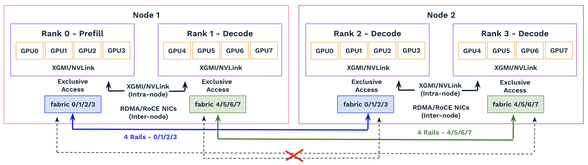
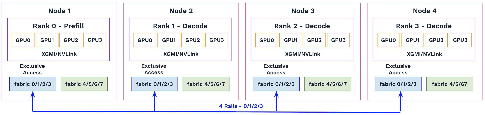
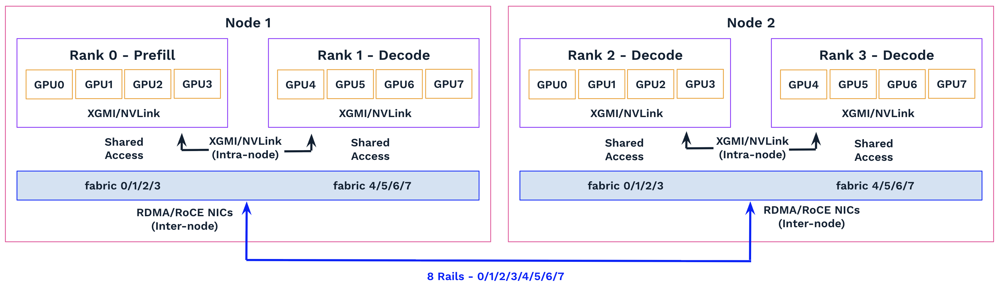
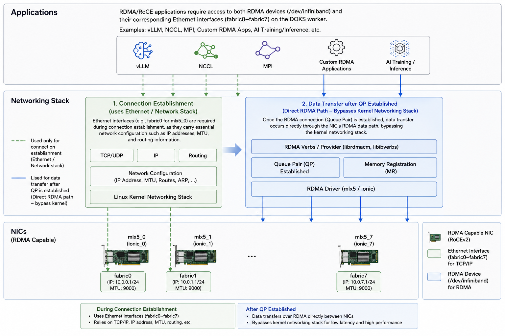

# RDMA Sharing Implementation for DOKS

Follow [amd-mn-k8s-environment.MD](amd-mn-k8s-environment.MD) to prepare the environment before proceeding. Also review [the setup flow](amd-mn-k8s-environment.MD#summary--pod-gpu-rdma-and-network-setup-flow) for GPU, RDMA, and pod networking, and understand the roles and limitations of the host device CNI.

## Why RDMA Sharing Is Necessary

For distributed training or inference workloads where each rank uses all eight GPUs on a node, the goal is to dedicate all eight RDMA/RoCE links exclusively to that rank. In this configuration, the host-device CNI is a good fit, as it provides the pod with exclusive, non-shared access to the RDMA network interfaces.

However, for workloads where each rank uses only one, two, or four GPUs, multiple ranks may be colocated on the same node and need to share the available RDMA/RoCE resources.

For example, in a prefill–decode disaggregated inference deployment with one prefill instance and three decode instances (each running a rank across four GPUs and four RDMA/RoCE NICs), the prefill instance transfers the computed KV cache to a selected decode instance for each request. This data movement between ranks uses XGMI/NVLink for intra-node communication and RDMA/RoCE for inter-node communication, requiring full connectivity between the prefill instance and all decode instances.

Without RDMA sharing, deploying two ranks per node—each with exclusive access to four RDMA/RoCE NICs—breaks this communication model. Because the GPU fabric follows [a rail-only architecture with eight independent forwarding planes](amd-mn-k8s-environment.MD#gpu-network-introduction), there is no RDMA/RoCE connectivity between ranks assigned to different NIC groups across nodes. For example, Rank 0 (Prefill) and Rank 3 (Decode) cannot communicate over RDMA/RoCE, and neither can Rank 1 and Rank 2 (although communication between the latter pair is not required in this use case).



To preserve the required communication paths, the deployment would require at least four nodes, with each rank consistently assigned the same set of four RDMA/RoCE NICs (for example, fabric0–fabric3 or fabric4–fabric7). This fragments the GPU resource pool and tightly couples workload placement to the underlying infrastructure, making deployments less flexible and increasing the operational complexity of handling topology changes and node failures.



With RDMA sharing enabled, each rank can access all eight RDMA/RoCE NICs on a node. This enables the workload to be consolidated onto just two nodes, improving resource utilization while preserving full connectivity, the required 1P → 3D communication pattern, and aggregate network bandwidth. It also decouples workload placement from fixed NIC assignments, making the deployment more resilient to scheduling changes and node failures.



## How RDMA Resources Are Shared

RDMA/RoCE applications require access to both the RDMA devices (/dev/infiniband) and their corresponding Ethernet interfaces (fabric0–fabric7) on the DOKS workers.

<details>
<summary>MI325x8</summary>

``` bash
# RDMA devices exposed by the mlx5 driver 
# ls /sys/class/infiniband/
mlx5_0	mlx5_1	mlx5_2	mlx5_3	mlx5_4	mlx5_5	mlx5_6	mlx5_7

# RDMA kernel device interfaces: RDMA control and verbs interfaces 
# Expose RDMA capabilities to user-space applications (e.g., NCCL, UCX, MPI, GPUDirect RDMA)
# ls /dev/infiniband/
by-ibdev  rdma_cm  umad1  umad3  umad5	umad7	 uverbs1  uverbs3  uverbs5  uverbs7
by-path   umad0    umad2  umad4  umad6	uverbs0  uverbs2  uverbs4  uverbs6

# RDMA GIDs per mlx5 device: each exposes RoCEv1 (GID[0], L2) and RoCEv2 (GID[1], IP/UDP)
# All GIDs are fe80:: link-local identifiers derived from NIC MAC, one per fabric rail
# Used by libibverbs/UCX/NCCL to select RDMA path and establish queue pair connectivity per interface
# ibv_devinfo -v | grep GID
			GID[  0]:		fe80:0000:0000:0000:90e3:17ff:fe97:8748, RoCE v1
			GID[  1]:		fe80::90e3:17ff:fe97:8748, RoCE v2
			GID[  0]:		fe80:0000:0000:0000:90e3:17ff:fe96:e7b8, RoCE v1
			GID[  1]:		fe80::90e3:17ff:fe96:e7b8, RoCE v2
			GID[  0]:		fe80:0000:0000:0000:90e3:17ff:fe96:e7b0, RoCE v1
			GID[  1]:		fe80::90e3:17ff:fe96:e7b0, RoCE v2
			GID[  0]:		fe80:0000:0000:0000:90e3:17ff:fe96:e8d8, RoCE v1
			GID[  1]:		fe80::90e3:17ff:fe96:e8d8, RoCE v2
			GID[  0]:		fe80:0000:0000:0000:90e3:17ff:fe96:e868, RoCE v1
			GID[  1]:		fe80::90e3:17ff:fe96:e868, RoCE v2
			GID[  0]:		fe80:0000:0000:0000:90e3:17ff:fe96:e7c8, RoCE v1
			GID[  1]:		fe80::90e3:17ff:fe96:e7c8, RoCE v2
			GID[  0]:		fe80:0000:0000:0000:90e3:17ff:fe96:e228, RoCE v1
			GID[  1]:		fe80::90e3:17ff:fe96:e228, RoCE v2
			GID[  0]:		fe80:0000:0000:0000:90e3:17ff:fe97:8d90, RoCE v1
			GID[  1]:		fe80::90e3:17ff:fe97:8d90, RoCE v2

# RDMA/RoCE fabric interfaces
# Each interface represents a physical or logical RDMA-capable port used for data-plane traffic
# ip -br a | grep fabric
fabric0          UP             fe80::90e3:17ff:fe97:8748/64 
fabric1          UP             fe80::90e3:17ff:fe96:e7b8/64 
fabric2          UP             fe80::90e3:17ff:fe96:e7b0/64 
fabric3          UP             fe80::90e3:17ff:fe96:e8d8/64 
fabric4          UP             fe80::90e3:17ff:fe96:e868/64 
fabric5          UP             fe80::90e3:17ff:fe96:e7c8/64 
fabric6          UP             fe80::90e3:17ff:fe96:e228/64 
fabric7          UP             fe80::90e3:17ff:fe97:8d90/64 
```

</details>
</br>

<details>
<summary>MI350x8</summary>

``` bash
# RDMA devices exposed by the ionic driver 
# ls /sys/class/infiniband/
ionic_0  ionic_1  ionic_2  ionic_3  ionic_4  ionic_5  ionic_6  ionic_7

# RDMA kernel device interfaces: RDMA control and verbs interfaces 
# Expose RDMA capabilities to user-space applications (e.g., NCCL, UCX, MPI, GPUDirect RDMA)
# ls /dev/infiniband/
by-ibdev  rdma_cm  umad1  umad3  umad5  umad7    uverbs1  uverbs3  uverbs5  uverbs7
by-path   umad0    umad2  umad4  umad6  uverbs0  uverbs2  uverbs4  uverbs6

# RDMA GIDs per ionic device: each exposes RoCEv2 (GID[0], IP/UDP) only
# All GIDs are fe80:: link-local identifiers derived from NIC MAC, one per fabric rail
# Used by libibverbs/UCX/NCCL to select RDMA path and establish queue pair connectivity per interface
# ibv_devinfo -v | grep GID
                        GID[  0]:               fe80::490:81ff:fe49:c440, RoCE v2
                        GID[  0]:               fe80::490:81ff:fe49:488, RoCE v2
                        GID[  0]:               fe80::490:81ff:fe49:18f8, RoCE v2
                        GID[  0]:               fe80::490:81ff:fe4a:6fb8, RoCE v2
                        GID[  0]:               fe80::490:81ff:fe49:85d0, RoCE v2
                        GID[  0]:               fe80::490:81ff:fe49:cbc0, RoCE v2
                        GID[  0]:               fe80::490:81ff:fe49:d280, RoCE v2
                        GID[  0]:               fe80::490:81ff:fe49:1eb0, RoCE v2

# RDMA/RoCE fabric interfaces
# Each interface represents a physical or logical RDMA-capable port used for data-plane traffic
# ip -br a | grep fabric
fabric0          UP             fe80::490:81ff:fe49:c440/64 
fabric1          UP             fe80::490:81ff:fe49:488/64 
fabric2          UP             fe80::490:81ff:fe49:18f8/64 
fabric3          UP             fe80::490:81ff:fe4a:6fb8/64 
fabric4          UP             fe80::490:81ff:fe49:85d0/64 
fabric5          UP             fe80::490:81ff:fe49:cbc0/64 
fabric6          UP             fe80::490:81ff:fe49:d280/64 
fabric7          UP             fe80::490:81ff:fe49:1eb0/64 
```

</details>
</br>

The DOKS-managed RDMA device plugin (rdma-shared-dp-ds) supports sharing RDMA resources across multiple pods. Kubernetes resource requests and limits determine how many pods can share a specific RDMA device (for example, mlx5_0 or ionic_0). Each RDMA device is assigned [an rdmaHcaMax capacity](https://github.com/Mellanox/k8s-rdma-shared-dev-plugin#rdma-shared-device-plugin-configurations) (default: 100 on DOKS), and each pod requests a portion of that capacity.

For example, if each pod requests 25, up to four pods can share the same RDMA device on a node. If exclusive access is required, a pod can request [the full capacity](rdma-sharing/rccl-test-2-nodes-mi350x8-ipvlan.yaml#L162) (100), which reserves the entire RDMA device and prevents any other pod from being scheduled to use it.

```
kubectl -n kube-system describe configmap rdma-devices 
kubectl get nodes
kubectl describe node NODE_NAME | grep fabric
```

The Ethernet interfaces, such as fabric0 for mlx5_0, are also required for RDMA/RoCE applications during connection establishment, as they carry essential network configuration such as IP addresses, MTU, and routing information. Once the RDMA connection (Queue Pair) is established, data transfer occurs directly through the NIC’s RDMA data path, bypassing the kernel networking stack.



To enable multiple pods to share access to the fabric0–fabric7 interfaces, [the ipvlan CNI](https://www.cni.dev/plugins/current/main/ipvlan/) can be used. It creates virtual fabricX interfaces inside each pod that are logically isolated but multiplexed over the same underlying physical fabricX interfaces on the DOKS worker. These virtual interfaces inherit the parent device’s network characteristics while avoiding MAC address explosion by sharing the MAC address of the underlying physical interface.

Each pod sees its own fabricX interface through ipvlan, providing isolated IP configuration and routing while the RDMA stack continues to operate on the shared physical NIC. Because [GID](https://networking-docs.nvidia.com/doca/archive/3-4-0/rdma-over-converged-ethernet#GID-Table-Population) (Global Identifier) entries are maintained at the physical NIC level and derived from the underlying network interfaces, all pods share the same RDMA devices and GID namespace. Each pod must therefore select the GID index corresponding to the IP assigned to its fabricX interface so that RDMA uses the correct network interface during connection setup. 

**The GID index can be configured either manually or automatically by setting the environment variable NCCL_IB_GID_INDEX to a specific value or to -1.**

[IPvlan](https://docs.docker.com/engine/network/drivers/ipvlan/) supports both L2 and L3 modes. In L2 mode, pods are assigned unique IP addresses while sharing the Layer 2 Ethernet domain of the underlying physical fabricX interface. Each rail in the GPU fabric remains an independent Layer 2 broadcast domain, allowing pods on the same subnet to communicate directly through ARP without Layer 3 routing. In L3 mode, pods also receive unique IP addresses, but traffic is forwarded using Layer 3 routing via static routes or dynamic routing protocols such as BGP, providing greater scalability and network isolation. Since the current rail-only GPU fabric consists of eight independent Layer 2 domains, IPvlan L2 mode aligns naturally with the existing network architecture, making it a simple and efficient solution.

To manage IP assignment on each fabricX interface, [the Whereabouts IPAM CNI](https://github.com/k8snetworkplumbingwg/whereabouts) can be used. It provides dynamic allocation of IPs from a predefined pool, ensuring each pod receives a unique address within the same subnet (corresponding to a GPU fabric rail).

[The macvlan CNI](https://www.cni.dev/plugins/current/main/macvlan/) is generally not recommended for this scenario. Unlike IPvlan, [Macvlan](https://docs.docker.com/engine/network/drivers/macvlan/) assigns a unique MAC address to each pod, increasing Layer 2 scaling overhead and the number of MAC addresses that upstream switches must learn. In virtualized environments, it also requires the hypervisor on the DO servers to allow multiple MAC addresses per vNIC (typically through promiscuous mode or MAC spoofing) for DOKS workers, a capability that is commonly restricted in public cloud deployments.


## Enabling RDMA Sharing in DOKS

### Step 1 - Multus CNI

Install the Multus CNI by following the instructions in [this guide](amd-mn-k8s-environment.MD#multus-cni).

### Step 2 - Whereabouts IPAM CNI 

Install the Whereabouts IPAM CNI by following the instructions in [this guide](https://github.com/k8snetworkplumbingwg/whereabouts).

``` bash
# git clone https://github.com/k8snetworkplumbingwg/whereabouts && cd whereabouts
# kubectl apply \
    -f doc/crds/daemonset-install.yaml \
    -f doc/crds/whereabouts.cni.cncf.io_ippools.yaml \
    -f doc/crds/whereabouts.cni.cncf.io_overlappingrangeipreservations.yaml \
    -f doc/crds/reconciler-deployment.yaml

serviceaccount/whereabouts created
clusterrolebinding.rbac.authorization.k8s.io/whereabouts created
clusterrole.rbac.authorization.k8s.io/whereabouts-cni created
configmap/whereabouts-config created
daemonset.apps/whereabouts created
customresourcedefinition.apiextensions.k8s.io/ippools.whereabouts.cni.cncf.io created
customresourcedefinition.apiextensions.k8s.io/overlappingrangeipreservations.whereabouts.cni.cncf.io created
deployment.apps/whereabouts-reconciler created

# kubectl -n kube-system describe configmap whereabouts-config 
# kubectl -n kube-system describe daemonset whereabouts
```

### Step 3 - iplvan CNI

The ipvlan CNI plugin is preinstalled in DOKS workers:

``` bash
ls -l /opt/cni/bin/
total 248492
-rw-r--r-- 1 root root    11357 Dec 11  2024 LICENSE
-rw-r--r-- 1 root root     2343 Dec 11  2024 README.md
-rwxr-xr-x 1 root root  4648054 Dec 11  2024 bandwidth
-rwxr-xr-x 1 root root  5283567 Dec 11  2024 bridge
-rwxr-xr-x 1 root root 69731072 Jun 18 03:25 cilium-cni
-rwxr-xr-x 1 root root 12771199 Dec 11  2024 dhcp
-rwxr-xr-x 1 root root  4843811 Dec 11  2024 dummy
-rwxr-xr-x 1 root root  5312426 Dec 11  2024 firewall
-rwxr-xr-x 1 root root  4784447 Dec 11  2024 host-device
-rwxr-xr-x 1 root root  4047543 Dec 11  2024 host-local
-rwxr-xr-x 1 root root  4860660 Dec 11  2024 ipvlan        # Preinstalled
-rwxr-xr-x 1 root root  4896553 Dec 11  2024 macvlan
-rwxr-xr-x 1 root root 49479534 Jun 20 18:41 multus-shim
-rwxr-xr-x 1 root root  3719482 Jun 20 18:41 passthru
-rwxr-xr-x 1 root root  4703145 Dec 11  2024 portmap
-rwxr-xr-x 1 root root  5068216 Dec 11  2024 ptp
-rwxr-xr-x 1 root root  4330463 Dec 11  2024 sbr
-rwxr-xr-x 1 root root  3648356 Dec 11  2024 static
-rwxr-xr-x 1 root root  4920887 Dec 11  2024 tap
-rwxr-xr-x 1 root root  4195353 Dec 11  2024 tuning
-rwxr-xr-x 1 root root  4854297 Dec 11  2024 vlan
-rwxr-xr-x 1 root root  4481459 Dec 11  2024 vrf
-rwxr-xr-x 1 root root 39700247 Jun 28 18:55 whereabouts   # Installed by the Whereabouts IPAM CNI
```

### Step 4 - NAD

[NetworkAttachmentDefinitions](https://github.com/k8snetworkplumbingwg/multus-cni/blob/master/docs/how-to-use.md#create-network-attachment-definition) (NADs) define the configuration for secondary networks but do not create or attach network interfaces themselves. Instead, pods reference NADs through annotations, and Multus CNI uses the referenced definitions to create and attach the corresponding interfaces during pod creation. A NAD only needs to be defined once and can reside in any namespace, provided it is accessible to Multus when the pod is created.

Prepare and deploy [rdma-sharing/ipvlan-network-attachments.yaml](rdma-sharing/ipvlan-network-attachments.yaml) configuration file to create virtual fabricX interfaces for pods while using Multus CNI with the ipvlan CNI plugin.

<details>
<summary>ipvlan-network-attachments.yaml</summary>

``` yaml 
# Define additional network interfaces that pods can attach to. 
apiVersion: k8s.cni.cncf.io/v1
kind: NetworkAttachmentDefinition
metadata:
  name: ipvlan-fabric0
spec:
  # The virtual fabricX interface will be created and assigned into the pod using the ipvlan CNI.
  # A unique IP pool is configured for each rail using the Whereabouts IPAM CNI.
  # Use ipvlan L2 mode, which removes the need for routing configuration within pods.
  config: '{
      "cniVersion": "0.3.1",
      "type": "ipvlan",
      "master": "fabric0",
      "mode": "l2",
      "ipam": {  
        "type": "whereabouts",
        "range": "192.168.100.0/24"
      }
    }'
---
apiVersion: k8s.cni.cncf.io/v1
kind: NetworkAttachmentDefinition
metadata:
  name: ipvlan-fabric1
spec:
  config: '{
      "cniVersion": "0.3.1",
      "type": "ipvlan",
      "master": "fabric1",
      "mode": "l2",
      "ipam": {  
        "type": "whereabouts",
        "range": "192.168.101.0/24"
      }
    }'
---
apiVersion: k8s.cni.cncf.io/v1
kind: NetworkAttachmentDefinition
metadata:
  name: ipvlan-fabric2
spec:
  config: '{
      "cniVersion": "0.3.1",
      "type": "ipvlan",
      "master": "fabric2",
      "mode": "l2",
      "ipam": {  
        "type": "whereabouts",
        "range": "192.168.102.0/24"
      }
    }'
---
apiVersion: k8s.cni.cncf.io/v1
kind: NetworkAttachmentDefinition
metadata:
  name: ipvlan-fabric3
spec:
  config: '{
      "cniVersion": "0.3.1",
      "type": "ipvlan",
      "master": "fabric3",
      "mode": "l2",
      "ipam": {  
        "type": "whereabouts",
        "range": "192.168.103.0/24"
      }
    }'
---
apiVersion: k8s.cni.cncf.io/v1
kind: NetworkAttachmentDefinition
metadata:
  name: ipvlan-fabric4
spec:
  config: '{
      "cniVersion": "0.3.1",
      "type": "ipvlan",
      "master": "fabric4",
      "mode": "l2",
      "ipam": {  
        "type": "whereabouts",
        "range": "192.168.104.0/24"
      }
    }'
---
apiVersion: k8s.cni.cncf.io/v1
kind: NetworkAttachmentDefinition
metadata:
  name: ipvlan-fabric5
spec:
  config: '{
      "cniVersion": "0.3.1",
      "type": "ipvlan",
      "master": "fabric5",
      "mode": "l2",
      "ipam": {  
        "type": "whereabouts",
        "range": "192.168.105.0/24"
      }
    }'
---
apiVersion: k8s.cni.cncf.io/v1
kind: NetworkAttachmentDefinition
metadata:
  name: ipvlan-fabric6
spec:
  config: '{
      "cniVersion": "0.3.1",
      "type": "ipvlan",
      "master": "fabric6",
      "mode": "l2",
      "ipam": {  
        "type": "whereabouts",
        "range": "192.168.106.0/24"
      }
    }'
---
apiVersion: k8s.cni.cncf.io/v1
kind: NetworkAttachmentDefinition
metadata:
  name: ipvlan-fabric7
spec:
  config: '{
      "cniVersion": "0.3.1",
      "type": "ipvlan",
      "master": "fabric7",
      "mode": "l2",
      "ipam": {  
        "type": "whereabouts",
        "range": "192.168.107.0/24"
      }
    }'
---
```

</details>
<br>

``` bash
# kubectl apply  -f rdma-sharing/ipvlan-network-attachments.yaml  

networkattachmentdefinition.k8s.cni.cncf.io/ipvlan-fabric0 created
networkattachmentdefinition.k8s.cni.cncf.io/ipvlan-fabric1 created
networkattachmentdefinition.k8s.cni.cncf.io/ipvlan-fabric2 created
networkattachmentdefinition.k8s.cni.cncf.io/ipvlan-fabric3 created
networkattachmentdefinition.k8s.cni.cncf.io/ipvlan-fabric4 created
networkattachmentdefinition.k8s.cni.cncf.io/ipvlan-fabric5 created
networkattachmentdefinition.k8s.cni.cncf.io/ipvlan-fabric6 created
networkattachmentdefinition.k8s.cni.cncf.io/ipvlan-fabric7 created

kubectl get network-attachment-definitions
kubectl describe network-attachment-definitions
kubectl delete -f rdma-sharing/ipvlan-network-attachments.yaml 
```

## Summary – Pod GPU, RDMA and Network Setup Flow

| Component                                       | Action                                                          | Output                                                |
| ----------------------------------------------- | --------------------------------------------------------------- | ----------------------------------------------------- |
| **kubelet**                                     | Creates the pod and invokes the CNI plugins                     | Starts the pod networking workflow                    |
| **Multus CNI**                                  | Orchestrates multiple CNI plugins                               | Attaches the primary and secondary network interfaces |
| **↳ Cilium (primary CNI)**                      | Configures the default Kubernetes pod network                   | `eth0` inside the pod                                 |
| **↳ ipvlan + Whereabouts IPAM (secondary CNI)** | Creates additional `ipvlan` interfaces and assigns IP addresses | `fabric0`–`fabric7` inside the pod                    |
| **RDMA Device Plugin**                          | Advertises RDMA resources and mounts RDMA device files          | `/dev/infiniband` inside the pod                      |
| **GPU Device Plugin**                           | Advertises GPU resources and mounts GPU device files            | `/dev/kfd` and `/dev/dri` inside the pod              |


## Example: RDMA Resource Sharing Across Applications

### Application Deployment

Create a Kubernetes ConfigMap that stores [amd-mn-doks/p2p_bw_test.py](amd-mn-doks/p2p_bw_test.py). The ConfigMap will be mounted into the pods so the script can run in a distributed environment.

``` bash
# Mount the test script into the Pods.
# kubectl create configmap mn-python-script --from-file=amd-mn-doks/p2p_bw_test.py

# kubectl describe configmap mn-python-script
# kubectl delete configmap mn-python-script
```

Build and deploy the Kubernetes manifest [rdma-sharing/mn-deployment-example-ipvlan-4pods-2nodes.yaml](rdma-sharing/mn-deployment-example-ipvlan-4pods-2nodes.yaml) to create four 4-GPU Pods across two DOKS workers with RDMA sharing enabled on all RDMA devices. Each pod requests 10 RDMA shares (out of the 100 configured by rdmaHcaMax) for each shared RDMA device and is assigned a dedicated virtual fabricX interface for it, allowing it to configure its own IP address while sharing the underlying physical RDMA NICs.

This deployment simulates multiple distributed applications concurrently sharing the same RDMA devices.

<details>
<summary>mn-deployment-example-ipvlan-4pods-2nodes.yaml</summary>

``` yaml
apiVersion: apps/v1
kind: Deployment
metadata:
  name: mn-deployment-example-ipvlan
spec:
  replicas: 4
  selector:
    matchLabels:
      app: mn-deployment-example-ipvlan
  template:
    metadata:
      labels:
        app: mn-deployment-example-ipvlan
      annotations:
        # Request Multus CNI to create and attach 8 additional fabricX interfaces to the Pod. 
        # After Pod creation, the container will have the default Cilium interface (eth0) plus fabric0–fabric7 for high-performance RDMA/RoCE communication.
        k8s.v1.cni.cncf.io/networks: >-
          ipvlan-fabric0@fabric0,
          ipvlan-fabric1@fabric1,
          ipvlan-fabric2@fabric2,
          ipvlan-fabric3@fabric3,
          ipvlan-fabric4@fabric4,
          ipvlan-fabric5@fabric5,
          ipvlan-fabric6@fabric6,
          ipvlan-fabric7@fabric7
    spec:
      restartPolicy: Always
      #hostNetwork: true
      nodeSelector:
        doks.digitalocean.com/gpu-brand: amd

      tolerations:
        - key: amd.com/gpu
          operator: Exists
          effect: NoSchedule

      volumes:
        - name: temp-hf-cache
          hostPath:
            path: /root/.cache/huggingface
            type: DirectoryOrCreate

        - name: dshm 
          emptyDir:
            medium: Memory
            sizeLimit: 128Gi

        - name: temp-python-script       
          configMap:
            name: mn-python-script

      containers:

        - name: server
          image: rocm/pytorch:rocm7.2.2_ubuntu24.04_py3.12_pytorch_release_2.7.1
          imagePullPolicy: Always
          ports:
            - containerPort: 8000
              name: http-example

          command: ["/bin/bash", "-lc"]
          args:
            - |
             set -ex
          
             apt update
             apt install -y iproute2 iputils-ping infiniband-diags ibverbs-utils net-tools
             
             #For MI350x8, to install userspace RDMA provider for AMD Pensando Pollara NICs, and not required for MI325x8
             echo 'deb [arch=amd64 signed-by=/etc/apt/keyrings/rocm.gpg] https://repo.radeon.com/amdainic/pensando/ubuntu/1.117.1-a-63 noble main' > /etc/apt/sources.list.d/ainic.list    
             apt update &&  apt install -y libionic1

             exec sleep infinity 
 
          securityContext:
            #privileged: true 
            capabilities:
              # Adding IPC_LOCK grants the container permission to lock memory in RAM
              # Because NCCL + RDMA need to pin memory (keep it fixed in RAM) so the NIC and GPU can do direct memory access (DMA)
              # Without IPC_LOCK the kernel may block or limit that pinning, causing RDMA registration failures and the code to crash during communication setup
              add:
              - IPC_LOCK

          volumeMounts:
            - name: temp-hf-cache
              mountPath: /root/.cache/huggingface

            - name: dshm
              mountPath: /dev/shm

            - name: temp-python-script
              mountPath: /p2p_bw_test.py
              subPath: p2p_bw_test.py

          resources:
            limits:
              # Request 4 AMD GPUs on the node.
              # The AMD GPU device allocates the GPUs and mounts the required GPU device files (/dev/kfd and /dev/dri) into the pod.
              amd.com/gpu: "4"
              # Request 10 RDMA shares (out of the 100 configured by `rdmaHcaMax`) from each fabric. 
              # The RDMA shared device plugin advertises and manages these resources, and mounts the corresponding RDMA device files (/dev/infiniband/*) into the container.
              rdma/fabric0: 10
              rdma/fabric1: 10
              rdma/fabric2: 10
              rdma/fabric3: 10
              rdma/fabric4: 10
              rdma/fabric5: 10
              rdma/fabric6: 10
              rdma/fabric7: 10
            requests:
              amd.com/gpu: "4"
              rdma/fabric0: 10
              rdma/fabric1: 10
              rdma/fabric2: 10
              rdma/fabric3: 10
              rdma/fabric4: 10
              rdma/fabric5: 10
              rdma/fabric6: 10
              rdma/fabric7: 10
```
</details>
<br>

<details>
<summary>MI325x8 DOKS</summary>

``` bash
# kubectl get nodes -o wide
NAME                          STATUS   ROLES    AGE    VERSION   INTERNAL-IP   EXTERNAL-IP       OS-IMAGE                       KERNEL-VERSION        CONTAINER-RUNTIME
rs-mn-cpu-power-pool-3crqkh   Ready    <none>   7d1h   v1.34.1   10.118.0.8    165.22.238.61     Debian GNU/Linux 13 (trixie)   6.12.48+deb13-amd64   containerd://1.7.28
rs-mn-mi325x8-pool-3c35jt     Ready    <none>   14d    v1.34.1   10.118.0.6    138.197.135.192   Debian GNU/Linux 13 (trixie)   6.12.48+deb13-amd64   containerd://1.7.28
rs-mn-mi325x8-pool-3cmiju     Ready    <none>   11d    v1.34.1   10.118.0.7    167.99.176.197    Debian GNU/Linux 13 (trixie)   6.12.48+deb13-amd64   containerd://1.7.28

# kubectl apply -f rdma-sharing/mn-deployment-example-ipvlan-4pods-2nodes.yaml
# kubectl delete -f rdma-sharing/mn-deployment-example-ipvlan-4pods-2nodes.yaml

# kubectl get pods -o wide
NAME                                            READY   STATUS    RESTARTS   AGE   IP             NODE                        NOMINATED NODE   READINESS GATES
mn-deployment-example-ipvlan-56f4fbcb4b-4s6rj   1/1     Running   0          2m    10.119.0.225   rs-mn-mi325x8-pool-3c35jt   <none>           <none>
mn-deployment-example-ipvlan-56f4fbcb4b-lqzpv   1/1     Running   0          2m    10.119.1.4     rs-mn-mi325x8-pool-3cmiju   <none>           <none>
mn-deployment-example-ipvlan-56f4fbcb4b-qrgwq   1/1     Running   0          2m    10.119.1.31    rs-mn-mi325x8-pool-3cmiju   <none>           <none>
mn-deployment-example-ipvlan-56f4fbcb4b-rlxkv   1/1     Running   0          2m    10.119.0.229   rs-mn-mi325x8-pool-3c35jt   <none>           <none>

# 20 shares are used for each RDMA device on the DOKS worker
# kubectl describe node rs-mn-mi325x8-pool-3c35jt
Name:               rs-mn-mi325x8-pool-3c35jt
Roles:              <none>
Labels:             amd.com/gpu=8
                    beta.kubernetes.io/arch=amd64
                    beta.kubernetes.io/instance-type=gpu-mi325x8-2048gb-fabric-contracted
                    beta.kubernetes.io/os=linux
                    doks.digitalocean.com/gpu-brand=amd
                    doks.digitalocean.com/gpu-model=mi325x
                    doks.digitalocean.com/is-gpu-fabric-connected=true
                    doks.digitalocean.com/managed=true
                    doks.digitalocean.com/node-id=cda0446b-5bd4-46c2-a23a-11f573d2b77b
                    doks.digitalocean.com/node-pool=rs-mn-mi325x8-pool
                    doks.digitalocean.com/node-pool-id=eadcdf7e-1e48-4692-8ab3-92c2389f8fbc
                    doks.digitalocean.com/version=1.34.1-do.2
                    failure-domain.beta.kubernetes.io/region=tor1
                    kubernetes.io/arch=amd64
                    kubernetes.io/hostname=rs-mn-mi325x8-pool-3c35jt
                    kubernetes.io/os=linux
                    node.kubernetes.io/instance-type=gpu-mi325x8-2048gb-fabric-contracted
                    region=tor1
                    topology.kubernetes.io/region=tor1
Annotations:        alpha.kubernetes.io/provided-node-ip: 10.118.0.6
                    csi.volume.kubernetes.io/nodeid: {"dobs.csi.digitalocean.com":"577982029"}
                    network.cilium.io/ipv4-Ingress-ip: 10.119.0.143
                    network.cilium.io/ipv4-cilium-host: 10.119.0.207
                    network.cilium.io/ipv4-health-ip: 10.119.0.213
                    network.cilium.io/ipv4-pod-cidr: 10.119.0.128/25
                    node.alpha.kubernetes.io/ttl: 0
                    volumes.kubernetes.io/controller-managed-attach-detach: true
CreationTimestamp:  Tue, 16 Jun 2026 03:56:26 +0000
Taints:             amd.com/gpu:NoSchedule
Unschedulable:      false
Lease:
  HolderIdentity:  rs-mn-mi325x8-pool-3c35jt
  AcquireTime:     <unset>
  RenewTime:       Wed, 01 Jul 2026 23:52:50 +0000
Conditions:
  Type                             Status  LastHeartbeatTime                 LastTransitionTime                Reason                       Message
  ----                             ------  -----------------                 ------------------                ------                       -------
  NetworkUnavailable               False   Tue, 16 Jun 2026 03:56:59 +0000   Tue, 16 Jun 2026 03:56:59 +0000   CiliumIsUp                   Cilium is running on this node
  MemoryPressure                   False   Wed, 01 Jul 2026 23:51:07 +0000   Thu, 18 Jun 2026 03:25:33 +0000   KubeletHasSufficientMemory   kubelet has sufficient memory available
  DiskPressure                     False   Wed, 01 Jul 2026 23:51:07 +0000   Thu, 18 Jun 2026 03:25:33 +0000   KubeletHasNoDiskPressure     kubelet has no disk pressure
  PIDPressure                      False   Wed, 01 Jul 2026 23:51:07 +0000   Thu, 18 Jun 2026 03:25:33 +0000   KubeletHasSufficientPID      kubelet has sufficient PID available
  Ready                            True    Wed, 01 Jul 2026 23:51:07 +0000   Thu, 18 Jun 2026 03:25:33 +0000   KubeletReady                 kubelet is posting ready status
  doks.kubernetes.io/AmdGpuReady   True    Wed, 01 Jul 2026 23:52:32 +0000   Sun, 28 Jun 2026 00:17:32 +0000   EndpointOK                   Endpoint reports ready at http://127.0.0.1:5000/metrics
Addresses:
  InternalIP:  10.118.0.6
  Hostname:    rs-mn-mi325x8-pool-3c35jt
  ExternalIP:  138.197.135.192
Capacity:
  amd.com/gpu:        8
  cpu:                160
  ephemeral-storage:  2111508792Ki
  hugepages-1Gi:      0
  hugepages-2Mi:      0
  memory:             1321048400Ki
  pods:               110
  rdma/fabric0:       100
  rdma/fabric1:       100
  rdma/fabric10:      0
  rdma/fabric11:      0
  rdma/fabric12:      0
  rdma/fabric13:      0
  rdma/fabric14:      0
  rdma/fabric15:      0
  rdma/fabric2:       100
  rdma/fabric3:       100
  rdma/fabric4:       100
  rdma/fabric5:       100
  rdma/fabric6:       100
  rdma/fabric7:       100
  rdma/fabric8:       0
  rdma/fabric9:       0
Allocatable:
  amd.com/gpu:        8
  cpu:                159500m
  ephemeral-storage:  1945966499486
  hugepages-1Gi:      0
  hugepages-2Mi:      0
  memory:             1287435600Ki
  pods:               110
  rdma/fabric0:       100
  rdma/fabric1:       100
  rdma/fabric10:      0
  rdma/fabric11:      0
  rdma/fabric12:      0
  rdma/fabric13:      0
  rdma/fabric14:      0
  rdma/fabric15:      0
  rdma/fabric2:       100
  rdma/fabric3:       100
  rdma/fabric4:       100
  rdma/fabric5:       100
  rdma/fabric6:       100
  rdma/fabric7:       100
  rdma/fabric8:       0
  rdma/fabric9:       0
System Info:
  Machine ID:                 4b4333cb3b764115bb9f3e8dba698823
  System UUID:                4b4333cb-3b76-4115-bb9f-3e8dba698823
  Boot ID:                    d01e78a3-b364-4191-b5b3-70a7092d7ce7
  Kernel Version:             6.12.48+deb13-amd64
  OS Image:                   Debian GNU/Linux 13 (trixie)
  Operating System:           linux
  Architecture:               amd64
  Container Runtime Version:  containerd://1.7.28
  Kubelet Version:            v1.34.1
  Kube-Proxy Version:         
ProviderID:                   digitalocean://577982029
Non-terminated Pods:          (11 in total)
  Namespace                   Name                                               CPU Requests  CPU Limits  Memory Requests  Memory Limits  Age
  ---------                   ----                                               ------------  ----------  ---------------  -------------  ---
  default                     mn-deployment-example-ipvlan-56f4fbcb4b-4s6rj      0 (0%)        0 (0%)      0 (0%)           0 (0%)         3m25s
  default                     mn-deployment-example-ipvlan-56f4fbcb4b-rlxkv      0 (0%)        0 (0%)      0 (0%)           0 (0%)         3m25s
  kube-system                 amd-gpu-device-plugin-k6dc6                        0 (0%)        0 (0%)      0 (0%)           0 (0%)         13d
  kube-system                 cilium-q6vr2                                       320m (0%)     0 (0%)      350Mi (0%)       50Mi (0%)      13d
  kube-system                 cpc-bridge-proxy-ebpf-lvfq8                        100m (0%)     0 (0%)      75Mi (0%)        0 (0%)         15d
  kube-system                 csi-do-node-n4bpm                                  0 (0%)        0 (0%)      0 (0%)           0 (0%)         13d
  kube-system                 do-node-agent-amd-device-metrics-exporter-q22r6    312m (0%)     1050m (0%)  312Mi (0%)       1356Mi (0%)    3d23h
  kube-system                 doks-telemetry-config-reloader-x5r97               0 (0%)        0 (0%)      0 (0%)           0 (0%)         15d
  kube-system                 kube-multus-ds-7kwlc                               100m (0%)     100m (0%)   50Mi (0%)        50Mi (0%)      11d
  kube-system                 rdma-shared-dp-ds-b9n4j                            0 (0%)        0 (0%)      0 (0%)           0 (0%)         13d
  kube-system                 whereabouts-vb7pk                                  100m (0%)     100m (0%)   100Mi (0%)       200Mi (0%)     3d4h
Allocated resources:
  (Total limits may be over 100 percent, i.e., overcommitted.)
  Resource           Requests    Limits
  --------           --------    ------
  cpu                932m (0%)   1250m (0%)
  memory             887Mi (0%)  1656Mi (0%)
  ephemeral-storage  5Gi (0%)    10Gi (0%)
  hugepages-1Gi      0 (0%)      0 (0%)
  hugepages-2Mi      0 (0%)      0 (0%)
  amd.com/gpu        8           8
  rdma/fabric0       20          20
  rdma/fabric1       20          20
  rdma/fabric10      0           0
  rdma/fabric11      0           0
  rdma/fabric12      0           0
  rdma/fabric13      0           0
  rdma/fabric14      0           0
  rdma/fabric15      0           0
  rdma/fabric2       20          20
  rdma/fabric3       20          20
  rdma/fabric4       20          20
  rdma/fabric5       20          20
  rdma/fabric6       20          20
  rdma/fabric7       20          20
  rdma/fabric8       0           0
  rdma/fabric9       0           0
Events:              <none>
```

</details>
</br>

<details>
<summary>MI350x8 DOKS</summary>

``` bash
# kubectl get nodes -o wide
NAME                        STATUS   ROLES    AGE     VERSION   INTERNAL-IP   EXTERNAL-IP      OS-IMAGE                       KERNEL-VERSION    CONTAINER-RUNTIME
rs-mn-cpu-pool-381iam       Ready    <none>   34d     v1.34.1   10.120.0.6    167.71.156.33    Debian GNU/Linux 13 (trixie)   6.12.48+deb13-amd64   containerd://1.7.28
rs-mn-mi350x8-pool-3ckyx0   Ready    <none>   2d13h   v1.34.1   10.120.0.3    167.172.123.21   Debian GNU/Linux 13 (trixie)   6.12.48+deb13-amd64   containerd://1.7.28
rs-mn-mi350x8-pool-3cv7zt   Ready    <none>   8m34s   v1.34.1   10.120.0.4    167.99.161.247   Debian GNU/Linux 13 (trixie)   6.12.48+deb13-amd64   containerd://1.7.28

# kubectl apply -f rdma-sharing/mn-deployment-example-ipvlan-4pods-2nodes.yaml
# kubectl delete -f rdma-sharing/mn-deployment-example-ipvlan-4pods-2nodes.yaml

# kubectl get pods -o wide
NAME                                            READY   STATUS    RESTARTS   AGE   IP             NODE                        NOMINATED NODE   READINESS GATES
mn-deployment-example-ipvlan-56f4fbcb4b-5wkmg   1/1     Running   0          46h   10.121.4.25    rs-mn-mi350x8-pool-3ckyx0   <none>           <none>
mn-deployment-example-ipvlan-56f4fbcb4b-9slbd   1/1     Running   0          46h   10.121.4.150   rs-mn-mi350x8-pool-3cv7zt   <none>           <none>
mn-deployment-example-ipvlan-56f4fbcb4b-mqr88   1/1     Running   0          46h   10.121.4.66    rs-mn-mi350x8-pool-3ckyx0   <none>           <none>
mn-deployment-example-ipvlan-56f4fbcb4b-z5v8z   1/1     Running   0          46h   10.121.4.210   rs-mn-mi350x8-pool-3cv7zt   <none>           <none>

# 20 shares are used for each RDMA device on the DOKS worker
# kubectl describe node rs-mn-mi325x8-pool-3c35jt
Name:               rs-mn-mi350x8-pool-3ckyx0
Roles:              <none>
Labels:             amd.com/gpu=8
                    beta.kubernetes.io/arch=amd64
                    beta.kubernetes.io/instance-type=gpu-mi350x8-2304gb-fabric-contracted
                    beta.kubernetes.io/os=linux
                    doks.digitalocean.com/gpu-brand=amd
                    doks.digitalocean.com/gpu-model=mi350x
                    doks.digitalocean.com/is-gpu-fabric-connected=true
                    doks.digitalocean.com/managed=true
                    doks.digitalocean.com/node-id=01b47d2c-b6c0-4156-b2ac-132459530fac
                    doks.digitalocean.com/node-pool=rs-mn-mi350x8-pool
                    doks.digitalocean.com/node-pool-id=269062e6-0689-49ed-9a7d-bb80779adbb9
                    doks.digitalocean.com/version=1.34.1-do.2
                    failure-domain.beta.kubernetes.io/region=sfo2
                    kubernetes.io/arch=amd64
                    kubernetes.io/hostname=rs-mn-mi350x8-pool-3ckyx0
                    kubernetes.io/os=linux
                    node.kubernetes.io/instance-type=gpu-mi350x8-2304gb-fabric-contracted
                    region=sfo2
                    topology.kubernetes.io/region=sfo2
Annotations:        alpha.kubernetes.io/provided-node-ip: 10.120.0.3
                    csi.volume.kubernetes.io/nodeid: {"dobs.csi.digitalocean.com":"581938911"}
                    network.cilium.io/ipv4-Ingress-ip: 10.121.4.39
                    network.cilium.io/ipv4-cilium-host: 10.121.4.17
                    network.cilium.io/ipv4-health-ip: 10.121.4.118
                    network.cilium.io/ipv4-pod-cidr: 10.121.4.0/25
                    node.alpha.kubernetes.io/ttl: 0
                    volumes.kubernetes.io/controller-managed-attach-detach: true
CreationTimestamp:  Fri, 03 Jul 2026 01:33:07 +0000
Taints:             amd.com/gpu:NoSchedule
Unschedulable:      false
Lease:
  HolderIdentity:  rs-mn-mi350x8-pool-3ckyx0
  AcquireTime:     <unset>
  RenewTime:       Fri, 03 Jul 2026 17:03:28 +0000
Conditions:
  Type                             Status  LastHeartbeatTime                 LastTransitionTime                Reason                       Message
  ----                             ------  -----------------                 ------------------                ------                       -------
  NetworkUnavailable               False   Fri, 03 Jul 2026 01:33:43 +0000   Fri, 03 Jul 2026 01:33:43 +0000   CiliumIsUp                   Cilium is running on this node
  MemoryPressure                   False   Fri, 03 Jul 2026 17:01:05 +0000   Fri, 03 Jul 2026 01:33:07 +0000   KubeletHasSufficientMemory   kubelet has sufficient memory available
  DiskPressure                     False   Fri, 03 Jul 2026 17:01:05 +0000   Fri, 03 Jul 2026 01:33:07 +0000   KubeletHasNoDiskPressure     kubelet has no disk pressure
  PIDPressure                      False   Fri, 03 Jul 2026 17:01:05 +0000   Fri, 03 Jul 2026 01:33:07 +0000   KubeletHasSufficientPID      kubelet has sufficient PID available
  Ready                            True    Fri, 03 Jul 2026 17:01:05 +0000   Fri, 03 Jul 2026 01:33:39 +0000   KubeletReady                 kubelet is posting ready status
  doks.kubernetes.io/AmdGpuReady   True    Fri, 03 Jul 2026 17:03:31 +0000   Fri, 03 Jul 2026 01:34:01 +0000   EndpointOK                   Endpoint reports ready at http://127.0.0.1:5000/metrics
Addresses:
  InternalIP:  10.120.0.3
  Hostname:    rs-mn-mi350x8-pool-3ckyx0
  ExternalIP:  167.172.123.21
Capacity:
  amd.com/gpu:        8
  cpu:                192
  ephemeral-storage:  2111508792Ki
  hugepages-1Gi:      0
  hugepages-2Mi:      0
  memory:             2113762604Ki
  pods:               110
  rdma/fabric0:       100
  rdma/fabric1:       100
  rdma/fabric10:      0
  rdma/fabric11:      0
  rdma/fabric12:      0
  rdma/fabric13:      0
  rdma/fabric14:      0
  rdma/fabric15:      0
  rdma/fabric2:       100
  rdma/fabric3:       100
  rdma/fabric4:       100
  rdma/fabric5:       100
  rdma/fabric6:       100
  rdma/fabric7:       100
  rdma/fabric8:       0
  rdma/fabric9:       0
Allocatable:
  amd.com/gpu:        8
  cpu:                191420m
  ephemeral-storage:  1945966499486
  hugepages-1Gi:      0
  hugepages-2Mi:      0
  memory:             2064043308Ki
  pods:               110
  rdma/fabric0:       100
  rdma/fabric1:       100
  rdma/fabric10:      0
  rdma/fabric11:      0
  rdma/fabric12:      0
  rdma/fabric13:      0
  rdma/fabric14:      0
  rdma/fabric15:      0
  rdma/fabric2:       100
  rdma/fabric3:       100
  rdma/fabric4:       100
  rdma/fabric5:       100
  rdma/fabric6:       100
  rdma/fabric7:       100
  rdma/fabric8:       0
  rdma/fabric9:       0
System Info:
  Machine ID:                 5adeb75607b74b83820902ed455326b0
  System UUID:                5adeb756-07b7-4b83-8209-02ed455326b0
  Boot ID:                    c756b37d-817e-4621-a5c6-b804f1d241da
  Kernel Version:             6.12.48+deb13-amd64
  OS Image:                   Debian GNU/Linux 13 (trixie)
  Operating System:           linux
  Architecture:               amd64
  Container Runtime Version:  containerd://1.7.28
  Kubelet Version:            v1.34.1
  Kube-Proxy Version:         
ProviderID:                   digitalocean://581938911
Non-terminated Pods:          (11 in total)
  Namespace                   Name                                               CPU Requests  CPU Limits  Memory Requests  Memory Limits  Age
  ---------                   ----                                               ------------  ----------  ---------------  -------------  ---
  default                     mn-deployment-example-ipvlan-56f4fbcb4b-5wkmg      0 (0%)        0 (0%)      0 (0%)           0 (0%)         100s
  default                     mn-deployment-example-ipvlan-56f4fbcb4b-mqr88      0 (0%)        0 (0%)      0 (0%)           0 (0%)         100s
  kube-system                 amd-gpu-device-plugin-hfjdd                        0 (0%)        0 (0%)      0 (0%)           0 (0%)         15h
  kube-system                 cilium-qwrf8                                       320m (0%)     0 (0%)      350Mi (0%)       50Mi (0%)      15h
  kube-system                 cpc-bridge-proxy-ebpf-rz7dq                        100m (0%)     0 (0%)      75Mi (0%)        0 (0%)         15h
  kube-system                 csi-do-node-d7zns                                  0 (0%)        0 (0%)      0 (0%)           0 (0%)         15h
  kube-system                 do-node-agent-amd-device-metrics-exporter-64x9r    312m (0%)     1050m (0%)  312Mi (0%)       1356Mi (0%)    15h
  kube-system                 doks-telemetry-config-reloader-xfsnr               0 (0%)        0 (0%)      0 (0%)           0 (0%)         15h
  kube-system                 kube-multus-ds-vgwvn                               100m (0%)     100m (0%)   50Mi (0%)        50Mi (0%)      15h
  kube-system                 rdma-shared-dp-ds-g57cr                            0 (0%)        0 (0%)      0 (0%)           0 (0%)         15h
  kube-system                 whereabouts-hlwdz                                  100m (0%)     100m (0%)   100Mi (0%)       200Mi (0%)     15h
Allocated resources:
  (Total limits may be over 100 percent, i.e., overcommitted.)
  Resource           Requests    Limits
  --------           --------    ------
  cpu                932m (0%)   1250m (0%)
  memory             887Mi (0%)  1656Mi (0%)
  ephemeral-storage  5Gi (0%)    10Gi (0%)
  hugepages-1Gi      0 (0%)      0 (0%)
  hugepages-2Mi      0 (0%)      0 (0%)
  amd.com/gpu        8           8
  rdma/fabric0       20          20
  rdma/fabric1       20          20
  rdma/fabric10      0           0
  rdma/fabric11      0           0
  rdma/fabric12      0           0
  rdma/fabric13      0           0
  rdma/fabric14      0           0
  rdma/fabric15      0           0
  rdma/fabric2       20          20
  rdma/fabric3       20          20
  rdma/fabric4       20          20
  rdma/fabric5       20          20
  rdma/fabric6       20          20
  rdma/fabric7       20          20
  rdma/fabric8       0           0
  rdma/fabric9       0           0
Events:              <none>
```

</details>
</br>

### GID on the Host

For MI325x8, initially, each RDMA device exposes two GID entries corresponding to the DOKS worker's fabricX interface: one for RoCE v1 and one for RoCE v2, both using the interface's IPv6 link-local address.

After two pods are created, each with its own virtual fabricX interface for every RDMA device, eight additional GID entries are appended to the shared GID table, resulting in 10 GID entries per RDMA device. Each pod contributes the following four GID entries:

- IPv4-mapped IPv6 GID (RoCE v1)
- IPv4-mapped IPv6 GID (RoCE v2)
- IPv6 link-local GID (RoCE v1)
- IPv6 link-local GID (RoCE v2)

The IPv4-mapped GIDs are derived from the IPv4 address assigned by Whereabouts, while the IPv6 link-local GIDs are generated from the kernel-assigned IPv6 link-local address on the pod's ipvlan interface.

On MI350x8, the RDMA device driver no longer supports RoCE v1 GIDs. Consequently, each RDMA device exposes only RoCE v2 GID entries. After two pods are running, each RDMA device has a total of five GID entries: one for the DOKS worker's fabricX interface and two additional RoCE v2 GIDs from each pod (an IPv4-mapped IPv6 GID and an IPv6 link-local GID).

Because the DOKS worker and all pods share the same RDMA device and GID table, each pod (and the host - DOKS worker) must select the GID index corresponding to the IP address assigned to its own fabricX interface. This ensures that the RDMA Connection Manager (RDMA CM) binds the Queue Pair (QP) to the correct source address and underlying interface during connection establishment. 

The [rdma-sharing/rdma_mapping.py](rdma-sharing/rdma_mapping.py) script determines the appropriate GID index by matching the first IP address configured on each fabricX interface with the GID table reported by `ibv_devinfo -v`.

<details>
<summary>MI325x8: Host OS</summary>

**DOSK Worker: rs-mn-mi325x8-pool-3c35jt (GID Index 1,1,1,1,1,1,1,1)**

``` bash
root@rs-mn-mi325x8-pool-3c35jt:~# ip -br a | grep fabric
fabric0          UP             fe80::90e3:17ff:fe97:8748/64 
fabric1          UP             fe80::90e3:17ff:fe96:e7b8/64 
fabric2          UP             fe80::90e3:17ff:fe96:e7b0/64 
fabric3          UP             fe80::90e3:17ff:fe96:e8d8/64 
fabric4          UP             fe80::90e3:17ff:fe96:e868/64 
fabric5          UP             fe80::90e3:17ff:fe96:e7c8/64 
fabric6          UP             fe80::90e3:17ff:fe96:e228/64 
fabric7          UP             fe80::90e3:17ff:fe97:8d90/64 

root@rs-mn-mi325x8-pool-3c35jt:~# ibv_devinfo -v | grep GID
			GID[  0]:		fe80:0000:0000:0000:90e3:17ff:fe97:8748, RoCE v1 # Fabric 0
			GID[  1]:		fe80::90e3:17ff:fe97:8748, RoCE v2
			GID[  2]:		0000:0000:0000:0000:0000:ffff:c0a8:6403, RoCE v1 # 4 GID entries for the Pod: mn-deployment-example-ipvlan-56f4fbcb4b-rlxkv 
			GID[  3]:		::ffff:192.168.100.3, RoCE v2                    # GID 3
			GID[  4]:		fe80:0000:0000:0000:92e3:1700:0297:8748, RoCE v1 
			GID[  5]:		fe80::92e3:1700:297:8748, RoCE v2
			GID[  6]:		0000:0000:0000:0000:0000:ffff:c0a8:6404, RoCE v1 # 4 GID entries for the pod: mn-deployment-example-ipvlan-56f4fbcb4b-4s6rj
			GID[  7]:		::ffff:192.168.100.4, RoCE v2                    # GID 7
			GID[  8]:		fe80:0000:0000:0000:92e3:1700:0197:8748, RoCE v1
			GID[  9]:		fe80::92e3:1700:197:8748, RoCE v2
			GID[  0]:		fe80:0000:0000:0000:90e3:17ff:fe96:e7b8, RoCE v1 # Fabric 1
			GID[  1]:		fe80::90e3:17ff:fe96:e7b8, RoCE v2
			GID[  2]:		0000:0000:0000:0000:0000:ffff:c0a8:6503, RoCE v1
			GID[  3]:		::ffff:192.168.101.3, RoCE v2
			GID[  4]:		fe80:0000:0000:0000:92e3:1700:0196:e7b8, RoCE v1
			GID[  5]:		fe80::92e3:1700:196:e7b8, RoCE v2
			GID[  6]:		0000:0000:0000:0000:0000:ffff:c0a8:6504, RoCE v1
			GID[  7]:		::ffff:192.168.101.4, RoCE v2
			GID[  8]:		fe80:0000:0000:0000:92e3:1700:0296:e7b8, RoCE v1
			GID[  9]:		fe80::92e3:1700:296:e7b8, RoCE v2
			GID[  0]:		fe80:0000:0000:0000:90e3:17ff:fe96:e7b0, RoCE v1 # Fabric 2
			GID[  1]:		fe80::90e3:17ff:fe96:e7b0, RoCE v2
			GID[  2]:		0000:0000:0000:0000:0000:ffff:c0a8:6603, RoCE v1
			GID[  3]:		::ffff:192.168.102.3, RoCE v2
			GID[  4]:		fe80:0000:0000:0000:92e3:1700:0196:e7b0, RoCE v1
			GID[  5]:		fe80::92e3:1700:196:e7b0, RoCE v2
			GID[  6]:		0000:0000:0000:0000:0000:ffff:c0a8:6604, RoCE v1
			GID[  7]:		::ffff:192.168.102.4, RoCE v2
			GID[  8]:		fe80:0000:0000:0000:92e3:1700:0296:e7b0, RoCE v1
			GID[  9]:		fe80::92e3:1700:296:e7b0, RoCE v2
			GID[  0]:		fe80:0000:0000:0000:90e3:17ff:fe96:e8d8, RoCE v1 # Fabric 3
			GID[  1]:		fe80::90e3:17ff:fe96:e8d8, RoCE v2
			GID[  2]:		0000:0000:0000:0000:0000:ffff:c0a8:6703, RoCE v1
			GID[  3]:		::ffff:192.168.103.3, RoCE v2
			GID[  4]:		fe80:0000:0000:0000:92e3:1700:0196:e8d8, RoCE v1
			GID[  5]:		fe80::92e3:1700:196:e8d8, RoCE v2
			GID[  6]:		0000:0000:0000:0000:0000:ffff:c0a8:6704, RoCE v1
			GID[  7]:		::ffff:192.168.103.4, RoCE v2
			GID[  8]:		fe80:0000:0000:0000:92e3:1700:0296:e8d8, RoCE v1
			GID[  9]:		fe80::92e3:1700:296:e8d8, RoCE v2
			GID[  0]:		fe80:0000:0000:0000:90e3:17ff:fe96:e868, RoCE v1 # Fabric 4
			GID[  1]:		fe80::90e3:17ff:fe96:e868, RoCE v2
			GID[  2]:		0000:0000:0000:0000:0000:ffff:c0a8:6803, RoCE v1
			GID[  3]:		::ffff:192.168.104.3, RoCE v2
			GID[  4]:		fe80:0000:0000:0000:92e3:1700:0196:e868, RoCE v1
			GID[  5]:		fe80::92e3:1700:196:e868, RoCE v2
			GID[  6]:		0000:0000:0000:0000:0000:ffff:c0a8:6804, RoCE v1
			GID[  7]:		::ffff:192.168.104.4, RoCE v2
			GID[  8]:		fe80:0000:0000:0000:92e3:1700:0296:e868, RoCE v1
			GID[  9]:		fe80::92e3:1700:296:e868, RoCE v2
			GID[  0]:		fe80:0000:0000:0000:90e3:17ff:fe96:e7c8, RoCE v1 # Fabric 5
			GID[  1]:		fe80::90e3:17ff:fe96:e7c8, RoCE v2
			GID[  2]:		0000:0000:0000:0000:0000:ffff:c0a8:6903, RoCE v1
			GID[  3]:		::ffff:192.168.105.3, RoCE v2
			GID[  4]:		fe80:0000:0000:0000:92e3:1700:0196:e7c8, RoCE v1
			GID[  5]:		fe80::92e3:1700:196:e7c8, RoCE v2
			GID[  6]:		0000:0000:0000:0000:0000:ffff:c0a8:6904, RoCE v1
			GID[  7]:		::ffff:192.168.105.4, RoCE v2
			GID[  8]:		fe80:0000:0000:0000:92e3:1700:0296:e7c8, RoCE v1
			GID[  9]:		fe80::92e3:1700:296:e7c8, RoCE v2
			GID[  0]:		fe80:0000:0000:0000:90e3:17ff:fe96:e228, RoCE v1 # Fabric 6
			GID[  1]:		fe80::90e3:17ff:fe96:e228, RoCE v2
			GID[  2]:		0000:0000:0000:0000:0000:ffff:c0a8:6a02, RoCE v1
			GID[  3]:		::ffff:192.168.106.2, RoCE v2
			GID[  4]:		fe80:0000:0000:0000:92e3:1700:0196:e228, RoCE v1
			GID[  5]:		fe80::92e3:1700:196:e228, RoCE v2
			GID[  6]:		0000:0000:0000:0000:0000:ffff:c0a8:6a04, RoCE v1
			GID[  7]:		::ffff:192.168.106.4, RoCE v2
			GID[  8]:		fe80:0000:0000:0000:92e3:1700:0296:e228, RoCE v1
			GID[  9]:		fe80::92e3:1700:296:e228, RoCE v2
			GID[  0]:		fe80:0000:0000:0000:90e3:17ff:fe97:8d90, RoCE v1 # Fabric 7
			GID[  1]:		fe80::90e3:17ff:fe97:8d90, RoCE v2
			GID[  2]:		0000:0000:0000:0000:0000:ffff:c0a8:6b02, RoCE v1
			GID[  3]:		::ffff:192.168.107.2, RoCE v2
			GID[  4]:		fe80:0000:0000:0000:92e3:1700:0197:8d90, RoCE v1
			GID[  5]:		fe80::92e3:1700:197:8d90, RoCE v2
			GID[  6]:		0000:0000:0000:0000:0000:ffff:c0a8:6b03, RoCE v1
			GID[  7]:		::ffff:192.168.107.3, RoCE v2
			GID[  8]:		fe80:0000:0000:0000:92e3:1700:0297:8d90, RoCE v1
			GID[  9]:		fe80::92e3:1700:297:8d90, RoCE v2

root@rs-mn-mi325x8-pool-3c35jt:~# python3 rdma_mapping.py 
{'mlx5_0': ('fabric0', 1), 'mlx5_1': ('fabric1', 1), 'mlx5_2': ('fabric2', 1), 'mlx5_3': ('fabric3', 1), 'mlx5_4': ('fabric4', 1), 'mlx5_5': ('fabric5', 1), 'mlx5_6': ('fabric6', 1), 'mlx5_7': ('fabric7', 1)}
```

</details>
</br>

<details>
<summary>MI350x8: Host OS</summary>

**DOSK Worker: rs-mn-mi350x8-pool-3ckyx0 (GID Index 0,0,0,0,0,0,0,0)**

``` bash
root@rs-mn-mi350x8-pool-3ckyx0:~# ip -br a | grep fabric
fabric0          UP             fe80::490:81ff:fe49:c440/64 
fabric1          UP             fe80::490:81ff:fe49:488/64 
fabric2          UP             fe80::490:81ff:fe49:18f8/64 
fabric3          UP             fe80::490:81ff:fe4a:6fb8/64 
fabric4          UP             fe80::490:81ff:fe49:85d0/64 
fabric5          UP             fe80::490:81ff:fe49:cbc0/64 
fabric6          UP             fe80::490:81ff:fe49:d280/64 
fabric7          UP             fe80::490:81ff:fe49:1eb0/64

root@rs-mn-mi350x8-pool-3ckyx0:~# ibv_devinfo -v | grep GID
                        GID[  0]:               fe80::490:81ff:fe49:c440, RoCE v2 # Fabric 0
                        GID[  1]:               ::ffff:192.168.100.1, RoCE v2     # 2 GID entries for the Pod: mn-deployment-example-ipvlan-56f4fbcb4b-mqr88   
                        GID[  2]:               fe80::690:8100:249:c440, RoCE v2
                        GID[  3]:               ::ffff:192.168.100.2, RoCE v2     # 2 GID entries for the Pod: mn-deployment-example-ipvlan-56f4fbcb4b-5wkmg   
                        GID[  4]:               fe80::690:8100:149:c440, RoCE v2
                        GID[  0]:               fe80::490:81ff:fe49:488, RoCE v2  # Fabric 1
                        GID[  1]:               ::ffff:192.168.101.1, RoCE v2
                        GID[  2]:               fe80::690:8100:149:488, RoCE v2
                        GID[  3]:               ::ffff:192.168.101.2, RoCE v2
                        GID[  4]:               fe80::690:8100:249:488, RoCE v2
                        GID[  0]:               fe80::490:81ff:fe49:18f8, RoCE v2 # Fabric 2
                        GID[  1]:               ::ffff:192.168.102.1, RoCE v2
                        GID[  2]:               fe80::690:8100:149:18f8, RoCE v2
                        GID[  3]:               ::ffff:192.168.102.2, RoCE v2
                        GID[  4]:               fe80::690:8100:249:18f8, RoCE v2
                        GID[  0]:               fe80::490:81ff:fe4a:6fb8, RoCE v2 # Fabric 3
                        GID[  1]:               ::ffff:192.168.103.1, RoCE v2
                        GID[  2]:               fe80::690:8100:14a:6fb8, RoCE v2
                        GID[  3]:               ::ffff:192.168.103.2, RoCE v2
                        GID[  4]:               fe80::690:8100:24a:6fb8, RoCE v2
                        GID[  0]:               fe80::490:81ff:fe49:85d0, RoCE v2 # Fabric 4
                        GID[  1]:               ::ffff:192.168.104.1, RoCE v2
                        GID[  2]:               fe80::690:8100:149:85d0, RoCE v2
                        GID[  3]:               ::ffff:192.168.104.2, RoCE v2
                        GID[  4]:               fe80::690:8100:249:85d0, RoCE v2
                        GID[  0]:               fe80::490:81ff:fe49:cbc0, RoCE v2 # Fabric 5
                        GID[  1]:               ::ffff:192.168.105.1, RoCE v2
                        GID[  2]:               fe80::690:8100:149:cbc0, RoCE v2
                        GID[  3]:               ::ffff:192.168.105.2, RoCE v2
                        GID[  4]:               fe80::690:8100:249:cbc0, RoCE v2
                        GID[  0]:               fe80::490:81ff:fe49:d280, RoCE v2 # Fabric 6
                        GID[  1]:               ::ffff:192.168.106.1, RoCE v2
                        GID[  2]:               fe80::690:8100:149:d280, RoCE v2
                        GID[  3]:               ::ffff:192.168.106.2, RoCE v2
                        GID[  4]:               fe80::690:8100:249:d280, RoCE v2
                        GID[  0]:               fe80::490:81ff:fe49:1eb0, RoCE v2 # Fabric 7
                        GID[  1]:               ::ffff:192.168.107.1, RoCE v2
                        GID[  2]:               fe80::690:8100:149:1eb0, RoCE v2
                        GID[  3]:               ::ffff:192.168.107.2, RoCE v2
                        GID[  4]:               fe80::690:8100:249:1eb0, RoCE v2

root@rs-mn-mi350x8-pool-3ckyx0:~# python3 rdma_mapping.py 
{'ionic_0': ('fabric0', 0), 'ionic_1': ('fabric1', 0), 'ionic_2': ('fabric2', 0), 'ionic_3': ('fabric3', 0), 'ionic_4': ('fabric4', 0), 'ionic_5': ('fabric5', 0), 'ionic_6': ('fabric6', 0), 'ionic_7': ('fabric7', 0)}
```

</details>
</br>

### Pod IP Assignment, Routing and GID

With the Whereabouts IPAM plugin, each fabricX interface belongs to a deterministic subnet, but the specific IP address assigned (for example, .1, .2, or .3) is dynamically allocated when a Pod is created. As a result, IP addresses are not guaranteed to remain consistent across Pods or DOKS workers.

GID index assignments are also dynamic. Although all pods on a DOKS worker share the same RDMA device and GID table, each pod owns its own set of virtual fabricX interfaces and therefore has an independent RDMA addressing context. Moreover, because pods may initialize different subsets of RDMA devices, the GID indices associated with a given IP address can differ across pods and across RDMA devices. 

Instead of explicitly querying and specifying a GID index, setting NCCL_IB_GID_INDEX=-1 allows NCCL/RCCL to automatically select an appropriate available GID. This auto-selection capability is supported by NCCL/RCCL, and its reliability and compatibility across different NIC drivers have improved in newer releases. For DOKS clusters, NCCL_IB_GID_INDEX=-1 is generally the recommended default. A specific GID index should only be used for troubleshooting or in environments that require a fixed RDMA/RoCE configuration.

When IPvlan operates in L2 mode, each fabricX interface resides in the Layer 2 broadcast domain of its parent NIC. Address resolution is performed locally within the subnet, and multiple IP addresses may map to the same MAC address because all virtual interfaces share the underlying physical RDMA NIC. Consequently, traffic between Pods on the RDMA/RoCE fabric is forwarded directly at Layer 2, eliminating the need for explicit Layer 3 routing.

**Notes:** In a fully connected GPU fabric, all eight rails share the same Layer 2 broadcast domain. Consequently, the same IP-to-MAC mapping may be learned **through multiple fabricX interfaces**. This is expected behavior because each interface offers an equivalent Layer 2 path to the destination, and therefore does not inherently introduce connectivity issues.

Finally, all fabricX interfaces appear in the UNKNOWN state within pods. This is expected for IPvlan interfaces in Linux, as they are virtual interfaces layered over the same underlying physical fabricX NICs and do not reflect physical link state. The UNKNOWN operstate does not indicate a fault, and end-to-end connectivity can be verified through successful ICMP communication across all fabric interfaces.

Using host-device CNI, fabricX is a real host netdev moved into the pod network namespace and remains directly tied to the underlying RDMA-capable NIC, enabling the RDMA core to correlate GID entries, IP addresses, and netdevs so that rdma link can display netdev fabricX. With IPvlan CNI, fabricX is a virtual interface created within the pod namespace and multiplexed over the host NICs; although it provides correct L2/IP connectivity, it is not part of RDMA’s netdev-to-GID correlation path, so rdma link in the pod typically cannot resolve or display the netdev field. This is purely a tooling visibility limitation and does not impact RDMA functionality as long as GID/IP mappings and the underlying RDMA-capable NIC are correctly configured.

<details>
<summary>MI325x8: Within the pods</summary>

|No| Pods                                            | eth 0                           | fabric 0~7                                                | DOKS worker
|-| ----------------------------------------------- | ------------------------------- | ----------------------------------------------------- |-------------- |
|1| mn-deployment-example-ipvlan-56f4fbcb4b-rlxkv   | 10.119.0.229                    | 192.168.100.3,192.168.101.3,192.168.102.3,192.168.103.3,192.168.104.3,192.168.105.3,192.168.106.2,192.168.107.2</br> | rs-mn-mi325x8-pool-3c35jt |
|2| mn-deployment-example-ipvlan-56f4fbcb4b-4s6rj  | 10.119.0.225                    | 192.168.100.4,192.168.101.4,192.168.102.4,192.168.103.4,192.168.104.4,192.168.105.4,192.168.106.4,192.168.107.3</br> | rs-mn-mi325x8-pool-3c35jt |
|3| mn-deployment-example-ipvlan-56f4fbcb4b-lqzpv   | 10.119.1.4                     | 192.168.100.1,192.168.101.1,192.168.102.1,192.168.103.1,192.168.104.1,192.168.105.2,192.168.106.1,192.168.107.1</br> | rs-mn-mi325x8-pool-3cmiju |
|4| mn-deployment-example-ipvlan-56f4fbcb4b-qrgwq   |  10.119.1.31                   | 192.168.100.2,192.168.101.2,192.168.102.2,192.168.103.2,192.168.104.2,192.168.105.1,192.168.106.3,192.168.107.4</br>  | rs-mn-mi325x8-pool-3cmiju |


**Pod 1: mn-deployment-example-ipvlan-56f4fbcb4b-rlxkv  (GID Index 3,3,3,3,3,3,3,3)**
``` bash
root@mn-deployment-example-ipvlan-56f4fbcb4b-rlxkv:/# ip -br a
lo               UNKNOWN        127.0.0.1/8 ::1/128 
fabric0@if4      UNKNOWN        192.168.100.3/24 fe80::92e3:1700:297:8748/64 
fabric1@if5      UNKNOWN        192.168.101.3/24 fe80::92e3:1700:196:e7b8/64 
fabric2@if6      UNKNOWN        192.168.102.3/24 fe80::92e3:1700:196:e7b0/64 
fabric3@if7      UNKNOWN        192.168.103.3/24 fe80::92e3:1700:196:e8d8/64 
fabric4@if8      UNKNOWN        192.168.104.3/24 fe80::92e3:1700:196:e868/64 
fabric5@if9      UNKNOWN        192.168.105.3/24 fe80::92e3:1700:196:e7c8/64 
fabric6@if10     UNKNOWN        192.168.106.2/24 fe80::92e3:1700:196:e228/64 
fabric7@if11     UNKNOWN        192.168.107.2/24 fe80::92e3:1700:197:8d90/64 
eth0@if177       UP             10.119.0.229/32 fe80::1c3b:22ff:fe92:2af5/64

root@mn-deployment-example-ipvlan-56f4fbcb4b-rlxkv:/# rdma link
link mlx5_0/1 state ACTIVE physical_state LINK_UP 
link mlx5_1/1 state ACTIVE physical_state LINK_UP  
link mlx5_2/1 state ACTIVE physical_state LINK_UP  
link mlx5_3/1 state ACTIVE physical_state LINK_UP  
link mlx5_4/1 state ACTIVE physical_state LINK_UP  
link mlx5_5/1 state ACTIVE physical_state LINK_UP  
link mlx5_6/1 state ACTIVE physical_state LINK_UP  
link mlx5_7/1 state ACTIVE physical_state LINK_UP 

root@mn-deployment-example-ipvlan-56f4fbcb4b-rlxkv:/# python3 rdma_mapping.py 
{'mlx5_0': ('fabric0', 3), 'mlx5_1': ('fabric1', 3), 'mlx5_2': ('fabric2', 3), 'mlx5_3': ('fabric3', 3), 'mlx5_4': ('fabric4', 3), 'mlx5_5': ('fabric5', 3), 'mlx5_6': ('fabric6', 3), 'mlx5_7': ('fabric7', 3)}

root@mn-deployment-example-ipvlan-56f4fbcb4b-rlxkv:/# ip route
default via 10.119.0.207 dev eth0 mtu 1500 
10.119.0.207 dev eth0 scope link 
192.168.100.0/24 dev fabric0 proto kernel scope link src 192.168.100.3 
192.168.101.0/24 dev fabric1 proto kernel scope link src 192.168.101.3 
192.168.102.0/24 dev fabric2 proto kernel scope link src 192.168.102.3 
192.168.103.0/24 dev fabric3 proto kernel scope link src 192.168.103.3 
192.168.104.0/24 dev fabric4 proto kernel scope link src 192.168.104.3 
192.168.105.0/24 dev fabric5 proto kernel scope link src 192.168.105.3 
192.168.106.0/24 dev fabric6 proto kernel scope link src 192.168.106.2 
192.168.107.0/24 dev fabric7 proto kernel scope link src 192.168.107.2 

root@mn-deployment-example-ipvlan-56f4fbcb4b-rlxkv:/# for fabric in {0..7}; do
  for pod in {1..4}; do
    ip="192.168.10${fabric}.${pod}"
    ping -c 1 -W 1 "$ip" >/dev/null 2>&1 && echo "OK $ip" || echo "FAIL $ip"
  done
done
OK 192.168.100.1
OK 192.168.100.2
OK 192.168.100.3
OK 192.168.100.4
OK 192.168.101.1
OK 192.168.101.2
OK 192.168.101.3
OK 192.168.101.4
OK 192.168.102.1
OK 192.168.102.2
OK 192.168.102.3
OK 192.168.102.4
OK 192.168.103.1
OK 192.168.103.2
OK 192.168.103.3
OK 192.168.103.4
OK 192.168.104.1
OK 192.168.104.2
OK 192.168.104.3
OK 192.168.104.4
OK 192.168.105.1
OK 192.168.105.2
OK 192.168.105.3
OK 192.168.105.4
OK 192.168.106.1
OK 192.168.106.2
OK 192.168.106.3
OK 192.168.106.4
OK 192.168.107.1
OK 192.168.107.2
OK 192.168.107.3
OK 192.168.107.4

root@mn-deployment-example-ipvlan-56f4fbcb4b-rlxkv:/# arp | sort -k4
Address                  HWtype  HWaddress           Flags Mask            Iface
10.119.0.207             ether   2e:9e:71:27:7a:65   C                     eth0
192.168.100.1            ether   92:e3:17:97:89:c8   C                     fabric0
192.168.100.2            ether   92:e3:17:97:89:c8   C                     fabric0
192.168.100.4            ether   92:e3:17:97:87:48   C                     fabric0
192.168.101.1            ether   92:e3:17:97:90:20   C                     fabric1
192.168.101.2            ether   92:e3:17:97:90:20   C                     fabric1
192.168.101.4            ether   92:e3:17:96:e7:b8   C                     fabric1
192.168.102.1            ether   92:e3:17:97:8f:08   C                     fabric2
192.168.102.2            ether   92:e3:17:97:8f:08   C                     fabric2
192.168.102.4            ether   92:e3:17:96:e7:b0   C                     fabric2
192.168.103.1            ether   92:e3:17:97:8f:28   C                     fabric3
192.168.103.2            ether   92:e3:17:97:8f:28   C                     fabric3
192.168.103.4            ether   92:e3:17:96:e8:d8   C                     fabric3
192.168.104.1            ether   92:e3:17:97:90:98   C                     fabric4
192.168.104.2            ether   92:e3:17:97:90:98   C                     fabric4
192.168.104.4            ether   92:e3:17:96:e8:68   C                     fabric4
192.168.105.1            ether   92:e3:17:97:89:b8   C                     fabric5
192.168.105.2            ether   92:e3:17:97:89:b8   C                     fabric5
192.168.105.4            ether   92:e3:17:96:e7:c8   C                     fabric5
192.168.106.1            ether   92:e3:17:97:8f:50   C                     fabric6
192.168.106.3            ether   92:e3:17:97:8f:50   C                     fabric6
192.168.106.4            ether   92:e3:17:96:e2:28   C                     fabric6
192.168.107.1            ether   92:e3:17:97:8f:f0   C                     fabric7
192.168.107.3            ether   92:e3:17:97:8d:90   C                     fabric7
192.168.107.4            ether   92:e3:17:97:8f:f0   C                     fabric7
```

**Pod 2: mn-deployment-example-ipvlan-56f4fbcb4b-4s6r  (GID Index 7,7,7,7,7,7,7,7)**
``` bash
root@mn-deployment-example-ipvlan-56f4fbcb4b-4s6rj:/# ip -br a
lo               UNKNOWN        127.0.0.1/8 ::1/128 
fabric0@if4      UNKNOWN        192.168.100.4/24 fe80::92e3:1700:197:8748/64 
fabric1@if5      UNKNOWN        192.168.101.4/24 fe80::92e3:1700:296:e7b8/64 
fabric2@if6      UNKNOWN        192.168.102.4/24 fe80::92e3:1700:296:e7b0/64 
fabric3@if7      UNKNOWN        192.168.103.4/24 fe80::92e3:1700:296:e8d8/64 
fabric4@if8      UNKNOWN        192.168.104.4/24 fe80::92e3:1700:296:e868/64 
fabric5@if9      UNKNOWN        192.168.105.4/24 fe80::92e3:1700:296:e7c8/64 
fabric6@if10     UNKNOWN        192.168.106.4/24 fe80::92e3:1700:296:e228/64 
fabric7@if11     UNKNOWN        192.168.107.3/24 fe80::92e3:1700:297:8d90/64 
eth0@if175       UP             10.119.0.225/32 fe80::4c2c:87ff:fe1f:4469/64 

root@mn-deployment-example-ipvlan-56f4fbcb4b-4s6rj:/# ibv_devinfo -v | grep GID
			GID[  0]:		fe80:0000:0000:0000:90e3:17ff:fe97:8748, RoCE v1
			GID[  1]:		fe80::90e3:17ff:fe97:8748, RoCE v2
			GID[  2]:		0000:0000:0000:0000:0000:ffff:c0a8:6403, RoCE v1
			GID[  3]:		::ffff:192.168.100.3, RoCE v2                    # GID 3
			GID[  4]:		fe80:0000:0000:0000:92e3:1700:0297:8748, RoCE v1
			GID[  5]:		fe80::92e3:1700:297:8748, RoCE v2
			GID[  6]:		0000:0000:0000:0000:0000:ffff:c0a8:6404, RoCE v1
			GID[  7]:		::ffff:192.168.100.4, RoCE v2                    # GID 7
			GID[  8]:		fe80:0000:0000:0000:92e3:1700:0197:8748, RoCE v1
			GID[  9]:		fe80::92e3:1700:197:8748, RoCE v2
			GID[  0]:		fe80:0000:0000:0000:90e3:17ff:fe96:e7b8, RoCE v1
			GID[  1]:		fe80::90e3:17ff:fe96:e7b8, RoCE v2
			GID[  2]:		0000:0000:0000:0000:0000:ffff:c0a8:6503, RoCE v1
			GID[  3]:		::ffff:192.168.101.3, RoCE v2
			GID[  4]:		fe80:0000:0000:0000:92e3:1700:0196:e7b8, RoCE v1
			GID[  5]:		fe80::92e3:1700:196:e7b8, RoCE v2
			GID[  6]:		0000:0000:0000:0000:0000:ffff:c0a8:6504, RoCE v1
			GID[  7]:		::ffff:192.168.101.4, RoCE v2
			GID[  8]:		fe80:0000:0000:0000:92e3:1700:0296:e7b8, RoCE v1
			GID[  9]:		fe80::92e3:1700:296:e7b8, RoCE v2
			GID[  0]:		fe80:0000:0000:0000:90e3:17ff:fe96:e7b0, RoCE v1
			GID[  1]:		fe80::90e3:17ff:fe96:e7b0, RoCE v2
			GID[  2]:		0000:0000:0000:0000:0000:ffff:c0a8:6603, RoCE v1
			GID[  3]:		::ffff:192.168.102.3, RoCE v2
			GID[  4]:		fe80:0000:0000:0000:92e3:1700:0196:e7b0, RoCE v1
			GID[  5]:		fe80::92e3:1700:196:e7b0, RoCE v2
			GID[  6]:		0000:0000:0000:0000:0000:ffff:c0a8:6604, RoCE v1
			GID[  7]:		::ffff:192.168.102.4, RoCE v2
			GID[  8]:		fe80:0000:0000:0000:92e3:1700:0296:e7b0, RoCE v1
			GID[  9]:		fe80::92e3:1700:296:e7b0, RoCE v2
			GID[  0]:		fe80:0000:0000:0000:90e3:17ff:fe96:e8d8, RoCE v1
			GID[  1]:		fe80::90e3:17ff:fe96:e8d8, RoCE v2
			GID[  2]:		0000:0000:0000:0000:0000:ffff:c0a8:6703, RoCE v1
			GID[  3]:		::ffff:192.168.103.3, RoCE v2
			GID[  4]:		fe80:0000:0000:0000:92e3:1700:0196:e8d8, RoCE v1
			GID[  5]:		fe80::92e3:1700:196:e8d8, RoCE v2
			GID[  6]:		0000:0000:0000:0000:0000:ffff:c0a8:6704, RoCE v1
			GID[  7]:		::ffff:192.168.103.4, RoCE v2
			GID[  8]:		fe80:0000:0000:0000:92e3:1700:0296:e8d8, RoCE v1
			GID[  9]:		fe80::92e3:1700:296:e8d8, RoCE v2
			GID[  0]:		fe80:0000:0000:0000:90e3:17ff:fe96:e868, RoCE v1
			GID[  1]:		fe80::90e3:17ff:fe96:e868, RoCE v2
			GID[  2]:		0000:0000:0000:0000:0000:ffff:c0a8:6803, RoCE v1
			GID[  3]:		::ffff:192.168.104.3, RoCE v2
			GID[  4]:		fe80:0000:0000:0000:92e3:1700:0196:e868, RoCE v1
			GID[  5]:		fe80::92e3:1700:196:e868, RoCE v2
			GID[  6]:		0000:0000:0000:0000:0000:ffff:c0a8:6804, RoCE v1
			GID[  7]:		::ffff:192.168.104.4, RoCE v2
			GID[  8]:		fe80:0000:0000:0000:92e3:1700:0296:e868, RoCE v1
			GID[  9]:		fe80::92e3:1700:296:e868, RoCE v2
			GID[  0]:		fe80:0000:0000:0000:90e3:17ff:fe96:e7c8, RoCE v1
			GID[  1]:		fe80::90e3:17ff:fe96:e7c8, RoCE v2
			GID[  2]:		0000:0000:0000:0000:0000:ffff:c0a8:6903, RoCE v1
			GID[  3]:		::ffff:192.168.105.3, RoCE v2
			GID[  4]:		fe80:0000:0000:0000:92e3:1700:0196:e7c8, RoCE v1
			GID[  5]:		fe80::92e3:1700:196:e7c8, RoCE v2
			GID[  6]:		0000:0000:0000:0000:0000:ffff:c0a8:6904, RoCE v1
			GID[  7]:		::ffff:192.168.105.4, RoCE v2
			GID[  8]:		fe80:0000:0000:0000:92e3:1700:0296:e7c8, RoCE v1
			GID[  9]:		fe80::92e3:1700:296:e7c8, RoCE v2
			GID[  0]:		fe80:0000:0000:0000:90e3:17ff:fe96:e228, RoCE v1
			GID[  1]:		fe80::90e3:17ff:fe96:e228, RoCE v2
			GID[  2]:		0000:0000:0000:0000:0000:ffff:c0a8:6a02, RoCE v1
			GID[  3]:		::ffff:192.168.106.2, RoCE v2
			GID[  4]:		fe80:0000:0000:0000:92e3:1700:0196:e228, RoCE v1
			GID[  5]:		fe80::92e3:1700:196:e228, RoCE v2
			GID[  6]:		0000:0000:0000:0000:0000:ffff:c0a8:6a04, RoCE v1
			GID[  7]:		::ffff:192.168.106.4, RoCE v2
			GID[  8]:		fe80:0000:0000:0000:92e3:1700:0296:e228, RoCE v1
			GID[  9]:		fe80::92e3:1700:296:e228, RoCE v2
			GID[  0]:		fe80:0000:0000:0000:90e3:17ff:fe97:8d90, RoCE v1
			GID[  1]:		fe80::90e3:17ff:fe97:8d90, RoCE v2
			GID[  2]:		0000:0000:0000:0000:0000:ffff:c0a8:6b02, RoCE v1
			GID[  3]:		::ffff:192.168.107.2, RoCE v2
			GID[  4]:		fe80:0000:0000:0000:92e3:1700:0197:8d90, RoCE v1
			GID[  5]:		fe80::92e3:1700:197:8d90, RoCE v2
			GID[  6]:		0000:0000:0000:0000:0000:ffff:c0a8:6b03, RoCE v1
			GID[  7]:		::ffff:192.168.107.3, RoCE v2
			GID[  8]:		fe80:0000:0000:0000:92e3:1700:0297:8d90, RoCE v1
			GID[  9]:		fe80::92e3:1700:297:8d90, RoCE v2

root@mn-deployment-example-ipvlan-56f4fbcb4b-4s6rj:/# python3 rdma_mapping.py 
{'mlx5_0': ('fabric0', 7), 'mlx5_1': ('fabric1', 7), 'mlx5_2': ('fabric2', 7), 'mlx5_3': ('fabric3', 7), 'mlx5_4': ('fabric4', 7), 'mlx5_5': ('fabric5', 7), 'mlx5_6': ('fabric6', 7), 'mlx5_7': ('fabric7', 7)}
```

</details>
</br>

<details>
<summary>MI350x8: Within the pods</summary>

|No| Pods                                            | eth 0                           | fabric 0~7                                                | DOKS worker
|-| ----------------------------------------------- | ------------------------------- | ----------------------------------------------------- |-------------- |
|1| mn-deployment-example-ipvlan-56f4fbcb4b-5wkmg   | 10.121.4.25                     | 192.168.100.2,192.168.101.2,192.168.102.2,192.168.103.2,192.168.104.2,192.168.105.2,192.168.106.2,192.168.107.2</br> | rs-mn-mi350x8-pool-3ckyx0 |
|2| mn-deployment-example-ipvlan-56f4fbcb4b-mqr88  | 10.121.4.66                    | 192.168.100.1,192.168.101.1,192.168.102.1,192.168.103.1,192.168.104.1,192.168.105.1,192.168.106.1,192.168.107.1</br> | rs-mn-mi350x8-pool-3ckyx0 |
|3| mn-deployment-example-ipvlan-56f4fbcb4b-9slbd   | 10.121.4.150                     | 192.168.100.4,192.168.101.4,192.168.102.4,192.168.103.3,192.168.104.3,192.168.105.3,192.168.106.3,192.168.107.3</br> | rs-mn-mi350x8-pool-3cv7zt |
|4| mn-deployment-example-ipvlan-56f4fbcb4b-z5v8z  | 10.121.4.210                   | 192.168.100.3,192.168.101.3,192.168.102.3,192.168.103.4,192.168.104.4,192.168.105.4,192.168.106.4,192.168.107.4</br>  | rs-mn-mi350x8-pool-3cv7zt |


**Pod 1: mn-deployment-example-ipvlan-56f4fbcb4b-5wkmg  (GID Index 3,3,3,3,3,3,3,3)**
``` bash
root@mn-deployment-example-ipvlan-56f4fbcb4b-5wkmg:/# ip -br a
lo               UNKNOWN        127.0.0.1/8 ::1/128 
fabric0@if3      UNKNOWN        192.168.100.2/24 fe80::690:8100:149:c440/64 
fabric1@if5      UNKNOWN        192.168.101.2/24 fe80::690:8100:249:488/64 
fabric2@if6      UNKNOWN        192.168.102.2/24 fe80::690:8100:249:18f8/64 
fabric3@if7      UNKNOWN        192.168.103.2/24 fe80::690:8100:24a:6fb8/64 
fabric4@if8      UNKNOWN        192.168.104.2/24 fe80::690:8100:249:85d0/64 
fabric5@if9      UNKNOWN        192.168.105.2/24 fe80::690:8100:249:cbc0/64 
fabric6@if10     UNKNOWN        192.168.106.2/24 fe80::690:8100:249:d280/64 
fabric7@if11     UNKNOWN        192.168.107.2/24 fe80::690:8100:249:1eb0/64 
eth0@if23        UP             10.121.4.25/32 fe80::34b5:b5ff:fef3:ace6/64 

root@mn-deployment-example-ipvlan-56f4fbcb4b-5wkmg:/# rdma link
link ionic_0/1 state ACTIVE physical_state LINK_UP 
link ionic_1/1 state ACTIVE physical_state LINK_UP 
link ionic_2/1 state ACTIVE physical_state LINK_UP 
link ionic_3/1 state ACTIVE physical_state LINK_UP 
link ionic_4/1 state ACTIVE physical_state LINK_UP 
link ionic_5/1 state ACTIVE physical_state LINK_UP 
link ionic_6/1 state ACTIVE physical_state LINK_UP 
link ionic_7/1 state ACTIVE physical_state LINK_UP 

root@mn-deployment-example-ipvlan-56f4fbcb4b-5wkmg:/# python3 rdma_mapping.py 
{'ionic_0': ('fabric0', 3), 'ionic_1': ('fabric1', 3), 'ionic_2': ('fabric2', 3), 'ionic_3': ('fabric3', 3), 'ionic_4': ('fabric4', 3), 'ionic_5': ('fabric5', 3), 'ionic_6': ('fabric6', 3), 'ionic_7': ('fabric7', 3)}

root@mn-deployment-example-ipvlan-56f4fbcb4b-5wkmg:/# ip route
default via 10.121.4.17 dev eth0 mtu 1500 
10.121.4.17 dev eth0 scope link 
192.168.100.0/24 dev fabric0 proto kernel scope link src 192.168.100.2 
192.168.101.0/24 dev fabric1 proto kernel scope link src 192.168.101.2 
192.168.102.0/24 dev fabric2 proto kernel scope link src 192.168.102.2 
192.168.103.0/24 dev fabric3 proto kernel scope link src 192.168.103.2 
192.168.104.0/24 dev fabric4 proto kernel scope link src 192.168.104.2 
192.168.105.0/24 dev fabric5 proto kernel scope link src 192.168.105.2 
192.168.106.0/24 dev fabric6 proto kernel scope link src 192.168.106.2 
192.168.107.0/24 dev fabric7 proto kernel scope link src 192.168.107.2 

root@mn-deployment-example-ipvlan-56f4fbcb4b-5wkmg:/# for fabric in {0..7}; do
  for pod in {1..4}; do
    ip="192.168.10${fabric}.${pod}"
    ping -c 1 -W 1 "$ip" >/dev/null 2>&1 && echo "OK $ip" || echo "FAIL $ip"
  done
done
OK 192.168.100.1
OK 192.168.100.2
OK 192.168.100.3
OK 192.168.100.4
OK 192.168.101.1
OK 192.168.101.2
OK 192.168.101.3
OK 192.168.101.4
OK 192.168.102.1
OK 192.168.102.2
OK 192.168.102.3
OK 192.168.102.4
OK 192.168.103.1
OK 192.168.103.2
OK 192.168.103.3
OK 192.168.103.4
OK 192.168.104.1
OK 192.168.104.2
OK 192.168.104.3
OK 192.168.104.4
OK 192.168.105.1
OK 192.168.105.2
OK 192.168.105.3
OK 192.168.105.4
OK 192.168.106.1
OK 192.168.106.2
OK 192.168.106.3
OK 192.168.106.4
OK 192.168.107.1
OK 192.168.107.2
OK 192.168.107.3
OK 192.168.107.4

root@mn-deployment-example-ipvlan-56f4fbcb4b-5wkmg:/# arp | sort -k4
Address                  HWtype  HWaddress           Flags Mask            Iface
10.121.4.17              ether   0a:48:09:cc:1d:26   C                     eth0
192.168.100.1            ether   06:90:81:49:c4:40   C                     fabric0
192.168.100.3            ether   06:90:81:4b:e6:70   C                     fabric0
192.168.100.4            ether   06:90:81:4b:e6:70   C                     fabric0
192.168.101.1            ether   06:90:81:49:04:88   C                     fabric1
192.168.101.3            ether   06:90:81:4b:ca:20   C                     fabric1
192.168.101.4            ether   06:90:81:4b:ca:20   C                     fabric1
192.168.102.1            ether   06:90:81:49:18:f8   C                     fabric2
192.168.102.3            ether   06:90:81:4c:1a:90   C                     fabric2
192.168.102.4            ether   06:90:81:4c:1a:90   C                     fabric2
192.168.103.1            ether   06:90:81:4a:6f:b8   C                     fabric3
192.168.103.3            ether   06:90:81:4b:fc:78   C                     fabric3
192.168.103.4            ether   06:90:81:4b:fc:78   C                     fabric3
192.168.104.1            ether   06:90:81:49:85:d0   C                     fabric4
192.168.104.3            ether   06:90:81:4c:17:90   C                     fabric4
192.168.104.4            ether   06:90:81:4c:17:90   C                     fabric4
192.168.105.1            ether   06:90:81:49:cb:c0   C                     fabric5
192.168.105.3            ether   06:90:81:4c:0f:98   C                     fabric5
192.168.105.4            ether   06:90:81:4c:0f:98   C                     fabric5
192.168.106.1            ether   06:90:81:49:d2:80   C                     fabric6
192.168.106.3            ether   06:90:81:4c:16:10   C                     fabric6
192.168.106.4            ether   06:90:81:4c:16:10   C                     fabric6
192.168.107.1            ether   06:90:81:49:1e:b0   C                     fabric7
192.168.107.3            ether   06:90:81:4b:f5:10   C                     fabric7
192.168.107.4            ether   06:90:81:4b:f5:10   C                     fabric7
```

**Pod 2: mn-deployment-example-ipvlan-56f4fbcb4b-mqr88  (GID Index 1,1,1,1,1,1,1,1)**
``` bash
root@mn-deployment-example-ipvlan-56f4fbcb4b-mqr88:/# ip -br a
lo               UNKNOWN        127.0.0.1/8 ::1/128 
fabric0@if3      UNKNOWN        192.168.100.1/24 fe80::690:8100:249:c440/64 
fabric1@if5      UNKNOWN        192.168.101.1/24 fe80::690:8100:149:488/64 
fabric2@if6      UNKNOWN        192.168.102.1/24 fe80::690:8100:149:18f8/64 
fabric3@if7      UNKNOWN        192.168.103.1/24 fe80::690:8100:14a:6fb8/64 
fabric4@if8      UNKNOWN        192.168.104.1/24 fe80::690:8100:149:85d0/64 
fabric5@if9      UNKNOWN        192.168.105.1/24 fe80::690:8100:149:cbc0/64 
fabric6@if10     UNKNOWN        192.168.106.1/24 fe80::690:8100:149:d280/64 
fabric7@if11     UNKNOWN        192.168.107.1/24 fe80::690:8100:149:1eb0/64 
eth0@if25        UP             10.121.4.66/32 fe80::f46b:56ff:fef3:4dc4/64 

root@mn-deployment-example-ipvlan-56f4fbcb4b-mqr88:/# ibv_devinfo -v | grep GID
			GID[  0]:		fe80::490:81ff:fe49:c440, RoCE v2
			GID[  1]:		::ffff:192.168.100.1, RoCE v2     # GID 1  
			GID[  2]:		fe80::690:8100:249:c440, RoCE v2
			GID[  3]:		::ffff:192.168.100.2, RoCE v2     # GID 3  
			GID[  4]:		fe80::690:8100:149:c440, RoCE v2
			GID[  0]:		fe80::490:81ff:fe49:488, RoCE v2
			GID[  1]:		::ffff:192.168.101.1, RoCE v2
			GID[  2]:		fe80::690:8100:149:488, RoCE v2
			GID[  3]:		::ffff:192.168.101.2, RoCE v2
			GID[  4]:		fe80::690:8100:249:488, RoCE v2
			GID[  0]:		fe80::490:81ff:fe49:18f8, RoCE v2
			GID[  1]:		::ffff:192.168.102.1, RoCE v2
			GID[  2]:		fe80::690:8100:149:18f8, RoCE v2
			GID[  3]:		::ffff:192.168.102.2, RoCE v2
			GID[  4]:		fe80::690:8100:249:18f8, RoCE v2
			GID[  0]:		fe80::490:81ff:fe4a:6fb8, RoCE v2
			GID[  1]:		::ffff:192.168.103.1, RoCE v2
			GID[  2]:		fe80::690:8100:14a:6fb8, RoCE v2
			GID[  3]:		::ffff:192.168.103.2, RoCE v2
			GID[  4]:		fe80::690:8100:24a:6fb8, RoCE v2
			GID[  0]:		fe80::490:81ff:fe49:85d0, RoCE v2
			GID[  1]:		::ffff:192.168.104.1, RoCE v2
			GID[  2]:		fe80::690:8100:149:85d0, RoCE v2
			GID[  3]:		::ffff:192.168.104.2, RoCE v2
			GID[  4]:		fe80::690:8100:249:85d0, RoCE v2
			GID[  0]:		fe80::490:81ff:fe49:cbc0, RoCE v2
			GID[  1]:		::ffff:192.168.105.1, RoCE v2
			GID[  2]:		fe80::690:8100:149:cbc0, RoCE v2
			GID[  3]:		::ffff:192.168.105.2, RoCE v2
			GID[  4]:		fe80::690:8100:249:cbc0, RoCE v2
			GID[  0]:		fe80::490:81ff:fe49:d280, RoCE v2
			GID[  1]:		::ffff:192.168.106.1, RoCE v2
			GID[  2]:		fe80::690:8100:149:d280, RoCE v2
			GID[  3]:		::ffff:192.168.106.2, RoCE v2
			GID[  4]:		fe80::690:8100:249:d280, RoCE v2
			GID[  0]:		fe80::490:81ff:fe49:1eb0, RoCE v2
			GID[  1]:		::ffff:192.168.107.1, RoCE v2
			GID[  2]:		fe80::690:8100:149:1eb0, RoCE v2
			GID[  3]:		::ffff:192.168.107.2, RoCE v2
			GID[  4]:		fe80::690:8100:249:1eb0, RoCE v2

root@mn-deployment-example-ipvlan-56f4fbcb4b-mqr88:/# python3 rdma_mapping.py 
{'ionic_0': ('fabric0', 1), 'ionic_1': ('fabric1', 1), 'ionic_2': ('fabric2', 1), 'ionic_3': ('fabric3', 1), 'ionic_4': ('fabric4', 1), 'ionic_5': ('fabric5', 1), 'ionic_6': ('fabric6', 1), 'ionic_7': ('fabric7', 1)}
```

</details>
</br>

### Concurrent RDMA Access Validation

Multiple distributed applications can concurrently share the same RDMA devices.

For example, Application 1 (Pod 21 → Pod 11) and Application 2 (Pod 21 → Pod 12) may belong to different RCCL communication groups distinguished by their master ports (12356 and 12357), yet both transmit traffic through the same mlx5_0 device. 

Similarly, Application 1 (Pod 21 → Pod 11) and Application 3 (Pod 22 → Pod 12) may belong to different RCCL groups distinguished by their master IP addresses (10.119.1.4 and 10.119.1.31), while still sharing the same underlying mlx5_0 device.

In both cases, logical separation of RCCL communication groups—whether by master port or master IP—does not imply physical NIC isolation. The communication is multiplexed over the same shared RDMA device.

**Here, specific GID indexes are explicitly assigned per run to emphasize differences across pods, but they can be replaced with -1 (the default value for NCCL_IB_GID_INDEX) to enable automatic selection.**

<details>
<summary>MI325x8: RDMA Resource Sharing Across Applications</summary>

|No| Pods                                                 | eth 0                           | GID indexes based on the 1st IP          | DOKS worker |
|-| ------------------------------------------------------| ------------------------------- | -----------------| ------------------------------------ |
|1| Pod 11: mn-deployment-example-ipvlan-56f4fbcb4b-rlxkv | 10.119.0.229                    | 3/3/3/3/3/3/3/3 | Worker 1: rs-mn-mi325x8-pool-3c35jt |
|2| Pod 12: mn-deployment-example-ipvlan-56f4fbcb4b-4s6rj | 10.119.0.225                    | 7/7/7/7/7/7/7/7 | Worker 1: rs-mn-mi325x8-pool-3c35jt |
|3| Pod 21: mn-deployment-example-ipvlan-56f4fbcb4b-lqzpv | 10.119.1.4                      | 3/3/3/3/3/3/3/3 | Worker 2: rs-mn-mi325x8-pool-3cmiju |
|4| Pod 22: mn-deployment-example-ipvlan-56f4fbcb4b-qrgwq | 10.119.1.31                     | 7/7/7/7/7/7/7/7 | Worker 2: rs-mn-mi325x8-pool-3cmiju |
 
**Application 1: Pod 21 -> Pod 11**

``` bash
# Pod 21
# kubectl exec -it mn-deployment-example-ipvlan-56f4fbcb4b-lqzpv  -- /bin/bash
root@mn-deployment-example-ipvlan-56f4fbcb4b-lqzpv:/# 
    NCCL_DEBUG=INFO \
    NCCL_IB_GID_INDEX=3 \
    NCCL_SOCKET_IFNAME=eth0 \
    NCCL_IB_QPS_PER_CONNECTION=8 \
    NCCL_P2P_CHUNKSIZE=16777216 \
    MASTER_ADDR=10.119.1.4 \
    MASTER_PORT=12356 \
    WORLD_SIZE=2 \
    RANK=0 \
    NCCL_IB_HCA=mlx5_0 \
    GPU_ID=0 \
    python3 /p2p_bw_test.py

# Pod 11
# kubectl exec -it mn-deployment-example-ipvlan-56f4fbcb4b-rlxkv -- /bin/bash
root@mn-deployment-example-ipvlan-56f4fbcb4b-rlxkv:/# 
    NCCL_DEBUG=INFO \
    NCCL_IB_GID_INDEX=3 \
    NCCL_SOCKET_IFNAME=eth0 \
    NCCL_IB_QPS_PER_CONNECTION=8 \
    NCCL_P2P_CHUNKSIZE=16777216 \
    MASTER_ADDR=10.119.1.4 \
    MASTER_PORT=12356 \
    WORLD_SIZE=2 \
    RANK=1 \
    NCCL_IB_HCA=mlx5_0 \
    GPU_ID=0 \
    python3 /p2p_bw_test.py
```

**Application 2: Pod 21 -> Pod 12**

```bash
# Pod 21
# kubectl exec -it mn-deployment-example-ipvlan-56f4fbcb4b-lqzpv  -- /bin/bash
root@mn-deployment-example-ipvlan-56f4fbcb4b-lqzpv:/# 
    NCCL_DEBUG=INFO \
    NCCL_IB_GID_INDEX=3 \
    NCCL_SOCKET_IFNAME=eth0 \
    NCCL_IB_QPS_PER_CONNECTION=8 \
    NCCL_P2P_CHUNKSIZE=16777216 \
    MASTER_ADDR=10.119.1.4 \
    MASTER_PORT=12357 \
    WORLD_SIZE=2 \
    RANK=0 \
    NCCL_IB_HCA=mlx5_0 \
    GPU_ID=0 \
    python3 /p2p_bw_test.py

# Pod 12
# kubectl exec -it mn-deployment-example-ipvlan-56f4fbcb4b-4s6rj -- /bin/bash
root@mn-deployment-example-ipvlan-56f4fbcb4b-4s6rj:/# 
    NCCL_DEBUG=INFO \
    NCCL_IB_GID_INDEX=7 \
    NCCL_SOCKET_IFNAME=eth0 \
    NCCL_IB_QPS_PER_CONNECTION=8 \
    NCCL_P2P_CHUNKSIZE=16777216 \
    MASTER_ADDR=10.119.1.4 \
    MASTER_PORT=12357 \
    WORLD_SIZE=2 \
    RANK=1 \
    NCCL_IB_HCA=mlx5_0 \
    GPU_ID=0 \
    python3 /p2p_bw_test.py
```

**Application 3: Pod 22 -> Pod 12**

``` bash

# Pod 22
# kubectl exec -it mn-deployment-example-ipvlan-56f4fbcb4b-qrgwq  -- /bin/bash
root@mn-deployment-example-ipvlan-56f4fbcb4b-qrgwq:/# 
    NCCL_DEBUG=INFO \
    NCCL_IB_GID_INDEX=7 \
    NCCL_SOCKET_IFNAME=eth0 \
    NCCL_IB_QPS_PER_CONNECTION=8 \
    NCCL_P2P_CHUNKSIZE=16777216 \
    MASTER_ADDR=10.119.1.31 \
    MASTER_PORT=12356 \
    WORLD_SIZE=2 \
    RANK=0 \
    NCCL_IB_HCA=mlx5_0 \
    GPU_ID=0 \
    python3 /p2p_bw_test.py

# Pod 12
# kubectl exec -it mn-deployment-example-ipvlan-56f4fbcb4b-4s6rj -- /bin/bash
root@mn-deployment-example-ipvlan-56f4fbcb4b-4s6rj:/# 
    NCCL_DEBUG=INFO \
    NCCL_IB_GID_INDEX=7 \
    NCCL_SOCKET_IFNAME=eth0 \
    NCCL_IB_QPS_PER_CONNECTION=8 \
    NCCL_P2P_CHUNKSIZE=16777216 \
    MASTER_ADDR=10.119.1.31 \
    MASTER_PORT=12356 \
    WORLD_SIZE=2 \
    RANK=1 \
    NCCL_IB_HCA=mlx5_0 \
    GPU_ID=0 \
    python3 /p2p_bw_test.py
```

</details>
</br>

**Notes:** In Kubernetes, GPU IDs are local to the Pod. The GPUs allocated to a Pod are typically renumbered starting from GPU0, so GPU0 represents the first GPU visible to the Pod rather than the physical GPU 0 on the host. When the Pod is created, the GPU device plugin allocates a subset of the host's physical GPUs, and the container runtime exposes only those devices to the Pod. Although the GPUs are renumbered within the Pod, each retains immutable hardware identifiers, such as its PCI Bus ID and UUID, which are preserved across both the host and the Pod. These identifiers provide a one-to-one mapping between Pod-local GPU IDs and the corresponding physical GPUs on the host.

## Deployment Recommendations

Sharing RDMA devices across multiple distributed applications improves overall RDMA resource utilization and enables more flexible workload placement. However, dedicated RDMA resources remain the preferred configuration for mission-critical workloads because they provide predictable performance, stronger performance isolation, and more consistent latency.

In addition, GPU-to-RDMA/RoCE NIC affinity should be preserved whenever possible. Aligning GPUs and RDMA/RoCE NICs within the same NUMA domain—and, for rail-optimized systems, within the same rail—minimizes cross-socket traffic, reduces communication overhead, and maximizes RDMA bandwidth while minimizing latency. See [the link](mi350x8-mn-rdma-testing.MD#summary) for test results covering different cross-node communication scenarios.


