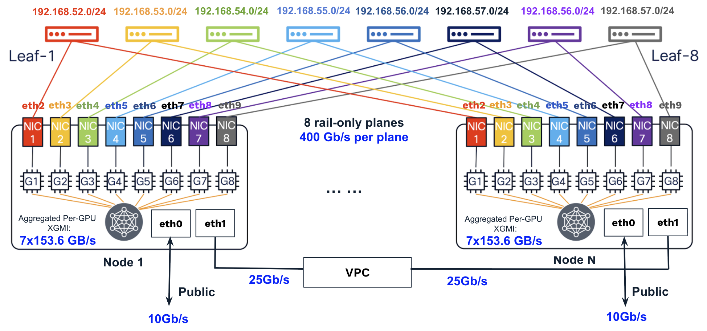

# Multi-Node Environment Setup for MI350x8 GPU Droplets

This guide provides a basic introduction and step-by-step instructions for setting up an environment for multi-node testing and applications using MI350x8 GPU Droplets.

## GPU Network Introduction

All droplets have Internet access via `eth0` at 10 Gb/s and VPC connectivity via `eth1` at 25 Gb/s, while the GPU network supports inter-node GPU-to-GPU communication via [RDMA/RoCE](https://instinct.docs.amd.com/projects/gpu-cluster-networking/en/latest/how-to/roce-network-config.html) for distributed training and inference workloads.

A single GPU Fabric can support up to 122 homogeneous nodes after reserving 6 nodes as spares. These nodes can be shared across multiple customers, with VLANs used to isolate and segregate their traffic.

The GPU Fabric is rail-only at the moment and consists of 8 independent forwarding planes. Each plane connects at 400 Gb/s to [an NVIDIA Mellanox ConnectX-7 NIC](https://instinct.docs.amd.com/projects/system-acceptance/en/latest/network/nic-installation.html#nvidia-mellanox-cx-7-400gx1) on MI325x8 node or [an AMD Pensando Pollara NIC](https://instinct.docs.amd.com/projects/system-acceptance/en/latest/network/nic-installation.html#amd-pensando-pollara-400-ai-nic) on MI350X nodes. NICs across different planes are isolated and cannot communicate with each other.



The 8 RDMA/RoCE NICs in GPU Droplets are configured and managed as `eth2–eth9`. We must define 8 IP address segments—one per forwarding plane—and assign a unique IP from the correct segment to each NIC, as misconfiguration can easily cause issues. 

The `eth2–eth9` can be treated as standard Ethernet interfaces, supported by the kernel TCP/IP stack in GPU Droplets (Ubuntu 24.04). You can run HTTP or ping over their IP addresses, and traffic can be managed via iptables.

When RDMA/RoCE applications run over the 8 NICs using RoCEv2 (UDP over IP), traffic is handled directly by the NICs, bypassing the kernel TCP/IP stack. As a result, the RX and TX packet counters for `eth2–eth9` do not increment, even though the traffic is transmitted successfully.

RDMA/RoCE applications still require an out-of-band TCP/IP channel for bootstrap/initialization and coordination, such as exchanging rank or connection information. On GPU Droplets, this channel is provided by `eth1` interface.

For GPU-to-GPU communication, the preferred paths are [XGMI](https://instinct.docs.amd.com/projects/virt-drv/en/latest/userguides/XGMI_configuration.html) (AMD Infinity Fabric) for intra-node transfers and 400 Gigabit Ethernet with RDMA for inter-node transfers. PCIe and shared memory (intra-node) and TCP/IP (inter-node, eth1) serve only as fallback options. Numerous [RCCL environment variables](https://rocm.docs.amd.com/projects/rccl/en/develop/api-reference/env-variables.html) can be configured to control these communication paths, and they should be carefully considered.

**The following summarizes the different communication paths, their roles and traffic in distributed AI/ML applications on top of GPU Droplets:**

| Interface / Path | Bandwidth | Role |
|------------------|----------|------|
| eth0 | 10 Gb/s | SSH; <br>HTTP APIs;<br> Downloads and uploads (container images, models, datasets, libraries, and updates) |
| eth1 | 25 Gb/s | NFS (models/checkpoints, datasets, logs, and metrics); <br>HTTP APIs for distributed inference across Router, Prefiller, and Decoder;<br> Bootstrap/initialization and coordination for RDMA/RoCE; <br>Fallback path for RDMA/RoCE |
| eth2–eth9 | 400 Gb/s each | RDMA/RoCE for inter-node GPU-to-GPU communication (used by RCCL);<br> Training traffic (gradients, parameters, optimizer states, activations);<br> Inference traffic (activations, KV cache) |
| XGMI (not user-configurable) | 7×128 GB/s per MI325 GPU<br> 7×153.6 GB/s per MI350 GPU   | Intra-node GPU-to-GPU communication (used by NCCL/RCCL);<br>  Training traffic (gradients, activations, optimizer states);<br> Inference traffic (activations, KV cache) |

## Environment Setup and Basic Verification

Ensure that you have at least 2 nodes in the same GPU Fabric assigned to your account.

Provision 2 GPU droplets using doctl:

``` shell
doctl compute size list | grep gpu 
doctl compute ssh-key list
doctl vpcs list

# Get the current default AI/ML image for AMD GPU Droplets 
doctl compute image list --public | grep AMD | grep base


doctl compute droplet create rs-mi350x8-mn-test1 --image 221919586 --region sfo2 --size gpu-mi350x8-2304gb-fabric-contracted --enable-monitoring --ssh-keys 55531023

doctl compute droplet create rs-mi350x8-mn-test2 --image 221919586 --region sfo2 --size gpu-mi350x8-2304gb-fabric-contracted --enable-monitoring --ssh-keys 55531023
```

SSH into the droplets and perform a basic check:

``` shell
uname -r
cat /etc/os-release
dkms status

# Check if the AMD GPU kernel driver is currently loaded and active
lsmod | grep amdgpu 

amd-smi version
amd-smi list 
amd-smi xgmi
amd-smi topology

rocm-smi
rocm-smi --showtopo
rocminfo

# DO Agent
systemctl status do-agent 

# AMD Metrics Exporter
amd-metrics-exporter --version
systemctl status amd-metrics-exporter
netstat -tunap | amd-metrics-exporter
curl http://127.0.0.1:5000/metrics

# Basic Tools
apt update
apt install net-tools
```

Check the network configuration for the GPU droplets:

| GPU Droplet    | rs-mi350x8-mn-test1  | rs-mi350x8-mn-test2  | 
|----------------|----------------|-----------------|
| eth0-internet  | 143.110.201.31 | 178.128.11.166 |
| eth1-vpc       | 10.120.0.9/20  | 10.120.0.10/20 | 


## GPU Network Setup and Basic Check

Refer to GPU network IP allocation files ([node1-eth-ip.txt](mi350x8-mn/node1-eth-ip.txt) and [node2-eth-ip.txt](mi350x8-mn/node2-eth-ip.txt)), and configure the GPU network interface controllers on each GPU droplet:

| GPU Droplet    | rs-mi350x8-mn-test1  | rs-mi350x8-mn-test2  | 
|----------------|----------------|-----------------|
| eth2  | 192.168.52.101/24 | 192.168.52.102/24  | 
| eth3  | 192.168.53.101/24 | 192.168.53.102/24  | 
| eth4  | 192.168.54.101/24 | 192.168.54.102/24  | 
| eth5  | 192.168.55.101/24 | 192.168.55.102/24  |
| eth6  | 192.168.56.101/24 | 192.168.56.102/24  | 
| eth7  | 192.168.57.101/24 | 192.168.57.102/24  | 
| eth8  | 192.168.58.101/24 | 192.168.58.102/24  | 
| eth9  | 192.168.59.101/24 | 192.168.59.102/24  | 

``` shell
nano /etc/netplan/50-cloud-init.yaml 

# Copy the contents of the IP allocation file
netplan apply 
```

Perform a basic check:

``` shell
# Provides an overview of all network interfaces and their IPs
ip -br a

# Shows detailed configuration and status information for each interface.
ifconfig

# Lists all RDMA devices exposed by the kernel
ls /sys/class/infiniband/

# Provides detailed hardware-level information about each RDMA device’s capabilities and configuration.
ibv_devices
ibv_devinfo -v | grep GID

# Displays the mapping between RDMA devices and network interfaces along with link status
rdma link
```


