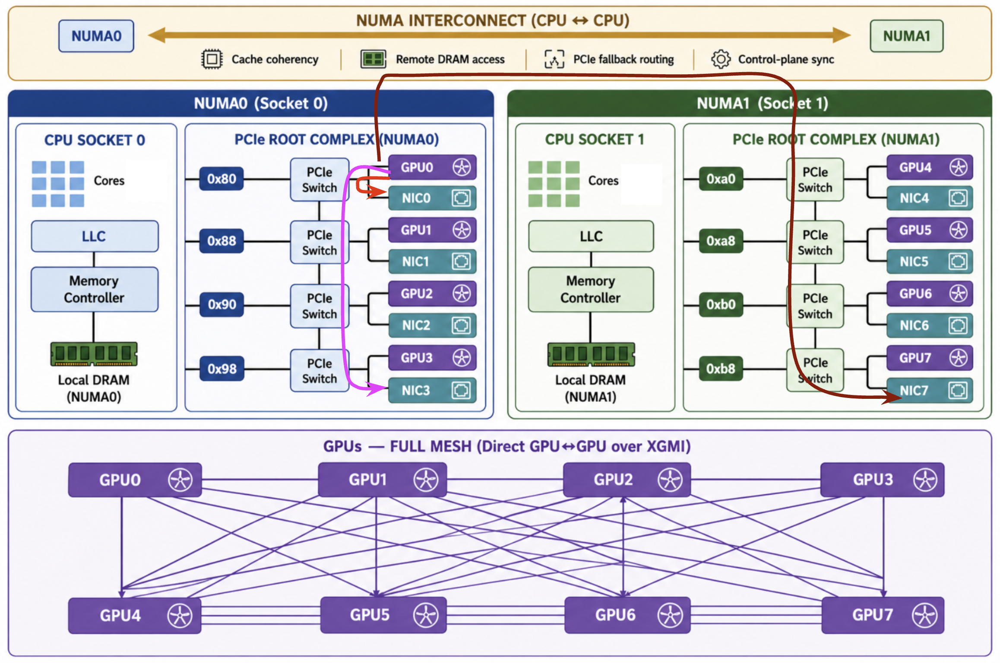

#  Multi-Node RDMA Testing for MI350x8 GPU Droplets

Follow [the guide](mi350x8-mn-environment.MD) to prepare the environment before proceeding.

This guide provides a basic introduction and step-by-step instructions for manually performing RDMA testing in a multi-node MI350x8 GPU droplet environment. It also evaluates the performance impact of NUMA placement and cross-socket communication under different scenarios.

[RDMA tests](https://instinct.docs.amd.com/projects/system-acceptance/en/latest/network/rdma-benchmarking.html#ofed-performance-tests) (e.g., ib_write_bw) measure raw network performance between nodes, focusing on NIC and fabric throughput, while [RCCL Tests](https://instinct.docs.amd.com/projects/system-acceptance/en/latest/network/rdma-benchmarking.html#rccl-benchmarking-results) use XGMI for intra-node communication and RDMA/RoCE for inter-node communication to evaluate end-to-end GPU communication, including additional overhead from kernels, topology, and collective algorithms. RDMA validates the underlying network and NIC performance, whereas RCCL reflects real application-level and system performance; together, they provide a baseline hardware view and a realistic workload-level assessment.

## Test Environment

```
GPU Droplet Image ID: 221919586
Guest OS: Ubuntu 24.04
Linux Kernel: 6.8.0-106-generic
ROCm: 7.0.2 
GPU Driver: 6.14.14
GPU Firmware: 01.25.17.07
```

| GPU Droplet    | rs-mi350x8-mn-test1  | rs-mi350x8-mn-test2  | 
|----------------|----------------|-----------------|
| eth0-internet  | 143.110.201.31 | 178.128.11.166 |
| eth1-vpc       | 10.120.0.9/20  | 10.120.0.10/20 | 
| eth2-roce      | 192.168.52.101/24 | 192.168.52.102/24  | 
| eth3-roce      | 192.168.53.101/24 | 192.168.53.102/24  | 
| eth4-roce      | 192.168.54.101/24 | 192.168.54.102/24  | 
| eth5-roce      | 192.168.55.101/24 | 192.168.55.102/24  |
| eth6-roce      | 192.168.56.101/24 | 192.168.56.102/24  | 
| eth7-roce      | 192.168.57.101/24 | 192.168.57.102/24  | 
| eth8-roce      | 192.168.58.101/24 | 192.168.58.102/24  | 
| eth9-roce      | 192.168.59.101/24 | 192.168.59.102/24  | 

## OFED Performance Tests: Installation and Build

[OFED](https://github.com/linux-rdma/perftest) (Open Fabrics Enterprise Distribution) Performance Tests are a suite of benchmarking tools used to evaluate RDMA performance over high-speed interconnects such as InfiniBand and RoCE (RDMA over Converged Ethernet).

Install the prerequisites on each GPU droplet, clone and build the tools:

```
# libibumad-dev: InfiniBand management interface for sending/receiving low-level fabric control messages.
# libpci-dev: Library for accessing and querying PCIe device and topology information.
# libibverbs-dev: Core RDMA verbs API for direct user-space access to RDMA hardware.
# librdmacm-dev: RDMA connection management library for setting up and controlling RDMA connections.
# ibverbs-utils: Utility tools for inspecting and debugging RDMA devices and verbs interfaces.
# libtool: Generic build system helper used for compiling and linking software packages.

apt install -y libibumad-dev libpci-dev libibverbs-dev librdmacm-dev ibverbs-utils libtool

git clone https://github.com/ROCm/rdma-perftest
cd rdma-perftest/

autoupdate
./autogen.sh
./configure --enable-rocm --with-rocm=/opt/rocm
make
make install
```

##  RDMA Testing

### MI350x8 Node Architecture

The MI350x8 node uses a dual-socket NUMA architecture, where each CPU socket forms its own NUMA domain with dedicated cores, memory and PCIe root complexes that connect through PCIe switches to GPUs and NICs, providing low-latency access within the same NUMA domain. Accessing memory or devices across NUMA nodes incurs additional latency due to inter-socket communication. Above the PCIe layer, all GPUs are interconnected via an AMD XGMI full-mesh fabric, enabling direct GPU-to-GPU communication across the entire node.



### 3 Scenarios

In the above topology, distance within the PCIe and NUMA hierarchy directly impacts both latency and bandwidth. We evaluate the following three scenarios:

**Note:** Since the GPU fabric is currently rail-only, both nodes must use the same NICs for RDMA testing.

#### Scenario 1: Local NUMA/PCIe Root Path

```
Node1, GPU0-NIC0 --- GPU Fabric ---- NIC0-GPU0, Node2
```

The communication path within a node:
```
GPU0 ── same PCIe switch ── NIC0
```
GPU0 talks to NIC0 through the same PCIe switch in NUMA0. The data never leaves the local switch domain, so it avoids root-complex hopping and any interconnect traffic. This gives minimum latency and peak bandwidth.

Start the server (receiver) first on `rs-mi350x8-mn-test2`, then run the client (sender) from `rs-mi350x8-mn-test1`:

This runs an RDMA WRITE bandwidth test over NIC ionic_0 using ROCm device 0 for GPUDirect RDMA, with 4 MB messages, 4 queue pairs, and reports throughput in Gbps.

```
root@rs-mi350x8-mn-test2:~/rdma-perftest# ./ib_write_bw --use_rocm=0 -d ionic_0 -s 4194304 -m 4096 -q 4 --report_gbits
************************************
* Waiting for client to connect... *
************************************
Using ROCm Device with ID: 0, Name: AMD Instinct MI350X VF, PCI Bus ID: 0x83, GCN Arch: gfx950:sramecc+:xnack-
allocated 33554432 bytes of GPU buffer at 0x720e8d000000
---------------------------------------------------------------------------------------
                    RDMA_Write BW Test
 Dual-port       : OFF		Device         : ionic_0
 Number of qps   : 4		Transport type : IB
 Connection type : RC		Using SRQ      : OFF
 PCIe relax order: ON		Lock-free      : OFF
 ibv_wr* API     : OFF		Using DDP      : OFF
 CQ Moderation   : 1
 CQE Poll Batch  : 16
 Mtu             : 4096[B]
 Link type       : Ethernet
 GID index       : 1
 Max inline data : 0[B]
 rdma_cm QPs	 : OFF
 Use ROCm memory : ON
 Data ex. method : Ethernet
---------------------------------------------------------------------------------------
 local address: LID 0000 QPN 0x0002 PSN 0x32123e RKey 0x000185 VAddr 0x00720e8e000000
 GID: 00:00:00:00:00:00:00:00:00:00:255:255:192:168:52:102
 local address: LID 0000 QPN 0x0800 PSN 0xa4e250 RKey 0x000185 VAddr 0x00720e8e400000
 GID: 00:00:00:00:00:00:00:00:00:00:255:255:192:168:52:102
 local address: LID 0000 QPN 0x0003 PSN 0xb9bd5a RKey 0x000185 VAddr 0x00720e8e800000
 GID: 00:00:00:00:00:00:00:00:00:00:255:255:192:168:52:102
 local address: LID 0000 QPN 0x0801 PSN 0x531aa1 RKey 0x000185 VAddr 0x00720e8ec00000
 GID: 00:00:00:00:00:00:00:00:00:00:255:255:192:168:52:102
 remote address: LID 0000 QPN 0x0800 PSN 0x5414e RKey 0x000195 VAddr 0x00747dea000000
 GID: 00:00:00:00:00:00:00:00:00:00:255:255:192:168:52:101
 remote address: LID 0000 QPN 0x0002 PSN 0x984c20 RKey 0x000195 VAddr 0x00747dea400000
 GID: 00:00:00:00:00:00:00:00:00:00:255:255:192:168:52:101
 remote address: LID 0000 QPN 0x0801 PSN 0x2eaaea RKey 0x000195 VAddr 0x00747dea800000
 GID: 00:00:00:00:00:00:00:00:00:00:255:255:192:168:52:101
 remote address: LID 0000 QPN 0x0003 PSN 0x4ba0f1 RKey 0x000195 VAddr 0x00747deac00000
 GID: 00:00:00:00:00:00:00:00:00:00:255:255:192:168:52:101
---------------------------------------------------------------------------------------
 #bytes     #iterations    BW peak[Gb/sec]    BW average[Gb/sec]   MsgRate[Mpps]
 4194304    20000            391.14             391.14 		     0.011657
---------------------------------------------------------------------------------------
deallocating GPU buffer 0x720e8d000000
```

```
root@rs-mi350x8-mn-test1:~/rdma-perftest# ./ib_write_bw --use_rocm=0 -d ionic_0 -s 4194304 -m 4096 -q 4 --report_gbits 10.120.0.10
Using ROCm Device with ID: 0, Name: AMD Instinct MI350X VF, PCI Bus ID: 0x83, GCN Arch: gfx950:sramecc+:xnack-
allocated 33554432 bytes of GPU buffer at 0x747de9000000
---------------------------------------------------------------------------------------
                    RDMA_Write BW Test
 Dual-port       : OFF		Device         : ionic_0
 Number of qps   : 4		Transport type : IB
 Connection type : RC		Using SRQ      : OFF
 PCIe relax order: ON		Lock-free      : OFF
 ibv_wr* API     : OFF		Using DDP      : OFF
 TX depth        : 128
 CQ Moderation   : 1
 CQE Poll Batch  : 16
 Mtu             : 4096[B]
 Link type       : Ethernet
 GID index       : 1
 Max inline data : 0[B]
 rdma_cm QPs	 : OFF
 Use ROCm memory : ON
 Data ex. method : Ethernet
---------------------------------------------------------------------------------------
 local address: LID 0000 QPN 0x0800 PSN 0xea3ffd RKey 0x000196 VAddr 0x007ced9c200000
 GID: 00:00:00:00:00:00:00:00:00:00:255:255:192:168:52:101
 local address: LID 0000 QPN 0x0002 PSN 0x3df6a3 RKey 0x000196 VAddr 0x007ced9c600000
 GID: 00:00:00:00:00:00:00:00:00:00:255:255:192:168:52:101
 local address: LID 0000 QPN 0x0801 PSN 0xadf6b1 RKey 0x000196 VAddr 0x007ced9ca00000
 GID: 00:00:00:00:00:00:00:00:00:00:255:255:192:168:52:101
 local address: LID 0000 QPN 0x0003 PSN 0x7aeac RKey 0x000196 VAddr 0x007ced9ce00000
 GID: 00:00:00:00:00:00:00:00:00:00:255:255:192:168:52:101
 remote address: LID 0000 QPN 0x0002 PSN 0xb9c2a6 RKey 0x000186 VAddr 0x0070852c200000
 GID: 00:00:00:00:00:00:00:00:00:00:255:255:192:168:52:102
 remote address: LID 0000 QPN 0x0800 PSN 0x3ee1cf RKey 0x000186 VAddr 0x0070852c600000
 GID: 00:00:00:00:00:00:00:00:00:00:255:255:192:168:52:102
 remote address: LID 0000 QPN 0x0003 PSN 0x752d37 RKey 0x000186 VAddr 0x0070852ca00000
 GID: 00:00:00:00:00:00:00:00:00:00:255:255:192:168:52:102
 remote address: LID 0000 QPN 0x0801 PSN 0xe7d683 RKey 0x000186 VAddr 0x0070852ce00000
 GID: 00:00:00:00:00:00:00:00:00:00:255:255:192:168:52:102
---------------------------------------------------------------------------------------
 #bytes     #iterations    BW peak[Gb/sec]    BW average[Gb/sec]   MsgRate[Mpps]
 4194304    20000            391.14             391.14 		     0.011657
---------------------------------------------------------------------------------------
deallocating GPU buffer 0x747de9000000
```


#### Scenario 2: Cross-PCIe Switch Path

```
Node1, GPU0-NIC3 --- GPU Fabric ---- NIC3-GPU0, Node2
```

The communication path within a node:
```
GPU0 ── Switch ── Root Complex ── Switch ── NIC3 (still NUMA0)
```
GPU0 reaches NIC3 within NUMA0 but via a different PCIe switch and root port. The traffic travels up to the PCIe root complex and then down through another switch to the NIC. Although still within a single socket, the additional PCIe hops and root complex contention introduce extra latency and reduce effective throughput.

Start the server (receiver) first on `rs-mi350x8-mn-test2`, then run the client (sender) from `rs-mi350x8-mn-test1`:

This runs an RDMA WRITE bandwidth test over NIC ionic_3 using ROCm device 0 for GPUDirect RDMA, with 4 MB messages, 4 queue pairs, and reports throughput in Gbps.

```
root@rs-mi350x8-mn-test2:~/rdma-perftest# ./ib_write_bw --use_rocm=0 -d ionic_3 -s 4194304 -m 4096 -q 4 --report_gbits
************************************
* Waiting for client to connect... *
************************************
Using ROCm Device with ID: 0, Name: AMD Instinct MI350X VF, PCI Bus ID: 0x83, GCN Arch: gfx950:sramecc+:xnack-
allocated 33554432 bytes of GPU buffer at 0x777e41600000
---------------------------------------------------------------------------------------
                    RDMA_Write BW Test
 Dual-port       : OFF		Device         : ionic_3
 Number of qps   : 4		Transport type : IB
 Connection type : RC		Using SRQ      : OFF
 PCIe relax order: ON		Lock-free      : OFF
 ibv_wr* API     : OFF		Using DDP      : OFF
 CQ Moderation   : 1
 CQE Poll Batch  : 16
 Mtu             : 4096[B]
 Link type       : Ethernet
 GID index       : 1
 Max inline data : 0[B]
 rdma_cm QPs	 : OFF
 Use ROCm memory : ON
 Data ex. method : Ethernet
---------------------------------------------------------------------------------------
 local address: LID 0000 QPN 0x0002 PSN 0x987cea RKey 0x0001b3 VAddr 0x00777e42600000
 GID: 00:00:00:00:00:00:00:00:00:00:255:255:192:168:55:102
 local address: LID 0000 QPN 0x0800 PSN 0xa6d58c RKey 0x0001b3 VAddr 0x00777e42a00000
 GID: 00:00:00:00:00:00:00:00:00:00:255:255:192:168:55:102
 local address: LID 0000 QPN 0x0003 PSN 0x6635e6 RKey 0x0001b3 VAddr 0x00777e42e00000
 GID: 00:00:00:00:00:00:00:00:00:00:255:255:192:168:55:102
 local address: LID 0000 QPN 0x0801 PSN 0x20363d RKey 0x0001b3 VAddr 0x00777e43200000
 GID: 00:00:00:00:00:00:00:00:00:00:255:255:192:168:55:102
 remote address: LID 0000 QPN 0x0002 PSN 0xf936fe RKey 0x000193 VAddr 0x0070e511200000
 GID: 00:00:00:00:00:00:00:00:00:00:255:255:192:168:55:101
 remote address: LID 0000 QPN 0x0800 PSN 0x740810 RKey 0x000193 VAddr 0x0070e511600000
 GID: 00:00:00:00:00:00:00:00:00:00:255:255:192:168:55:101
 remote address: LID 0000 QPN 0x0003 PSN 0xd7501a RKey 0x000193 VAddr 0x0070e511a00000
 GID: 00:00:00:00:00:00:00:00:00:00:255:255:192:168:55:101
 remote address: LID 0000 QPN 0x0801 PSN 0xc31661 RKey 0x000193 VAddr 0x0070e511e00000
 GID: 00:00:00:00:00:00:00:00:00:00:255:255:192:168:55:101
---------------------------------------------------------------------------------------
 #bytes     #iterations    BW peak[Gb/sec]    BW average[Gb/sec]   MsgRate[Mpps]
 4194304    20000            322.04             320.03 		     0.009538
---------------------------------------------------------------------------------------
deallocating GPU buffer 0x777e41600000
```

```
root@rs-mi350x8-mn-test1:~/rdma-perftest# ./ib_write_bw --use_rocm=0 -d ionic_3 -s 4194304 -m 4096 -q 4 --report_gbits 10.120.0.10
Using ROCm Device with ID: 0, Name: AMD Instinct MI350X VF, PCI Bus ID: 0x83, GCN Arch: gfx950:sramecc+:xnack-
allocated 33554432 bytes of GPU buffer at 0x70e510200000
---------------------------------------------------------------------------------------
                    RDMA_Write BW Test
 Dual-port       : OFF		Device         : ionic_3
 Number of qps   : 4		Transport type : IB
 Connection type : RC		Using SRQ      : OFF
 PCIe relax order: ON		Lock-free      : OFF
 ibv_wr* API     : OFF		Using DDP      : OFF
 TX depth        : 128
 CQ Moderation   : 1
 CQE Poll Batch  : 16
 Mtu             : 4096[B]
 Link type       : Ethernet
 GID index       : 1
 Max inline data : 0[B]
 rdma_cm QPs	 : OFF
 Use ROCm memory : ON
 Data ex. method : Ethernet
---------------------------------------------------------------------------------------
 local address: LID 0000 QPN 0x0002 PSN 0xf936fe RKey 0x000193 VAddr 0x0070e511200000
 GID: 00:00:00:00:00:00:00:00:00:00:255:255:192:168:55:101
 local address: LID 0000 QPN 0x0800 PSN 0x740810 RKey 0x000193 VAddr 0x0070e511600000
 GID: 00:00:00:00:00:00:00:00:00:00:255:255:192:168:55:101
 local address: LID 0000 QPN 0x0003 PSN 0xd7501a RKey 0x000193 VAddr 0x0070e511a00000
 GID: 00:00:00:00:00:00:00:00:00:00:255:255:192:168:55:101
 local address: LID 0000 QPN 0x0801 PSN 0xc31661 RKey 0x000193 VAddr 0x0070e511e00000
 GID: 00:00:00:00:00:00:00:00:00:00:255:255:192:168:55:101
 remote address: LID 0000 QPN 0x0002 PSN 0x987cea RKey 0x0001b3 VAddr 0x00777e42600000
 GID: 00:00:00:00:00:00:00:00:00:00:255:255:192:168:55:102
 remote address: LID 0000 QPN 0x0800 PSN 0xa6d58c RKey 0x0001b3 VAddr 0x00777e42a00000
 GID: 00:00:00:00:00:00:00:00:00:00:255:255:192:168:55:102
 remote address: LID 0000 QPN 0x0003 PSN 0x6635e6 RKey 0x0001b3 VAddr 0x00777e42e00000
 GID: 00:00:00:00:00:00:00:00:00:00:255:255:192:168:55:102
 remote address: LID 0000 QPN 0x0801 PSN 0x20363d RKey 0x0001b3 VAddr 0x00777e43200000
 GID: 00:00:00:00:00:00:00:00:00:00:255:255:192:168:55:102
---------------------------------------------------------------------------------------
 #bytes     #iterations    BW peak[Gb/sec]    BW average[Gb/sec]   MsgRate[Mpps]
 4194304    20000            322.04             320.03 		     0.009538
---------------------------------------------------------------------------------------
deallocating GPU buffer 0x70e510200000
```

#### Scenario 3: Remote NUMA/Cross-Socket Path, Node1-GPU0-NIC7 - 400GbE - NIC7-GPU0-Node2

```
Node1, GPU0-NIC7 --- GPU Fabric ---- NIC7-GPU0, Node2
```

The communication path within a node:
```
GPU0 ── Switch ── Root (NUMA0) ── CPU interconnect (UPI/IF) ── Root (NUMA1) ── Switch ── NIC7
```
GPU0 accesses NIC7 across NUMA0 → NUMA1. The path crosses the CPU interconnect (UPI/IF) between sockets before reaching the remote PCIe switch. This adds cross-socket latency and bandwidth limits, making it the slowest path.

Start the server (receiver) first on `rs-mi350x8-mn-test2`, then run the client (sender) from `rs-mi350x8-mn-test1`:

This runs an RDMA WRITE bandwidth test over NIC ionic_7 using ROCm device 0 for GPUDirect RDMA, with 4 MB messages, 4 queue pairs, and reports throughput in Gbps.

```
root@rs-mi350x8-mn-test2:~/rdma-perftest# ./ib_write_bw --use_rocm=0 -d ionic_7 -s 4194304 -m 4096 -q 4 --report_gbits
************************************
* Waiting for client to connect... *
************************************
Using ROCm Device with ID: 0, Name: AMD Instinct MI350X VF, PCI Bus ID: 0x83, GCN Arch: gfx950:sramecc+:xnack-
allocated 33554432 bytes of GPU buffer at 0x7c81d9000000
---------------------------------------------------------------------------------------
                    RDMA_Write BW Test
 Dual-port       : OFF		Device         : ionic_7
 Number of qps   : 4		Transport type : IB
 Connection type : RC		Using SRQ      : OFF
 PCIe relax order: ON		Lock-free      : OFF
 ibv_wr* API     : OFF		Using DDP      : OFF
 CQ Moderation   : 1
 CQE Poll Batch  : 16
 Mtu             : 4096[B]
 Link type       : Ethernet
 GID index       : 1
 Max inline data : 0[B]
 rdma_cm QPs	 : OFF
 Use ROCm memory : ON
 Data ex. method : Ethernet
---------------------------------------------------------------------------------------
 local address: LID 0000 QPN 0x0002 PSN 0xe95043 RKey 0x00017b VAddr 0x007c81da000000
 GID: 00:00:00:00:00:00:00:00:00:00:255:255:192:168:59:102
 local address: LID 0000 QPN 0x0800 PSN 0xfec871 RKey 0x00017b VAddr 0x007c81da400000
 GID: 00:00:00:00:00:00:00:00:00:00:255:255:192:168:59:102
 local address: LID 0000 QPN 0x0003 PSN 0x2e5f67 RKey 0x00017b VAddr 0x007c81da800000
 GID: 00:00:00:00:00:00:00:00:00:00:255:255:192:168:59:102
 local address: LID 0000 QPN 0x0801 PSN 0x8fc82a RKey 0x00017b VAddr 0x007c81dac00000
 GID: 00:00:00:00:00:00:00:00:00:00:255:255:192:168:59:102
 remote address: LID 0000 QPN 0x0002 PSN 0x1ade4e RKey 0x00016b VAddr 0x0073bbf5800000
 GID: 00:00:00:00:00:00:00:00:00:00:255:255:192:168:59:101
 remote address: LID 0000 QPN 0x0800 PSN 0xda2520 RKey 0x00016b VAddr 0x0073bbf5c00000
 GID: 00:00:00:00:00:00:00:00:00:00:255:255:192:168:59:101
 remote address: LID 0000 QPN 0x0003 PSN 0x2e0fea RKey 0x00016b VAddr 0x0073bbf6000000
 GID: 00:00:00:00:00:00:00:00:00:00:255:255:192:168:59:101
 remote address: LID 0000 QPN 0x0801 PSN 0xc7a1f1 RKey 0x00016b VAddr 0x0073bbf6400000
 GID: 00:00:00:00:00:00:00:00:00:00:255:255:192:168:59:101
---------------------------------------------------------------------------------------
 #bytes     #iterations    BW peak[Gb/sec]    BW average[Gb/sec]   MsgRate[Mpps]
 4194304    20000            304.32             302.59 		     0.009018
---------------------------------------------------------------------------------------
deallocating GPU buffer 0x7c81d9000000
```

```
root@rs-mi350x8-mn-test1:~/rdma-perftest# ./ib_write_bw --use_rocm=0 -d ionic_7 -s 4194304 -m 4096 -q 4 --report_gbits 10.120.0.10
Using ROCm Device with ID: 0, Name: AMD Instinct MI350X VF, PCI Bus ID: 0x83, GCN Arch: gfx950:sramecc+:xnack-
allocated 33554432 bytes of GPU buffer at 0x73bbf4800000
---------------------------------------------------------------------------------------
                    RDMA_Write BW Test
 Dual-port       : OFF		Device         : ionic_7
 Number of qps   : 4		Transport type : IB
 Connection type : RC		Using SRQ      : OFF
 PCIe relax order: ON		Lock-free      : OFF
 ibv_wr* API     : OFF		Using DDP      : OFF
 TX depth        : 128
 CQ Moderation   : 1
 CQE Poll Batch  : 16
 Mtu             : 4096[B]
 Link type       : Ethernet
 GID index       : 1
 Max inline data : 0[B]
 rdma_cm QPs	 : OFF
 Use ROCm memory : ON
 Data ex. method : Ethernet
---------------------------------------------------------------------------------------
 local address: LID 0000 QPN 0x0002 PSN 0x1ade4e RKey 0x00016b VAddr 0x0073bbf5800000
 GID: 00:00:00:00:00:00:00:00:00:00:255:255:192:168:59:101
 local address: LID 0000 QPN 0x0800 PSN 0xda2520 RKey 0x00016b VAddr 0x0073bbf5c00000
 GID: 00:00:00:00:00:00:00:00:00:00:255:255:192:168:59:101
 local address: LID 0000 QPN 0x0003 PSN 0x2e0fea RKey 0x00016b VAddr 0x0073bbf6000000
 GID: 00:00:00:00:00:00:00:00:00:00:255:255:192:168:59:101
 local address: LID 0000 QPN 0x0801 PSN 0xc7a1f1 RKey 0x00016b VAddr 0x0073bbf6400000
 GID: 00:00:00:00:00:00:00:00:00:00:255:255:192:168:59:101
 remote address: LID 0000 QPN 0x0002 PSN 0xe95043 RKey 0x00017b VAddr 0x007c81da000000
 GID: 00:00:00:00:00:00:00:00:00:00:255:255:192:168:59:102
 remote address: LID 0000 QPN 0x0800 PSN 0xfec871 RKey 0x00017b VAddr 0x007c81da400000
 GID: 00:00:00:00:00:00:00:00:00:00:255:255:192:168:59:102
 remote address: LID 0000 QPN 0x0003 PSN 0x2e5f67 RKey 0x00017b VAddr 0x007c81da800000
 GID: 00:00:00:00:00:00:00:00:00:00:255:255:192:168:59:102
 remote address: LID 0000 QPN 0x0801 PSN 0x8fc82a RKey 0x00017b VAddr 0x007c81dac00000
 GID: 00:00:00:00:00:00:00:00:00:00:255:255:192:168:59:102
---------------------------------------------------------------------------------------
 #bytes     #iterations    BW peak[Gb/sec]    BW average[Gb/sec]   MsgRate[Mpps]
 4194304    20000            304.32             302.59 		     0.009018
---------------------------------------------------------------------------------------
deallocating GPU buffer 0x73bbf4800000
```

We can also test other NIC and GPU combinations:

```
root@rs-mi350x8-mn-test2:~/rdma-perftest# ./ib_write_bw --use_rocm=7 -d ionic_7 -s 4194304 -m 4096 -q 4 --report_gbits
root@rs-mi350x8-mn-test1:~/rdma-perftest# ./ib_write_bw --use_rocm=7 -d ionic_7 -s 4194304 -m 4096 -q 4 --report_gbits 10.120.0.10

root@rs-mi350x8-mn-test2:~/rdma-perftest# ./ib_write_bw --use_rocm=7 -d ionic_4 -s 4194304 -m 4096 -q 4 --report_gbits
root@rs-mi350x8-mn-test1:~/rdma-perftest# ./ib_write_bw --use_rocm=7 -d ionic_4 -s 4194304 -m 4096 -q 4 --report_gbits 10.120.0.10

root@rs-mi350x8-mn-test2:~/rdma-perftest# ./ib_write_bw --use_rocm=7 -d ionic_0 -s 4194304 -m 4096 -q 4 --report_gbits
root@rs-mi350x8-mn-test1:~/rdma-perftest# ./ib_write_bw --use_rocm=7 -d ionic_0 -s 4194304 -m 4096 -q 4 --report_gbits 10.120.0.10
```


#### Summary

These results show a clear performance gradient between 2 nodes depending on which NIC GPU0 communicates with.

|No| Scenario   | GPU and NIC | Bytes    | Iterations | BW Peak (Gb/s) | BW Average (Gb/s) | MsgRate (Mpps) |
|-|------------|----------|----------|------------|----------------|-------------------|----------------|
|1| Local NUMA/PCIe Root Path | GPU0-NIC0  | 4194304  | 20000      | 391.14         | 391.14            | 0.011657       |
|2| Cross-PCIe Switch Path | GPU0-NIC3  | 4194304  | 20000      | 322.04         | 320.03            | 0.009538       |
|3| Remote NUMA/Cross-Socket Path | GPU0-NIC7  | 4194304  | 20000      | 304.32         | 302.59            | 0.009018       |

- GPU0 → NIC0 delivers the best performance, with a peak and average bandwidth of ~391 Gbps.
- GPU0 → NIC3 shows a noticeable drop, averaging ~320 Gbps (~18% lower than NIC0).
- GPU0 → NIC7 performs the worst, averaging ~303 Gbps (~22% lower than NIC0).

Overall, there is a consistent performance degradation as the NIC becomes more topologically distant from GPU0, indicating the impact of NUMA locality, PCIe switch hierarchy, or routing distance between GPU and NICs. The message rate follows the same pattern, confirming this is not just a bandwidth effect but a structural limitation in the data path.
