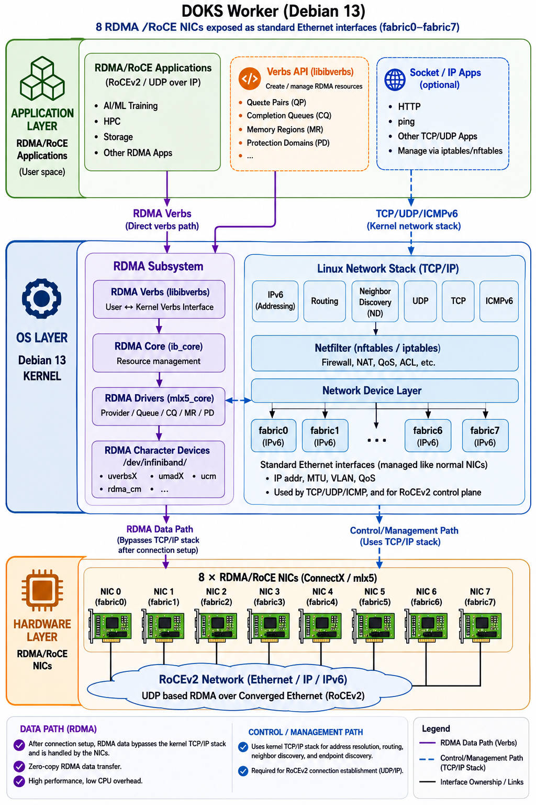

# Understanding RDMA/RoCE Networking in DOKS Workers


## Overview

Each DOKS worker is equipped with 8 RDMA-capable Ethernet NICs, which are exposed to Linux as the standard network interfaces fabric0–fabric7. Each interface is automatically assigned an IPv6 address and behaves like a conventional Ethernet interface. Administrators can configure these interfaces using standard Linux networking tools, assign IP addresses, configure MTU and VLANs, perform routing, and apply firewall rules using nftables (or iptables compatibility mode).

**Although these interfaces appear as ordinary Ethernet devices, they also support RoCEv2**, enabling applications to perform high-performance RDMA communication with low latency and minimal CPU overhead.

## Two Interfaces to the Same Physical NIC

One of the most common questions is why an RDMA-capable NIC appears as two different interfaces inside Linux:

- A network device (fabric0–fabric7)
- An RDMA device (/dev/infiniband)

This separation is intentional and reflects the Linux kernel architecture rather than the hardware itself.

Both interfaces represent the same physical NIC, but they expose different capabilities.

```
                Physical ConnectX NIC
                        │
        ┌───────────────┴───────────────┐
        │                               │
 Network Device                   RDMA Device
 (fabric0-fabric7)              (/dev/infiniband)
        │                               │
 Linux Networking                 RDMA Subsystem
    (netdev)                        (ib_core)
```

The network device is responsible for standard Ethernet networking, while the RDMA device exposes the NIC's RDMA acceleration engine through the RDMA verbs interface.

## Network Devices (fabric0–fabric7)

The fabric interfaces are standard Linux Ethernet interfaces.

They provide the operating system with all conventional networking functionality, including:

- IPv4/IPv6 addressing
- routing
- MTU configuration
- VLANs
- QoS
- neighbor discovery
- firewall policies
- traffic shaping

Because they are ordinary Linux network interfaces, applications can use them with the standard socket API. Examples include:

- HTTP
- SSH
- ping
- curl
- Kubernetes networking
- monitoring agents

These interfaces are fully managed by the Linux networking stack.

## RDMA Devices (/dev/infiniband)

The RDMA subsystem exposes the hardware acceleration capabilities of the NIC through character devices under:

```
/dev/infiniband/
```

Applications access these devices through libibverbs.

Instead of sending packets using sockets, RDMA applications create hardware resources such as

- Protection Domains (PD)
- Queue Pairs (QP)
- Completion Queues (CQ)
- Memory Regions (MR)
- Shared Receive Queues (SRQ)

These resources allow the NIC to directly transfer data between application memory and the network without copying data through the kernel networking stack.

This enables

- kernel bypass
- zero-copy transfers
- hardware offload
- extremely low latency
- very high throughput

## Why Linux Separates the Two Interfaces

Linux intentionally separates networking and RDMA into two kernel subsystems.

```
             Linux Kernel

     ┌────────────────────────┐
     │ Networking Subsystem   │
     │ (netdev)               │
     └──────────┬─────────────┘
                │
        fabric0-fabric7


     ┌────────────────────────┐
     │ RDMA Subsystem         │
     │ (ib_core)              │
     └──────────┬─────────────┘
                │
       /dev/infiniband
```

The networking subsystem manages packet transmission using the familiar BSD socket model (`send(), recv(), connect()`), while the RDMA subsystem manages hardware resources and queue-based communication using the RDMA verbs API (`ibv_create_qp(), ibv_reg_mr(), ibv_post_send()`, etc.).

Although both ultimately control the same physical NIC, they represent fundamentally different programming models. Keeping them separate allows Linux to support both conventional Ethernet applications and high-performance RDMA applications simultaneously on the same hardware.

## RoCEv2 Uses Both Interfaces

RoCEv2 combines RDMA with Ethernet/IP networking.

During connection establishment, the application relies on the Ethernet interfaces (fabric0–fabric7) to obtain the network information required for communication, including:

- IP addresses
- GIDs (Global Identifiers)
- routing information
- neighbor discovery
- MTU
- VLAN configuration
- QoS policies

Once the RDMA connection (Queue Pair) has been established, the data path changes. Instead of traversing the Linux TCP/IP stack, data is transferred directly by the NIC's RDMA engine.

```
Connection Setup

Application
      │
      ▼
TCP/IP Stack
      │
fabric0
      │
Ethernet Network


Data Transfer

Application
      │
libibverbs
      │
/dev/infiniband
      │
NIC DMA Engine
      │
Ethernet Network
```

The control plane uses the Linux networking stack, while the data plane bypasses it.

## Why Containers/Pods Need Both Resources

A container running an RDMA/RoCE application must be given access to both the RDMA devices and the corresponding Ethernet interfaces.

1. RDMA devices (/dev/infiniband)

These devices provide access to the RDMA verbs interface and allow the application to:

- create Queue Pairs
- register memory
- create Completion Queues
- perform RDMA read/write operations
- access the NIC's RDMA engine

Without these devices, the application cannot perform RDMA operations.

2. Ethernet interfaces (fabric0–fabric7)

The Ethernet interfaces provide the network context required by RoCEv2, including:

- IP configuration
- MTU
- VLAN
- QoS
- routing
- GID resolution
- endpoint discovery
- connection establishment

Without these interfaces, the application cannot determine how to reach remote peers, even though it has access to the RDMA hardware.

## Why One Interface Cannot Replace the Other

A common question is whether Linux could expose only a single interface to applications.

In practice, this is not feasible because the two interfaces serve fundamentally different purposes.

The Ethernet interface exposes a packet-oriented programming model based on sockets.

The RDMA interface exposes a hardware-oriented programming model based on queue pairs, registered memory, and completion queues.

**Attempting to merge these models into a single interface would require extending the traditional socket API to represent RDMA-specific concepts that do not naturally fit within the networking subsystem.** Instead, Linux keeps networking (netdev) and RDMA (ib_core) as separate kernel subsystems while allowing both to share the same physical NIC.

## End-to-End Architecture

```
                APPLICATION LAYER
┌──────────────────────────────────────────────────┐
│  RDMA Application (vLLM, NCCL, RCCL, MPI, etc.)  │
└──────────────────────────────────────────────────┘
                  │                 │
                  │                 │
          libibverbs           Socket API
                  │                 │
                  ▼                 ▼

                OPERATING SYSTEM
┌───────────────────────┐   ┌──────────────────────┐
│ RDMA Subsystem        │   │ Linux Networking     │
│ (/dev/infiniband)     │   │ fabric0–fabric7      │
│ ib_core               │   │ TCP/IP              │
│ mlx5 driver           │   │ Routing             │
└─────────────┬─────────┘   └──────────┬───────────┘
              │                        │
              └────────────┬───────────┘
                           ▼

                HARDWARE LAYER
┌──────────────────────────────────────────────────┐
│       8 × ConnectX RDMA/RoCE NICs                │
│         (RoCEv2 over Ethernet/IP)                │
└──────────────────────────────────────────────────┘
                           │
                           ▼
                    Ethernet Fabric
```

## Summary

A RoCE-capable NIC exposes two complementary interfaces in Linux: Ethernet network interfaces (fabric0–fabric7) and RDMA devices (/dev/infiniband). Although they represent the same physical hardware, they serve distinct roles. The Ethernet interfaces provide standard IP networking and the control-plane services required to establish RDMA connections, while the RDMA devices expose the NIC's hardware acceleration engine for zero-copy, kernel-bypass data transfers.

For this reason, a container running an RDMA application must have access to both the RDMA devices and the corresponding Ethernet interfaces. Together, they enable RoCEv2 to combine the flexibility of Ethernet networking with the performance advantages of RDMA, allowing applications such as NCCL, RCCL, MPI, and distributed AI inference frameworks like vLLM to achieve high bandwidth, low latency, and efficient CPU utilization.



